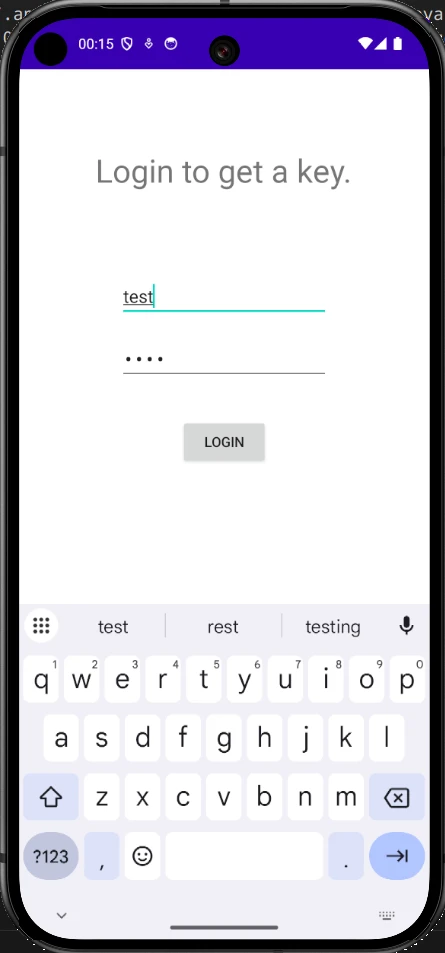

# APKey: Diving into Android Reverse Engineering

I've recently started diving into Android reverse engineering, and APKey is my very first challenge in this intensive training session. 

The challenge comes with a simple scenario:
> "This app contains some unique keys. Can you get one?"

Armed with our APK file (`APKey.apk`), let's see how we can crack this open and extract the flag.

---

## The Initial Recon & Alignment Hiccups

I started off by trying to decompile the application right away using JADX to see what we are dealing with.

```bash
jadx -d decompiled APKey.apk 
INFO  - loading ...
INFO  - processing ...
ERROR - finished with errors, count: 4                       
```

The output was messy, filled with incomprehensible classes. Before wasting hours staring at chaotic static code, I wanted to get a visual representation of how the app actually behaves. I tried installing it directly via ADB.

```bash
adb install APKey.apk 
Performing Streamed Install
adb: failed to install APKey.apk: Failure [-124: Failed parse during installPackageLI: Targeting R+ (version 30 and above) requires the resources.arsc of installed APKs to be stored uncompressed and aligned on a 4-byte boundary]
```

Ah, a classic alignment issue. Luckily, this was covered in my training. To fix this, we need to manually align the zip structure on a 4-byte boundary and then re-sign the APK so the Android system accepts it.

First, I aligned it:

```bash
~/Android/Sdk/build-tools/34.0.0/zipalign 4 ./APKey.apk ./APKaligned.apk
```

Then I generated a keystore (if not already present) and signed the aligned APK:

```bash
keytool -genkey -v -keystore ~/.android/htb.keystore -alias signkey -keyalg RSA -keysize 2048 -validity 20000
~/Android/Sdk/build-tools/34.0.0/apksigner sign --ks ~/.android/htb.keystore ./APKaligned.apk 
```

With the newly signed package, the installation went smoothly:

```bash
adb install ./APKaligned.apk
Performing Incremental Install
Serving...
All files should be loaded. Notifying the device.
Success
Install command complete in 273 ms
```

Opening the app presents a clean login interface. 



Since we don't have any credentials, it's time to head back to our static analysis to find out how the authentication mechanism works.

---

## Inspecting the Source Code

I opened the APK in JADX GUI. From the `AndroidManifest.xml`, I located the entry point: `MainActivity`. 

To make things readable, I renamed a few obfuscated elements to recognizable terms like `usernameEl`, `passwordEl`, and `validateButton`. 

Looking at the logic:

```java
android.widget.EditText r5 = r5.usernameEl     // Catch: java.lang.Exception -> L88
android.text.Editable r5 = r5.getText()     // Catch: java.lang.Exception -> L88
java.lang.String r5 = r5.toString()     // Catch: java.lang.Exception -> L88
java.lang.String r0 = "admin"
```

The username is straightforward: `"admin"`.

Now, let's look at the password verification:

```java
android.widget.EditText r5 = r5.passwordEl     // Catch: java.lang.Exception -> L88
android.text.Editable r5 = r5.getText()     // Catch: java.lang.Exception -> L88
java.lang.String r5 = r5.toString()     // Catch: java.lang.Exception -> L88
java.lang.String r1 = "MD5"

java.lang.String r1 = "a2a3d412e92d896134d9c9126d756f"
boolean r5 = r5.equals(r1)     // Catch: java.lang.Exception -> L88
```

The app checks the input against an MD5-like hash: `"a2a3d412e92d896134d9c9126d756f"`. But finding the associated password seemed impossible

At this point, I realized there were three potential paths forward:
1. Deep-dive into the reverse process to reconstruct the flag decryption key manually.
2. Modify the application's bytecode to bypass the check or hardcode our own password hash.
3. Hook the application dynamically (e.g., using Frida) to bypass or extract the values during runtime.

While dynamic hooking is still slightly out of my depth, patching the Smali code seemed like a fast, accessible way to gain hands-on experience. But since maximizing learning is the goal here, I decided to try both Path 1 (Patching) and Path 2 (Reversing the actual decryption logic).

---

## Path 1: Repackaging & Patching the APK

To modify the password check, we need to decode the APK into its Smali representation, swap the mystery hash with a hash of our choosing, and rebuild it.

First, I disassembled the original APK using `apktool`:

```bash
apktool d APKey_orig.apk
```

I tracked down the validation logic inside `smali/com/example/apkey/MainActivity$a.smali`. Right around line 140, I found where the hardcoded hash is loaded into the register:

```smali
:goto_1
    const-string v1, "a2a3d412e92d896134d9c9126d756f"
```

I swapped this hash with the MD5 hash of `Password123` (`42f749ade7f9e195bf475f37a44cafcb`):

```smali
:goto_1
    const-string v1, "42f749ade7f9e195bf475f37a44cafcb"
```

With the patch in place, I rebuilt the package:

```bash
apktool b
I: Using Apktool 3.0.2-dirty on APKey_orig.apk with 8 threads
I: Smaling smali folder into classes.dex...
I: Building resources with aapt2...
I: Building apk file...
I: Importing unknown files...
I: Built apk into: ./dist/APKey_orig.apk
```

Just like before, the newly created package must be aligned and signed:

```bash
~/Android/Sdk/build-tools/34.0.0/zipalign -v 4 dist/APKey_orig.apk ../APKey_repackage.apk
~/Android/Sdk/build-tools/34.0.0/apksigner sign --ks ~/.android/htb.keystore --ks-key-alias signkey ./APKey_repackage.apk 
```

Now, I re-installed our custom build:

```bash
adb install APKey_repackage.apk 
Performing Incremental Install
Serving...
All files should be loaded. Notifying the device.
Success
```

I fired up the app, logged in using `admin` and `Password123`, and it worked perfectly! The flag was rendered right on the screen. 

Copying the flag manually from a device screen can be annoying, which gave me the perfect excuse to attempt Path 2: digging directly into the code to recover it.

---

## Path 2: Reversing the Cryptographic Logic

Returning to JADX-GUI, let's analyze how the flag is actually generated when the check succeeds. Looking at the logic around `L56`:

```java
java.lang.String r1 = "a2a3d412e92d896134d9c9126d756f"
boolean r5 = r5.equals(r1)     // Catch: java.lang.Exception -> L88
if (r5 == 0) goto L7b
com.example.apkey.MainActivity r5 = com.example.apkey.MainActivity.this     // Catch: java.lang.Exception -> L88
android.content.Context r5 = r5.getApplicationContext()     // Catch: java.lang.Exception -> L88
...
java.lang.String r0 = p069c.p073b.p074a.C0550g.m1990a()     // Catch: java.lang.Exception -> L88
java.lang.String r0 = p069c.p073b.p074a.C0545b.m1985a(r0)     // Catch: java.lang.Exception -> L88
r1 = 1
android.widget.Toast r5 = android.widget.Toast.makeText(r5, r0, r1)     // Catch: java.lang.Exception -> L88
```

The flag is shown in a typical native Toast notification using `Toast.makeText(context, text, duration)`. 

By enabling the "show inconsistent code" option in JADX-GUI, the simplified logic for the text argument became much clearer:

```java
toastMakeText = Toast.makeText(applicationContext, C0545b.fun1(C0550g.fun2()), 1);
```

The displayed message depends on two primary functions: `fun2()` (which gathers string parts) and `fun1()` (which decrypts it).

Looking into `fun2()`, we can see it pieces together elements from lists and values returned by various class methods:

```java
public static String fun2() {
    StringBuilder sb = new StringBuilder();
    ArrayList arrayList = new ArrayList();
    arrayList.add("722gFc");
    // ... items added ...
    arrayList.add("kI94fD");
    sb.append((String) arrayList.get(8)); // "1UlBm2"
    sb.append(C0551h.m1992a());
    sb.append(C0552i.m1993a());
    sb.append(C0549f.m1989a());
    sb.append(C0548e.m1988a());
    
    ArrayList arrayList2 = new ArrayList();
    arrayList2.add("ue7888");
    // ... items added ...
    arrayList2.add("2DabnR");
    sb.append((String) arrayList2.get(9)); // "2DabnR"
    sb.append(C0546c.m1986a());
    
    ArrayList arrayList3 = new ArrayList();
    arrayList3.add("jH67k8");
    // ... items added ...
    arrayList3.add("h93Fr5");
    sb.append((String) arrayList3.get(5)); // "Wod2bk"
    sb.append(C0547d.m1987a());
    sb.append(C0544a.m1984a());
    return sb.toString();
}
```

This boils down to a sequence of values concatenated together:

`"1UlBm2" + C0551h.m1992a() + C0552i.m1993a() + C0549f.m1989a() + C0548e.m1988a() + "2DabnR" + C0546c.m1986a() + "Wod2bk" + C0547d.m1987a() + C0544a.m1984a()`

To resolve this, I manually inspected each helper class. For instance, `C0551h` looks like this:

```java
public class C0551h {
    public static String m1992a() {
        ArrayList arrayList = new ArrayList();
        arrayList.add("8GGfdt");
        // ... items added ...
        arrayList.add("kd9Iuy");
        return (String) arrayList.get(6); // "kHtZuV"
    }
}
```

By painstakingly reconstructing the return values from all helper functions, I mapped the sequence:

*   `C0551h.m1992a()` -> `"kHtZuV"`
*   `C0552i.m1993a()` -> `"rSE6qY"`
*   `C0549f.m1989a()` -> `"6HxWkw"`
*   `C0548e.m1988a()` -> `"HyeaX9"`
*   `C0546c.m1986a()` -> `"FlEGyL"`
*   `C0547d.m1987a()` -> `"wAxcoc"`
*   `C0544a.m1984a()` -> `"85S94kFpV1"`

Putting it all together, the final output of `fun2()` is:
`"1UlBm2kHtZuVrSE6qY6HxWkwHyeaX92DabnRFlEGyLWod2bkwAxcoc85S94kFpV1"`

This output is then decrypted by `fun1()`, which sets up a secret key derived dynamically from characters of our helper functions to initialize a cipher:

```java
public static String fun1(String str) throws NoSuchPaddingException, NoSuchAlgorithmException, InvalidKeyException {
    SecretKeySpec secretKeySpec = new SecretKeySpec((String.valueOf(C0551h.m1992a().charAt(0)) + String.valueOf(C0544a.m1984a().charAt(8)) + ...).getBytes(), C0550g.m1991b());
    Cipher cipher = Cipher.getInstance(C0550g.m1991b());
    cipher.init(2, secretKeySpec);
    return new String(cipher.doFinal(Base64.decode(str, 0)), "utf-8");
}
```

While it is entirely possible to write a quick Java or Python script to handle this decryption, manually piecing together the key byte-by-byte is tedious and prone to typos. Having already recovered the flag dynamically using our patched APK, I decided to leave the static key reconstruction here.

---

## Conclusion

This first experience reversing on Android was incredibly satisfying. It highlighted how multiple workflows (repackaging/patching, static code analysis, and dynamic instrumentation) can be applied to solve the same problem. 

The theoretical concepts from my prep work made navigating the APK's structure intuitive. If challenges down the road scale up in complexity, things will get rough, but for a start, this was a fantastic confidence booster!