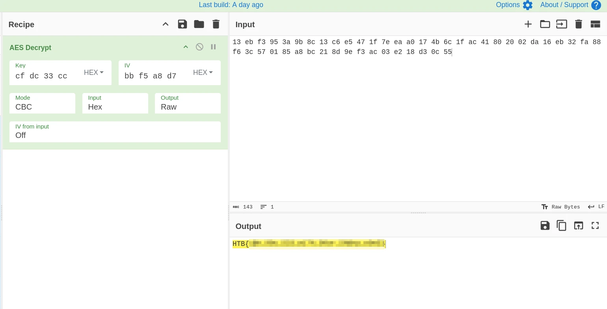

# Arno's Magic Words: A Journey Into Unity Android Reverse Engineering

## Introduction

Today we are diving into a really fun Android CTF challenge involving Arno Dorian from Assassin's Creed. The setup gives us a solid hook: Arno is legendary for his sharp tongue, which usually lands him in trouble. Our goal? Make him say the "magic words" to reveal the flag.

When I first installed the provided APK on my emulator, it immediately crashed. A quick look at the logs revealed typical VM/emulation mismatch or architecture issues:

```text
2026-07-13 18:21:45.593 11310-11329 CRASH com.android.chrome E Tombstone written to: /storage/emulated/0/Android/data/com.Z4ki.Arno/files/tombstone_00
```

Since this is an ARM-compiled APK, I switched over to a physical Android device running in developer debugging mode. This bypassed the architecture issue and allowed me to reach the home screen.


Upon launch, I was greeted with a cool Assassin's Creed Unity image and a single tempting button to generate quotes. This suggested that the flag might hide within these generation routines.

---

## Static Analysis: The Unity Trailed & The Address Confusion

To understand the plumbing, I loaded the APK into **JADX-GUI** and inspected the `AndroidManifest.xml`. I immediately spotted this activity declaration:

```xml
<activity
    android:theme="@style/BaseUnityGameActivityTheme"
    android:name="com.unity3d.player.UnityPlayerGameActivity"
    android:enabled="true"
    android:exported="true"
    ...
```

This confirmed we were dealing with a Unity-based game. 

I checked the game folder structure and found `assets/bin/Data/data.unity3d`. Often, game localization, dialogues, and script assets are serialized here. I ran **AssetRipper** to extract everything, but unfortunately, no obvious flag data popped up in the raw assets.

The actual gameplay logic had to be inside the compiled binary framework: **IL2CPP**. In this type of build, C# game code is compiled down to native assembly within the `libil2cpp.so` shared library. To restore the method signatures, we need `global-metadata.dat`.

Although my local CLI tools stumbled on the extraction, an online IL2CPP dumper resolved it quickly. Examining the reconstructed C# scaffolding revealed a highly interesting class named `FlagControl` with methods like `GetFlag()`, `GetKey()`, `GetIv()`, and `DecryptFlag()`.

This is where I ran into my first real headache: mapping out the addresses. The dumper outputted lines like this:

```csharp
[Token(Token = "0x6000002")]
[Address(RVA = "0x16D1740", Offset = "0x16D0740", VA = "0x16D1740")]
public void ShowQuote()
{
}
```

I spent a good chunk of time scratching my head over the difference between the RVA (Relative Virtual Address) and the raw file Offset. In static analysis tools like Ghidra, you are looking at files on disk, but Frida hooks active memory. I initially mixed them up, attempting to hook the raw file offset which led nowhere. Once I realized I needed the RVA pointer (`0x16D1740`) added dynamically to the base address of `libil2cpp.so` load-time memory space, everything began to click.

---

## The Frida Hooking Nightmare

While I could see the `FlagControl` methods, there were virtually no cross-references indicating how or when they executed. To bridge the gap, I turned to dynamic instrumentation using **Frida**.

Using **Objection**, I patched the APK to load a Frida gadget. However, every time I attempted to run `frida-trace` on my test device, the application exited abruptly:

```bash
$ frida-trace -H 127.0.0.1:27042 -i 'ShowQuote' Gadget
Started tracing 0 functions.
Connection terminated
```

After several hours of painful debugging, I discovered that Objection's automatic patcher had injected a duplicate `<clinit>` block inside the main activity smali code. This split initialization threw off the runtime entry point.

Here is what the code looked like before my fix:

```smali
.method static constructor <clinit>()V
   .locals 1
   const-string v0, "frida-gadget"
   invoke-static {v0}, Ljava/lang/System;->loadLibrary(Ljava/lang/String;)V
   return-void
.end method

...

.method static constructor <clinit>()V
    .locals 1
    const-string v0, "game"
    invoke-static {v0}, Ljava/lang/System;->loadLibrary(Ljava/lang/String;)V
    return-void
.end method
```

To resolve the conflict, I manually combined both library loading actions into a single constructor method block:

```smali
.method static constructor <clinit>()V
    .locals 1
    const-string v0, "game"
    invoke-static {v0}, Ljava/lang/System;->loadLibrary(Ljava/lang/String;)V
    const-string v0, "frida-gadget"
    invoke-static {v0}, Ljava/lang/System;->loadLibrary(Ljava/lang/String;)V
    return-void
.end method
```

After rebuilding and signing the APK, `frida-trace` worked perfectly!

---

## Intercepting and the CyberChef Detour

Aiming at the memory-mapped RVA offset `0x16D1740`, I could trace button interaction events in real-time:

```bash
$ frida-trace -H 127.0.0.1:27042 -a 'libil2cpp.so!0x16D1740' Gadget
  2135 ms  sub_16d1740()
  2938 ms  sub_16d1740()
```

Seeing those logs trigger on button-press was extremely satisfying. Now, how do we retrieve the flag?

The `GetFlag` function at RVA `0x16D1918` returns an encrypted byte array. My ultimate goal was to dynamically call `DecryptFlag` (`0x16D1988`) from within Frida to print the clean string. However, when I wrote my first script to execute this decryption routine, the application instantly crashed with memory access violations. 

Stuck and wanting to make sure my logic was sound, I took a step back and decided to extract the raw values instead of trying to force on-device execution right away. I wrote a safer hook to grab the encrypted flag, the key, and the initialization vector directly from memory.

Analyzing the low-level representation of an `Il2CppArray` struct context helped me read the active heap:
* `+0x00`: Class reference pointer (8 bytes)
* `+0x08`: Lock Monitor (8 bytes)
* `+0x10`: Bounds (8 bytes)
* `+0x18`: Length (stored as uint32)
* `+0x20`: Raw byte array start

Once I dumped the raw hex values from memory, I headed over to **CyberChef**. By entering the extracted key, IV, and ciphertext into an AES Decrypt block, I was finally able to recover the flag!



---

## Fixing the Script: Unmasking Hidden Parameters

With the flag in hand, I could have stopped there, but the developer inside me hated that my script was crashing. I needed to understand *why* my direct call to `DecryptFlag` was failing.

I realized that C# compiler output under IL2CPP does not map exactly to a simple C function. When C# compiles instance methods to native code, it secretly passes hidden parameters. The first argument is always the instance pointer (`this`), but Unity's runtime often maps an additional hidden parameter at the end of the method signature: a pointer containing the method metadata (`MethodInfo*`).

My initial `NativeFunction` definition looked like a clean transition of standard arguments, completely ignoring these hidden internal structures. The mismatched stack parameters caused the app to crash every single time.

By updating the signature to include the instance pointer in the arguments and providing a dummy null pointer `ptr(0)` at the end to satisfy the native method metadata parameter, the script finally worked without crashing.

Here is the evolved, successfully working Frida script:

```javascript
function retrieveDataFromFun(arg0, RVA, log) {
    const GetFlagAddr = Process.getModuleByName('libil2cpp.so').base.add(RVA)
    const GetFlag = new NativeFunction(GetFlagAddr, 'pointer', ['pointer', 'pointer']);
    let retvalue = GetFlag(arg0, ptr(0))
    return retvalue
}

defineHandler({
    onEnter(log, args) {
        const GetFlagAddr = '0x16d1918'
        const GetIvAddr = '0x16D18A8'
        const GetKeyAddr = '0x16D1838'
        const DecryptFlagAddr = '0x16D1988'
        
        const Flag = retrieveDataFromFun(args[0], GetFlagAddr, log)
        const Iv = retrieveDataFromFun(args[0], GetIvAddr, log)
        const Key = retrieveDataFromFun(args[0], GetKeyAddr, log)
        
        const DecryptFlag = new NativeFunction(
            Process.getModuleByName('libil2cpp.so').base.add(DecryptFlagAddr), 
            'pointer', 
            ['pointer', 'pointer', 'pointer', 'pointer', 'pointer']
        );
        
        const decryptedFlag = DecryptFlag(args[0], Key, Iv, Flag, ptr(0))
        log("Decrypted Flag: " + decryptedFlag.add(0x14).readUtf16String())
    },

    onLeave(log, retval) {}
});
```

Going from a broken connection to a manual CyberChef extraction, and finally resolving the dynamic script by mapping the hidden IL2CPP low-level parameters, made this an incredibly educational journey.