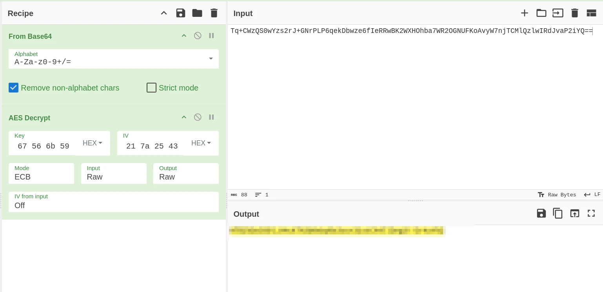

# Cryptohorrific - Writeup

## 1. Initial Analysis & File Inspection

Another exercise from the mobile series, but weirdly enough I don't have an APK this time.

```bash
[ hackthebox.app]$ ls -la *
-rw-r--r-- 1 neirda neirda   185  3 mai    2018 challenge.plist
-rw-r--r-- 1 neirda neirda 32352  3 mai    2018 hackthebox
-rw-r--r-- 1 neirda neirda  9793  3 mai    2018 htb-company.png
-rw-r--r-- 1 neirda neirda  1132  3 mai    2018 Info.plist
-rw-r--r-- 1 neirda neirda     8  3 mai    2018 PkgInfo

Base.lproj:
total 16
drwxr-xr-x 4 neirda neirda 4096  3 mai    2018 .
drwxr-xr-x 4 neirda neirda 4096  3 mai    2018 ..
drwxr-xr-x 2 neirda neirda 4096  3 mai    2018 LaunchScreen.storyboardc
drwxr-xr-x 2 neirda neirda 4096  3 mai    2018 Main.storyboardc

_CodeSignature:
total 16
drwxr-xr-x 2 neirda neirda 4096  3 mai    2018 .
drwxr-xr-x 4 neirda neirda 4096  3 mai    2018 ..
-rw-r--r-- 1 neirda neirda 5073  3 mai    2018 CodeResources
```

The PNG file doesn't even open, I'm lost (and 2018 ????).

Apparently, it's an iOS app and the information is inside the `hackthebox` binary file.

---

## 2. Reverse Engineering with Ghidra

I open the `hackthebox` binary in Ghidra.

What's good is that a lot of elements are well-named and identified. I find references to the `cf_flag` label here:

```objective-cpp
/* Function Stack Size: 0x10 bytes */

void ViewController::viewDidLoad(ID param_1,SEL param_2)

{
    ID self;
    ID self_00;
    ID IVar1;
    ID IVar2;
    ID IVar3;
    ID IVar4;
    undefined8 uVar5;
    ID IVar6;
    undefined8 uVar7;
    ID IVar8;
    undefined8 uVar9;
    ID local_28;
    class_t *local_20;
    SEL local_18;
    ID local_10;
    
    local_20 = &objc::class_t::ViewController;
    local_28 = param_1;
    local_18 = param_2;
    local_10 = param_1;
    UIViewController::viewDidLoad((ID)&local_28,"viewDidLoad");
    self = *(ID *)(local_10 + l);
    self_00 = NSString::alloc((ID)&_OBJC_CLASS_$_NSString,"alloc");
    IVar8 = local_10;
    IVar1 = NSData::alloc((ID)&_OBJC_CLASS_$_NSData,"alloc");
    IVar2 = NSArray::alloc((ID)&_OBJC_CLASS_$_NSArray,"alloc");
    IVar3 = NSBundle::mainBundle((ID)&_OBJC_CLASS_$_NSBundle,"mainBundle");
    IVar3 = _objc_retainAutoreleasedReturnValue(IVar3);
    IVar4 = _objc_msgSend(IVar3,"pathForResource:ofType:",&cf_challenge,&cf_plist);
    uVar5 = _objc_retainAutoreleasedReturnValue(IVar4);
    IVar2 = NSArray::initWithContentsOfFile:(IVar2,"initWithContentsOfFile:",uVar5);
    IVar4 = NSArray::objectAtIndex:(IVar2,"objectAtIndex:",0);
    IVar4 = _objc_retainAutoreleasedReturnValue(IVar4);
    IVar6 = _objc_msgSend(IVar4,"objectForKey:",&cf_flag);
    uVar7 = _objc_retainAutoreleasedReturnValue(IVar6);
    IVar1 = NSData::initWithBase64EncodedString:options:
                                        (IVar1,"initWithBase64EncodedString:options:",uVar7,0);
    IVar8 = _objc_msgSend(IVar8,"SecretManager:key:iv:data:",1,&cf_!A%D*G-KaPdSgVkY,
                                                &cf_QfTjWnZq4t7w!z%C,IVar1);
    uVar9 = _objc_retainAutoreleasedReturnValue(IVar8);
    IVar8 = NSString::initWithData:encoding:(self_00,"initWithData:encoding:",uVar9,4);
    _objc_msgSend(self,"setText:",IVar8);
    _objc_release(IVar8);
    _objc_release(uVar9);
    _objc_release(IVar1);
    _objc_release(uVar7);
    _objc_release(IVar4);
    _objc_release(IVar2);
    _objc_release(uVar5);
    _objc_release(IVar3);
    return;
}
```

This seems to be the only place with interesting code. I'll read up to learn a bit more about Objective-C and iOS reverse engineering: [GhidraEnjoyr/iOS-Reverse-Engineering](https://github.com/GhidraEnjoyr/iOS-Reverse-Engineering#introduction).

---

## 3. Extracting Plist Data & Analyzing Cryptography Functions

Running the `strings` command on the PLIST files reveals interesting data:

```bash
$ strings challenge.plist 
bplist00
TflagRidUtitle_
XTq+CWzQS0wYzs2rJ+GNrPLP6qekDbwze6fIeRRwBK2WXHOhba7WR2OGNUFKoAvyW7njTCMlQzlwIRdJvaP2iYQ==S123_
HackTheBoxIsCool
```

Looking at the decompiled code, another section stands out:

```objective-cpp
/* Function Stack Size: 0x2c bytes */

ID ViewController::SecretManager:key:iv:data:
                         (ID param_1,SEL param_2,unsigned int param_3,ID param_4,ID param_5,ID param_6)

{
    unsigned int op;
    CCCryptorStatus CVar1;
    ID bytes;
    void *dataIn;
    size_t local_b0;
    void *local_a8;
    size_t local_a0;
    ID local_98;
    ID length;
    ID param_5_bis;
    ID param_4_bis;
    unsigned int param_3_bis;
    SEL param_2_bis;
    ID param_1_bis;
    undefined8 local_60;
    undefined1 local_58 [32];
    undefined1 local_38 [24];
    long canary;
    
    canary = *(long *)PTR____stack_chk_guard_100003010;
    param_4_bis = 0;
    param_3_bis = param_3;
    param_2_bis = param_2;
    param_1_bis = param_1;
    _objc_storeStrong(&param_4_bis,param_4);
    param_5_bis = 0;
    _objc_storeStrong(&param_5_bis,param_5);
    length = 0;
    _objc_storeStrong(&length);
    _memset(local_38,0,0x11);
    _objc_msgSend(param_4_bis,"getCString:maxLength:encoding:",local_38,0x11,4);
    _memset(local_58,0,0x11);
    if (param_5_bis != 0) {
        _objc_msgSend(param_5_bis,"getCString:maxLength:encoding:",local_58,0x11,4);
    }
    local_98 = _objc_msgSend(length,"length");
    local_a0 = local_98 + 16;
    local_a8 = _malloc(local_a0);
    op = param_3_bis;
    local_b0 = 0;
    bytes = _objc_retainAutorelease(length);
    dataIn = (void *)_objc_msgSend(bytes,"bytes");
    CVar1 = _CCCrypt(op,0,3,local_38,0x10,local_58,dataIn,local_98,local_a8,local_a0,&local_b0);
    if (CVar1 == 0) {
        bytes = NSData::dataWithBytesNoCopy:length:
                                            ((ID)&_OBJC_CLASS_$_NSData,"dataWithBytesNoCopy:length:",local_a8,local_b0);
        local_60 = _objc_retainAutoreleasedReturnValue(bytes);
    }
    else {
        _free(local_a8);
        local_60 = 0;
    }
    _objc_storeStrong(&length,0);
    _objc_storeStrong(&param_5_bis,0);
    _objc_storeStrong(&param_4_bis,0);
    bytes = _objc_autoreleaseReturnValue(local_60);
    if (*(long *)PTR____stack_chk_guard_100003010 == canary) {
        return bytes;
    }
                                        /* WARNING: Subroutine does not return */
    ___stack_chk_fail();
}
```

The key call is:

```c
CVar1 = _CCCrypt(op,0,3,local_38,0x10,local_58,dataIn,local_98,local_a8,local_a0,&local_b0);
```

According to Apple's [CCCrypt documentation](https://developer.apple.com/library/archive/documentation/System/Conceptual/ManPages_iPhoneOS/man3/CCCrypt.3cc.html):

```c
CCCryptorStatus
CCCrypt(CCOperation op, CCAlgorithm alg, CCOptions options,
        const void *key, size_t keyLength, const void *iv,
        const void *dataIn, size_t dataInLength, void *dataOut,
        size_t dataOutAvailable, size_t *dataOutMoved);
```

| Position | Arg | Value | Meaning |
|---|---|---|---|
| 1 | `op` | `op` (variable) | Encrypt or decrypt — `0` = encrypt, `1` = decrypt |
| 2 | `alg` | `0` | `kCCAlgorithmAES` (AES-128) |
| 3 | `options` | `3` | Bitmask: `kCCOptionPKCS7Padding` (0x01) \| `kCCOptionECBMode` (0x02) → PKCS7 padding + ECB mode |
| 4 | `key` | `local_38` | Pointer to key bytes |
| 5 | `keyLength` | `0x10` | 16 bytes → AES-128 key |
| 6 | `iv` | `local_58` | IV pointer (ignored in ECB mode) |
| 7 | `dataIn` | `dataIn` | Input buffer |
| 8 | `dataInLength` | `local_98` | Input length |
| 9 | `dataOut` | `local_a8` | Output buffer |
| 10 | `dataOutAvailable` | `local_a0` | Output buffer capacity |
| 11 | `dataOutMoved` | `&local_b0` | Output size out-param |

Renaming variables clarifies where each AES component comes from:

- **DataIn**:
    ```objective-cpp
    dataIn = (void *)_objc_msgSend(bytes,"bytes");
    ```
- **IV**:
    ```objective-cpp
    _memset(IV,0,17);
    if (param_IV != 0) {
        _objc_msgSend(param_IV,"getCString:maxLength:encoding:",IV,17,4);
    }
    ```
- **Key**:
    ```objective-cpp
    _memset(key,0,17);
    _objc_msgSend(param_key,"getCString:maxLength:encoding:",key,17,4);
    ```

---

## 4. Parameter Extraction & Decryption

The function call in `viewDidLoad`:

```objective-cpp
IVar8 = _objc_msgSend(IVar8,"SecretManager:key:iv:data:",1,&cf_!A%D*G-KaPdSgVkY,
                                            &cf_QfTjWnZq4t7w!z%C,IVar1);
```

- `1` means decryption mode.
- Key:  `21 41 25 44 2a 47 2d 4b 61 50 64 53 67 56 6b 59`
- IV: `51 66 54 6a 57 6e 5a 71 34 74 37 77 21 7a 25 43`

Extracting data from `challenge.plist`:

```objective-cpp
IVar3 = _objc_msgSend(IVar2,"pathForResource:ofType:",&cf_challenge,&cf_plist);
uVar4 = _objc_retainAutoreleasedReturnValue(IVar3);
IVar1 = NSArray::initWithContentsOfFile:(IVar1,"initWithContentsOfFile:",uVar4);
IVar3 = NSArray::objectAtIndex:(IVar1,"objectAtIndex:",0);
IVar3 = _objc_retainAutoreleasedReturnValue(IVar3);
flag = _objc_msgSend(IVar3,"objectForKey:",&cf_flag);
base64data = _objc_retainAutoreleasedReturnValue(flag);
data = NSData::initWithBase64EncodedString:options:
(data,"initWithBase64EncodedString:options:",base64data,0);
```

This whole sequence indicates that the encrypted flag is stored in `challenge.plist` in Base64 format.

Using [plist-viewer.com](https://plist-viewer.com/index.html) gives:

```text
Tq+CWzQS0wYzs2rJ+GNrPLP6qekDbwze6fIeRRwBK2WXHOhba7WR2OGNUFKoAvyW7njTCMlQzlwIRdJvaP2iYQ==
```

I decrypt this data on CyberChef using AES in ECB mode with the key extracted above.



**COMPLETED**

---

## Conclusion

I found this challenge super simple; I even feel like I overcomplicated things for nothing. Just using `challenge.plist`, the line `IVar8 = _objc_msgSend(IVar8,"SecretManager:key:iv:data:",1,&cf_!A%D*G-KaPdSgVkY, &cf_QfTjWnZq4t7w!z%C,IVar1);`, and Ghidra, I could have solved this in 30 seconds flat (if I knew where to look and understood that calls were made using `_objc_msgSend`). The parameters were even written in order inside the function signature string.

I found it surprisingly simple compared to previous challenges, and I don't quite understand why it is rated harder than JIGSAW.