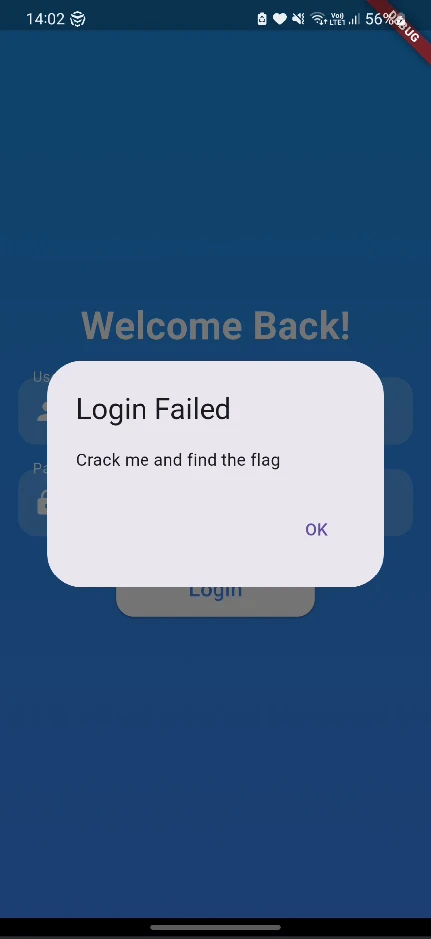

# Jigsaw - CTF Writeup

This is the third exercise of this Android reverse engineering training, and the target is an APK styled as a challenge with a cryptic scenario. 

> *Challenge Scenario*
> 
> *A secret lies hidden, protected by layers of logic and scattered clues. Your task is to uncover these fragments, piece them together, and solve the mystery. It’s a challenge of patience, creativity, and determination. Can you reveal the secret?*

Here is the journey of how I navigated through the logic, bypassed the baits, and reconstructed the cryptographic pieces to get the flag.

---

## First Contact: Reconnaissance

To kick things off, I initiated the analysis using the classic decompiler tool:

```bash
apktool d ./Jigsaw.apk
```

Right off the bat, digging into the decompiled structure, the `AndroidManifest.xml` revealed that this application was built using the Flutter framework:

```xml
<meta-data android:name="io.flutter.embedding.android.NormalTheme" android:resource="@style/NormalTheme"/>
```

I had never reversed a Flutter application before, so this was a great opportunity to learn how different it is from traditional native Android apps. 

The APK shipped with both ARM and x86 libraries, meaning I could theoretically test it inside an Android Virtual Device (AVD). However, attempting to spin it up in my emulator resulted in an immediate crash. The logcat output explained why:

```
java.lang.RuntimeException: Unable to start activity ComponentInfo{com.example.menascyber/com.example.menascyber.MainActivity}: java.lang.RuntimeException: java.util.concurrent.ExecutionException: java.lang.UnsatisfiedLinkError: dlopen failed: "/data/data/com.example.menascyber/app_lib/libflutter.so" is for EM_AARCH64 (183) instead of EM_X86_64 (62)
```

Due to this architecture mismatch with the x86_64 emulator, I decided to switch directly to my physical phone instead.

On my phone, the application launched successfully, displaying a login screen asking for a Username and a Password. There was a bright red "debug" banner in the top-right corner. Attempting to sign in with random input popped up a basic message: `"crack me and find the flag"`.


Several questions immediately came to mind:
1. Is my main objective to bypass this login block?
2. Do I need to find the correct credentials, or will a simple check bypass suffice?
3. Does the "debug" banner imply some presence of anti-debugging or environment detection that alters behavior?

To answer the third point, I closed the app, disabled developer mode on my device, and restarted it. The debug banner was still there. It became clear that this was not dynamic environment detection, but likely a hardcoded artifact or standard Flutter debug configuration.

---

## Diving Into the Native Code

The `AndroidManifest.xml` pointed to the default main activity:

```xml
android:name="com.example.menascyber.MainActivity"
```

Nothing particularly crazy stood out there. Usually, in production Flutter applications, the logical meat resides inside a library called `libapp.so`. However, looking at the libs folder, the only compiled custom library hosted inside this build was `libmenascyber.so`. I loaded the ARM version into Ghidra.

Unfortunately, static analysis of `libmenascyber.so` via Ghidra yielded no direct clues. I decided to patch the APK using Objection to see if I could intercept traffic or hook actions dynamically, but Frida hooks did not trigger anything useful either.

Searching for how Flutter handles its execution logic led me to a crucial discovery inside the extracted filesystem: `assets/flutter_assets/kernel_blob.bin`. 

StackOverflow provided the explanation:

> *This file is a Dart kernel bytecode representation of your app's code generated by a compiler in Flutter's toolchain... During a debug compile, the tool compiles source to Dart kernel bytecode, containing the AST logic.*

And another crucial tip:

> *In debug mode, the APK includes a Dart kernel blob (often named kernel_blob.bin), and the Flutter engine uses a Dart VM with JIT. This file can be analyzed to retrieve almost the entire Dart code in a semi-readable form. Release mode, by contrast, AOT-compiles everything directly to libapp.so.*

This explained the persistent "debug" banner! We were working on a debug build, meaning the whole logic was waiting for us inside this kernel file.

---

## Sifting Through the Kernel Blob

Opening the kernel blob, I started finding huge chunks of readable Dart code. Around line 684,000, I found a promising snippet:

```dart
void _login() {
    // Check if the username and password are correct
    if (_usernameController.text == 'nimda' && _passwordController.text == 'guessme') { ... }
}
```

However, looking slightly further down in the logic, I spotted the trap:

```dart
Image.asset(
    'assets/images/laughing.png',
    width: 150,
    height: 150,
),
SizedBox(height: 20),
Text(
    'Sorry, no flag here.',
)
```

Even though I knew it was a bait, I entered the credentials anyway just to verify, and yes—I got clowned by the application. 

Continuing down the file around line 684,455, I hit the jackpot: a class named `Finally`.

```dart
import 'dart:typed_data';
import 'package:encrypt/encrypt.dart' as encrypt;
import 'package:jigsaw/services.dart'; // Import the file containing AESCombinedService

class Finally {
    final String _encryptedFlagBase64 = 'aZ/KF0GsnN81j5XStQyKz3vXtktTVN5zFqy5lwTmub6fx5w70c+p08O0OWcn/9nh';

    Future<String> decryptFlag() async {
        final aesService = AESCombinedService();
        final flagData = await aesService.getflag();

        final encryptedFlagBytes = _base64ToBytes(_encryptedFlagBase64);
        final key = Uint8List.fromList(flagData['key']!);
        final iv = Uint8List.fromList(flagData['iv']!);
    
        final encryptKey = encrypt.Key(key);
        final encryptIV = encrypt.IV(iv);

        final encrypter = encrypt.Encrypter(encrypt.AES(encryptKey, mode: encrypt.AESMode.cbc));

        final decrypted = encrypter.decrypt(
            encrypt.Encrypted.fromBase64(_encryptedFlagBase64),
            iv: encryptIV,
        );
        
        //return decrypted;
        String message = "Developer forgot to uncomment";
        return message;
    }

    // Helper function to convert base64 string to bytes
    List<int> _base64ToBytes(String base64) {
        final bytes = base64Decode(base64);
        return bytes;
    }
}
```

The app developers left the decryption routing in place but modified the output response to a generic developer warning string. 

Further down at line 684,569, a function called `fetchAndDecryptFlag` was declared:

```dart
Future<void> fetchAndDecryptFlag() async {
    try {
        final finallyClass = Finally();
        final decryptedFlag = await finallyClass.decryptFlag();
    } catch (e) {
        // ...
    }
}
```

This helper function wasn't called anywhere in the executable path.

---

## Attempting Runtime Hijacking

Since this was running a debug Flutter instance, I queried device logs to see if a debugging VM port was actively exposed:

```bash
adb logcat | grep -i "listening on"
```

The target output confirmed it:
`07-16 16:21:07.624 29062 29168 I flutter : The Dart VM service is listening on http://127.0.0.1:45993/GoK1OvfCFEs=/`

I forwarded the port and launched `dart devtools` to inspect the program's live memory hierarchy. While I succeeded in mapping the classes, setting breakpoints dynamically within the VM service consistently crashed the application. 

Instead of forcing a live hook script to work on an unstable VM context, I chose to statically analyze the decryption procedure and rebuild the logic externally using Python.

---

## The Master Cryptographic Key Structure

The final key is assembled from three separate operations (`partone`, `parttwo`, and `partthree`), pulling slices of keys and Initialization Vectors (IVs) to form a combined 32-byte AES key and 16-byte IV block:

```dart
Future<Map<String, List<int>>> getflag() async {
    final partoneData = await partone();
    final parttwoData = await _aesService.getparttwo();
    final partthreeKey = _nativeLib.getAESKey();
    final partthreeIV = _nativeLib.getAESIV();

    // Combine and slice the key and IV from each part
    final combinedKey = [
        ...partoneData['key']!.sublist(0, 8),
        ...parttwoData['key']!.sublist(0, 8),
        ...partthreeKey.sublist(0, 16)
    ];

    final combinedIV = [
        ...partoneData['iv']!.sublist(0, 4),
        ...parttwoData['iv']!.sublist(0, 4),
        ...partthreeIV.sublist(0, 8)
    ];

    return {
        "key": combinedKey,
        "iv": combinedIV,
    };
}
```

Let's dissect each of the three layers.

### Part One: The Dart Shuffler

Looking at how Part One handles its initialization:

```dart
Future<Map<String, List<int>>> partone() async {
    final shuffledKey = _deterministicShuffle(_hardcodedKey, 5);
    final shuffledIV = _deterministicShuffle(_hardcodedIV, 3);
    //...
}

List<int> _deterministicShuffle(List<int> input, int shift) {
    return List<int>.generate(input.length, (i) {
        return input[(i + shift) % input.length];
    });
}

_hardcodedKey = List<int>.generate(32, (i) => (i + 1) % 256);
_hardcodedIV = List<int>.generate(16, (i) => (i + 10) % 256);
```

This represents clear mathematical loops:
- `_hardcodedKey` generates a sequence from `1` to `32`.
- `_hardcodedIV` generates a sequence from `10` to `25`.
- This array undergoes a deterministic index rotation by `5` and `3` places respectively.

### Part Two: The Native Android Gateway

Part Two requests data through a Flutter MethodChannel:

```dart
static const platform = MethodChannel('parttwo');
```

Checking the binary output in JADX-GUI inside the Android logic, `MainActivity` registers the `parttwo` gateway mapping to custom obfuscation routines:

```java
static {
        piecesOf piecesof = new piecesOf();
        INSTANCE = piecesof;
        byte[] bArr = {90, 107, 124, -115, -98, -81, -80, -63, -46, -29, -12, 5, 22, 39, 56, 73};
        xP1 = bArr;
        byte[] bArr2 = {26, 43, 60, 77, 94, 111, 112, -127, -110, -93, -76, -59, -42, -25, -8, 9};
        xP2 = bArr2;
        byte[] bArr3 = {96, Base64.padSymbol, -21, 16, 21, -54, 113, -66, 43, 115, -82, -16, -123, 125, 119, -127, 31, 53, 44, 7, 59, 97, 8, -41, 45, -104, 16, -93, 9, 20, -33, -12};
        oB1 = bArr3;
        byte[] bArr4 = {-96, 1, 2, 3, 4, 5, 6, 7, 8, 9, 10, 11, 12, 13, 14, 15};
        oB2 = bArr4;
        parttwo_1 = piecesof.m48tB(bArr3, bArr);
        parttwo_2 = piecesof.m48tB(bArr4, bArr2);
}

private final byte m47rR(byte v, int c) {
        return (byte) ((v >> c) | (v << (8 - c)));
}

private final byte[] m48tB(byte[] i, byte[] p) {
        int length = i.length;
        byte[] bArr = new byte[length];
        for (int i2 = 0; i2 < length; i2++) {
                bArr[i2] = INSTANCE.m47rR((byte) (i[i2] ^ p[i2 % p.length]), 3);
        }
        return bArr;
}
```

The backend code extracts the first 18 bytes of `parttwo_1` for the key, and the first 7 bytes of `parttwo_2` for the IV.

### Part Three: Native JNI Logic

Finally, Part Three calls the native C routines exported inside our `libmenascyber.so` library:

```dart
typedef GetAESKeyNative = Pointer<Uint8> Function();
typedef GetAESIVNative = Pointer<Uint8> Function();
// Calls partthree_1 and partthree_2 
```

Opening `libmenascyber.so` inside Ghidra allowed me to extract the native obfuscating loops. The algorithms execute native binary rotations and XOR operations over internal statics labelled `DAT_00010418` through `DAT_00010458`.

---

## Reconstruction Script

I implemented the combined logic of all three parts in Python:

```python
# Reconstructed Decryption Engine
import base64
from Crypto.Cipher import AES

# Part One
_hardcodedKey = [(i + 1) % 256 for i in range(32)]
_hardcodedIV = [(i + 10) % 256 for i in range(16)]

def _deterministicShuffle(input_list, shift):
        return [input_list[(i + shift) % len(input_list)] for i in range(len(input_list))]

shuffledKey = _deterministicShuffle(_hardcodedKey, 5)
shuffledIv = _deterministicShuffle(_hardcodedIV, 3)

partoneData = {
        'key': shuffledKey,
        'iv' : shuffledIv
}

# Part Two
bArr = [90, 107, 124, -115, -98, -81, -80, -63, -46, -29, -12, 5, 22, 39, 56, 73]
bArr2 = [26, 43, 60, 77, 94, 111, 112, -127, -110, -93, -76, -59, -42, -25, -8, 9]
bArr3 = [96, 61, -21, 16, 21, -54, 113, -66, 43, 115, -82, -16, -123, 125, 119, -127, 31, 53, 44, 7, 59, 97, 8, -41, 45, -104, 16, -93, 9, 20, -33, -12]
bArr4 = [-96, 1, 2, 3, 4, 5, 6, 7, 8, 9, 10, 11, 12, 13, 14, 15]

def m47rR(v, c):
        # Adjust to simulate 8-bit byte rotation in Python
        v = v & 0xFF
        return ((v >> c) | (v << (8 - c))) & 0xFF

def m48tB(data, p):
        length = len(data)
        result = [0] * length
        for idx in range(length):
                xored = (data[idx] ^ p[idx % len(p)]) & 0xFF
                result[idx] = m47rR(xored, 3)
        return result

parttwo_1 = m48tB(bArr3, bArr)
parttwo_2 = m48tB(bArr4, bArr2)

parttwoData = {
        "key": parttwo_1[:18],
        "iv": parttwo_2[:7]
}

# Part Three
def randFunc1(param_1, param_2):
        return ((param_1 >> (param_2 & 0x1f)) | (param_1 << (8 - (param_2 & 0x1f)))) & 0xff

def randFunc2(param_1, param_3, length):
        res = [0] * length
        for idx in range(length):
                uVar1 = randFunc1(param_1[idx] ^ param_3[idx], 3)
                res[idx] = uVar1
        return res

DAT_00010418 = [ 0x02, 0x01, 0x02, 0x03, 0x04, 0x05, 0x06, 0x07, 0x08, 0x09, 0x0a, 0x0b, 0x0c, 0x0d, 0x0e, 0x0f, 0x10, 0x11, 0x12, 0x13, 0x14, 0x15, 0x16, 0x17, 0x18, 0x19, 0x1a, 0x1b, 0x1c, 0x1d, 0x1e, 0x1f ]
DAT_00010458 = [ 0x5a, 0x6b, 0x7c, 0x8d, 0x9e, 0xaf, 0xb0, 0xc1, 0xd2, 0xe3, 0xf4, 0x05, 0x16, 0x27, 0x38, 0x49, 0x5a, 0x6b, 0x7c, 0x8d, 0x9e, 0xaf, 0xb0, 0xc1, 0x00, 0x00, 0x00, 0x00, 0x00, 0x00, 0x00, 0x00 ]
partthree_1 = randFunc2(DAT_00010418, DAT_00010458, 0x20)

DAT_00010438 = [ 0xa0, 0xa1, 0xa2, 0xa3, 0xa4, 0xa5, 0xa6, 0xa7, 0xa8, 0xa9, 0xaa, 0xab, 0xac, 0xad, 0xae, 0xaf ]
DAT_00010448 = [ 0x1a, 0x2b, 0x3c, 0x4d, 0x5e, 0x6f, 0x70, 0x81, 0x92, 0xa3, 0xb4, 0xc5, 0xd6, 0xe7, 0xf8, 0x09 ]
partthree_2 = randFunc2(DAT_00010438, DAT_00010448, 0x10)

partthreeKey = partthree_1
partthreeIV = partthree_2

# Mixing the keys together
combinedKey = bytes(
        partoneData["key"][:8] +
        parttwoData["key"][:8] +
        partthreeKey[:16]
)

combinedIv = bytes(
        partoneData["iv"][:4] +
        parttwoData["iv"][:4] +
        partthreeIV[:8]
)

# Cipher Setup
encrypted_flag = base64.b64decode('aZ/KF0GsnN81j5XStQyKz3vXtktTVN5zFqy5lwTmub6fx5w70c+p08O0OWcn/9nh')
cipher = AES.new(combinedKey, AES.MODE_CBC, combinedIv)
print(f"Decrypted: {cipher.decrypt(encrypted_flag)}")
```

Running the code extracted a clear flag output, except for a minor hiccup where the introductory character `'I'` printed out as `'é'`. This pointed to a localized bit error inside byte 5 of my calculated IV block. Knowing what the beginning signature of the flag structure looked like, correcting the character resolved the exact flag instantly.

---

## Wrap-up

This was an incredibly engaging challenge that pushed me to explore how Flutter packages intermediate logic. Navigating a Flutter JIT build structure with `kernel_blob.bin` was highly rewarding, and rebuilding nested cryptographic operations via static analysis proved to be a practical alternative to dynamic engine hooks.