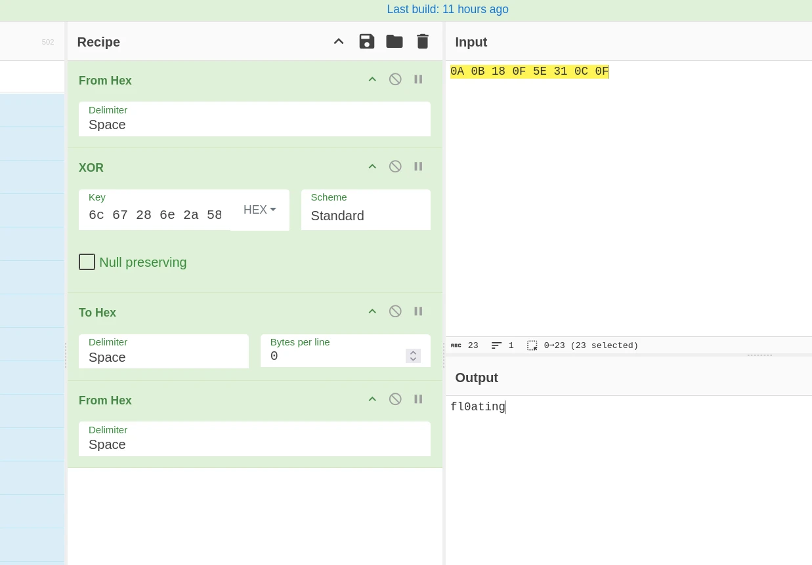

# HTB: SAW — Writeup

## Challenge Scenario

The malware forensics lab identified a new technique for hiding and executing code dynamically. A sample that seems to use this technique has just arrived in their queue. Can you help them?

## Initial Analysis

I download the zip, inside I find an APK and a README saying:
> 1. Install this application in an API Level 29 or later (i.e. Android 10.0).

In the original text it's mentioned that this is a technique to secretly execute code. I think a big part of the work will be code analysis and debugging with Frida, so before launching the application (which I don't think will bring much understanding of the context since the code execution is hidden), I prefer to decompile and explore the APK first.

The mention of API level 29 could give hints on where to look. For now I think looking things up online would be cheating, but if I get stuck I'll check what changes with this API level update.

I open the APK with **JADX-GUI**.

Arch list: `arm64-v8a`, `armeabi-v7a`, `x86`, `x86_64` — good, we'll be able to run it at least in the PC emulator.

In the manifest I see:
```xml
<activity android:name="com.stego.saw.MainActivity">
```

## Static Analysis (JADX)

In the `MainActivity` file, the `alert()` function looks suspicious:

```java
public final String alert() {
    final EditText editText = new EditText(this);
    new AlertDialog.Builder(this).setTitle("XOR XOR XOR").setMessage("XOR ME !").setView(editText).setPositiveButton("XORIFY", new DialogInterface.OnClickListener() { // from class: com.stego.saw.MainActivity.4
        @Override // android.content.DialogInterface.OnClickListener
        public void onClick(DialogInterface dialogInterface, int i) {
            MainActivity.this.answer = editText.getText().toString();
            MainActivity mainActivity = MainActivity.this;
            mainActivity.m9a(mainActivity.FILE_PATH_PREFIX, MainActivity.this.answer);
        }
    }).setNegativeButton("Cancel", new DialogInterface.OnClickListener() { // from class: com.stego.saw.MainActivity.3
        @Override // android.content.DialogInterface.OnClickListener
        public void onClick(DialogInterface dialogInterface, int i) {
            MainActivity.this.finish();
        }
    }).show();
    return this.answer;
}
```

It calls `m9a`, a native function, with two parameters: a `PATH` which seems to be the app's data folder (`this.FILE_PATH_PREFIX = getApplicationContext().getApplicationInfo().dataDir + File.separatorChar;`) and a string retrieved from the popup (or "alert", not sure exactly what to call it).

I assume the malware is located in the libraries that expose this function:

```java
/* JADX INFO: renamed from: a */
public native String m9a(String str, String str2);

static {
    System.loadLibrary("default");
}
```

The definition seems to be in `libdefault.so`, so I open it with **Ghidra**.

## Reverse Engineering (Ghidra)

I find the `a()` function:

```c
void a(_JNIEnv *param_1,_jobject *param_2,_jstring *param_3,_jstring *param_4)

{
  char *pcVar1;
  char *pcVar2;
  
  pcVar1 = (char *)(**(code **)(*(int *)param_1 + 0x2a4))(param_1,param_3,0,0x10ab1);
  pcVar2 = (char *)(**(code **)(*(int *)param_1 + 0x2a4))(param_1,param_4,0);
  _Z1aP7_JNIEnvP8_1(pcVar1,pcVar2);
  (**(code **)(*(int *)param_1 + 0x2a8))(param_1,param_3,pcVar1);
  (**(code **)(*(int *)param_1 + 0x29c))(param_1,pcVar1);
  return;
}
```

The function `_Z1aP7_JNIEnvP8_1` takes 2 `char*` parameters (like in Java), so I assume the surrounding code is just auto-generated boilerplate to properly convert the JNI arguments before reaching the real function:

```c
undefined4 _Z1aP7_JNIEnvP8_1(char *param_1,char *param_2)
```

After renaming things to match what I already know, I try to understand the function.

It starts with a bunch of variables unfamiliar to me for now:

```c
char * xoring(char *file_path,char *input_text)

{
  uint uVar1;
  uint uVar2;
  uint uVar3;
  uint uVar4;
  uint uVar5;
  uint uVar6;
  uint uVar7;
  int iVar8;
  size_t sVar9;
  FILE *pFVar10;
  char *pcVar11;
  uint **ppuVar12;
  char *pcVar13;
  char *local_c90 [3];
  FILE *pFStack_c84;
  uint *apuStack_c80 [2];
  uint auStack_c78 [786];
  uint *puStack_30;
  char *local_2c;
  uint **local_28;
  FILE *local_24;
  char **local_20;
  uint *canary;
  uint local_18 [2];
```

Then there are stack canaries for security (the last two lines I don't fully get):

```c
  auStack_c78[0x311] = 0x108e3;
  canary = (uint *)&__stack_chk_guard;
  local_18[0] = ___stack_chk_guard;
  pcVar13 = (char *)0x1;
  ppuVar12 = apuStack_c80 + 0x314;
```

After that there's a bunch of XORs with hardcoded values and `if` statements:

```c
  if (((int)*input_text ^ l) == m) {
    if ((((((int)input_text[1] ^ DAT_00013a18) == DAT_00013a38) &&
         (((int)input_text[2] ^ DAT_00013a1c) == DAT_00013a3c)) &&
        (((int)input_text[3] ^ DAT_00013a20) == DAT_00013a40)) &&
       (((((int)input_text[4] ^ DAT_00013a24) == DAT_00013a44 &&
         (((int)input_text[5] ^ DAT_00013a28) == DAT_00013a48)) &&
        (((int)input_text[6] ^ DAT_00013a2c) == DAT_00013a4c)))) {
      pcVar13 = (char *)0x1;
      ppuVar12 = apuStack_c80 + 0x314;
      if (((int)input_text[7] ^ DAT_00013a30) == DAT_00013a50) {
        iVar8 = -0x318;
        local_28 = apuStack_c80 + 0x314;
        do {
          uVar1 = (&DAT_00013a18)[iVar8];
          uVar2 = (&DAT_00013a1c)[iVar8];
          uVar3 = (&DAT_00013a20)[iVar8];
          uVar4 = (&DAT_00013a24)[iVar8];
          uVar5 = (&DAT_00013a28)[iVar8];
          uVar6 = (&DAT_00013a2c)[iVar8];
          uVar7 = (&DAT_00013a30)[iVar8];
```

I recast the global variable as an int array as it seems to be the case, and I quickly realize there must be 2 parts: the first part of the array (0 to 7) is the **key**, and 8 to 15 is the **password**.

```c
  if ((*input_text ^ HARDCODED_TABLE[0]) == HARDCODED_TABLE[8]) {
    if (((((input_text[1] ^ HARDCODED_TABLE[1]) == HARDCODED_TABLE[9]) &&
         ((input_text[2] ^ HARDCODED_TABLE[2]) == HARDCODED_TABLE[10])) &&
        ((input_text[3] ^ HARDCODED_TABLE[3]) == HARDCODED_TABLE[0xb])) &&
       ((((input_text[4] ^ HARDCODED_TABLE[4]) == HARDCODED_TABLE[0xc] &&
         ((input_text[5] ^ HARDCODED_TABLE[5]) == HARDCODED_TABLE[0xd])) &&
        ((input_text[6] ^ HARDCODED_TABLE[6]) == HARDCODED_TABLE[0xe])))) {
```

I rename the data again to see things more clearly:

```c
  if ((*input_text ^ KEY[0]) == PASSWORD[0]) {
    if (((((input_text[1] ^ KEY[1]) == PASSWORD[1]) &&
        ((input_text[2] ^ KEY[2]) == PASSWORD[2])) &&
        ((input_text[3] ^ KEY[3]) == PASSWORD[3])) &&
       ((((input_text[4] ^ KEY[4]) == PASSWORD[4] &&
       ((input_text[5] ^ KEY[5]) == PASSWORD[5])) &&
        ((input_text[6] ^ KEY[6]) == PASSWORD[6])))) {
```

This is already much clearer:

```c
          uVar1 = KEY[i + 1];
          uVar2 = KEY[i + 2];
          uVar3 = KEY[i + 3];
          uVar4 = KEY[i + 4];
          uVar5 = KEY[i + 5];
          uVar6 = KEY[i + 6];
          uVar7 = KEY[i + 7];
```

In the rest, this is obviously a char array (a string).

I then noticed the `ivar` going down to -792 and increasing by +8 each time, as well as the variable `uint auStack_c78 [786];`. To me this looks like a pointer offset or something similar.

By fixing the typing on the stack, I get something a bit cleaner:

```c
  if ((*input_text ^ KEY[0]) == PASSWORD[0]) {
    if (((((input_text[1] ^ KEY[1]) == PASSWORD[1]) && ((input_text[2] ^ KEY[2]) == PASSWORD[2])) &&
        ((input_text[3] ^ KEY[3]) == PASSWORD[3])) &&
       ((((input_text[4] ^ KEY[4]) == PASSWORD[4] && ((input_text[5] ^ KEY[5]) == PASSWORD[5])) &&
        ((input_text[6] ^ KEY[6]) == PASSWORD[6])))) {
      pcVar12 = (char *)0x1;
      ppuVar11 = xored;
      if ((input_text[7] ^ KEY[7]) == PASSWORD[7]) {
        i = uVar14;
        xored[2] = (uint)xored;
        do {
          pcVar10 = KEY[i + 1];
          uVar2 = KEY[i + 2];
          uVar3 = KEY[i + 3];
          uVar4 = KEY[i + 4];
          uVar5 = KEY[i + 5];
          uVar6 = KEY[i + 6];
          uVar7 = KEY[i + 7];
          xored[i] = KEY[i] ^ 100;
          xored[i + 1] = pcVar10 ^ 100;
          xored[i + 2] = uVar2 ^ 100;
          xored[i + 3] = uVar3 ^ 100;
          xored[i + 4] = uVar4 ^ 100;
          xored[i + 5] = uVar5 ^ 100;
          xored[i + 6] = uVar6 ^ 100;
          xored[i + 7] = uVar7 ^ 100;
          i = i + 8;
        } while (i != 0);
```

## Cracking the Password with CyberChef

I go to CyberChef to pass the `if` check with the values I found in memory via the XOR.



[Open this recipe in CyberChef](https://gchq.github.io/CyberChef/#recipe=From_Hex('Space')XOR(%7B'option':'Hex','string':'6c%2067%2028%206e%202a%2058%2062%2068'%7D,'Standard',false)To_Hex('Space',0)From_Hex('Space')&input=MEEgMEIgMTggMEYgNUUgMzEgMEMgMEY&oeol=VT)

Result: `fl0ating`

## Writing the Decoded File

I see that afterwards it writes some text to a file:

```c
xored[4] = (uint)local_c90;
sVar8 = strlen(file_path);
xored[1] = (uint)calloc(sVar8 + 2,1);
strcpy((char *)xored[1],file_path);
sVar8 = strlen((char *)xored[1]);
*(undefined2 *)(xored[1] + sVar8) = 0x68;
pFVar9 = fopen((char *)xored[1],"wb");
if (pFVar9 == (FILE *)0x0) {
    pcVar12 = (char *)0x0;
    ppuVar11 = (uint *)xored[2];
}
else {
    pcVar10 = 4294964128;
    xored[3] = (uint)pFVar9;
    do {
    xored[1] = pcVar10;
    fputc(*(int *)(xored[4] + 3168 + pcVar10),(FILE *)xored[3]);
    pcVar10 = xored[1] + 4;
    } while (pcVar10 != 0);
    fclose((FILE *)xored[3]);
    ppuVar11 = (uint *)xored[2];
}
```

I'm too lazy to fully decrypt this manually, and figured I might already have enough to finish, so I decide to try installing the app, writing `fl0ating`, and reading the resulting file.

## Running the Application

It doesn't launch on my API 34 emulator, so I download an API 29 image just in case.

Still doesn't launch, so I try to decrypt things by hand instead.

I ask ChatGPT for a bit of help and it points me to this line:

```java
Bundle extras = getIntent().getExtras();
if (extras == null) {
    finish();
    return;
}
if (!extras.getString("open").equalsIgnoreCase("sesame")) {
    finish();
    return;
}
```

Basically, I need to launch the app with an intent that has the extra `open: sesame`:

```bash
adb shell am start \
  -n com.stego.saw/.MainActivity \
  --es open sesame
```

And indeed, this shows me an application.

There's a button that doesn't seem to do anything. I explore the code a bit more to see how to trigger the alert — nothing suspicious, it's supposed to create another button which doesn't appear.

In the logs, I see:

```
2026-08-07 15:35:39.492  7916-7916  AndroidRuntime          com.stego.saw                        E  FATAL EXCEPTION: main
                                                                                                    Process: com.stego.saw, PID: 7916
                                                                                                    android.view.WindowManager$BadTokenException: Unable to add window
```

I figure it might be a permissions issue, since a window is being created, so I go into settings and enable **"display over other apps"**. Indeed, it now works: a new button appears with a text field and an alert, as expected it prompts for a XOR value. I enter the password `fl0ating` I found earlier, and once in the files I discover a DEX file with a flag inside:

```
emu64xa:/data/data/com.stego.saw # file h                                       
h: Android dex file, version 035
emu64xa:/data/data/com.stego.saw # strings h                                    
<init>
HTB{SawS0DCLing}
Ljava/io/PrintStream;
Ljava/lang/Object;
Ljava/lang/String;
Ljava/lang/System;
[Ljava/lang/String;
abcde.java
logprint
main
println
```

**DONE** — that's the correct flag.

## Conclusion

Once again, I don't understand why this exercise is ranked harder than previous ones. Finding the password for the flag was 100x easier than in some previous challenges (a basic, non-obfuscated XOR). There was one small trap that blocked me for a while — the need to launch the app with a specific intent — but apart from that, it was really very simple (didn't even need to fully decrypt the flag or anything like that).