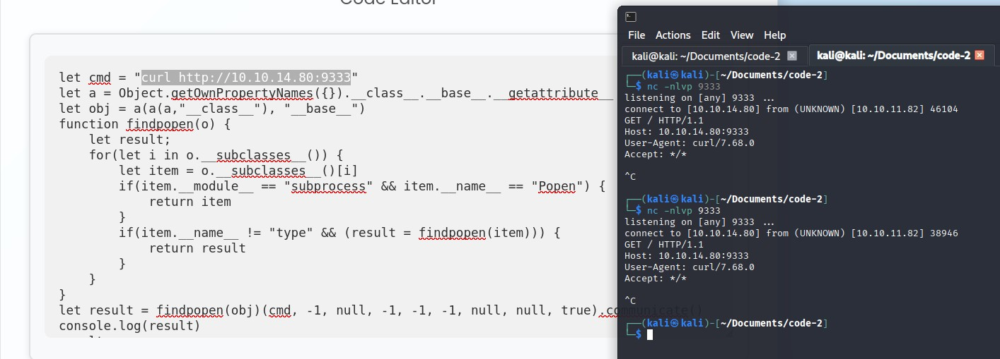
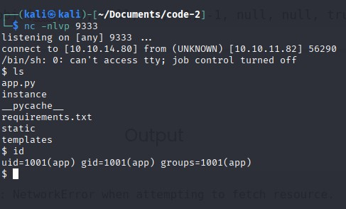
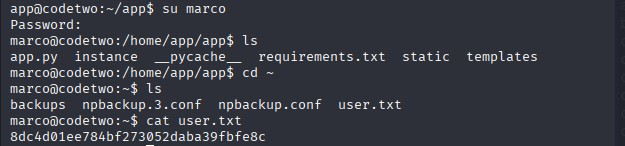
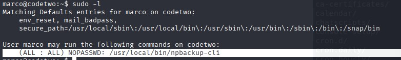
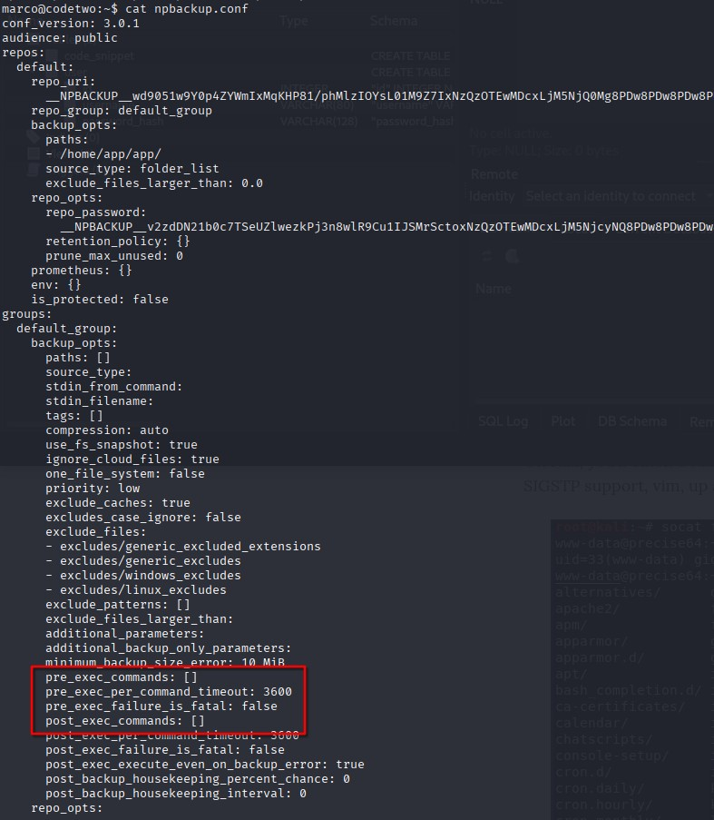
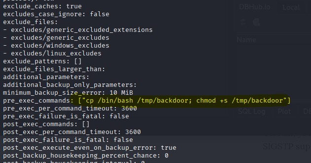
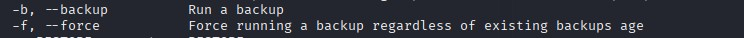
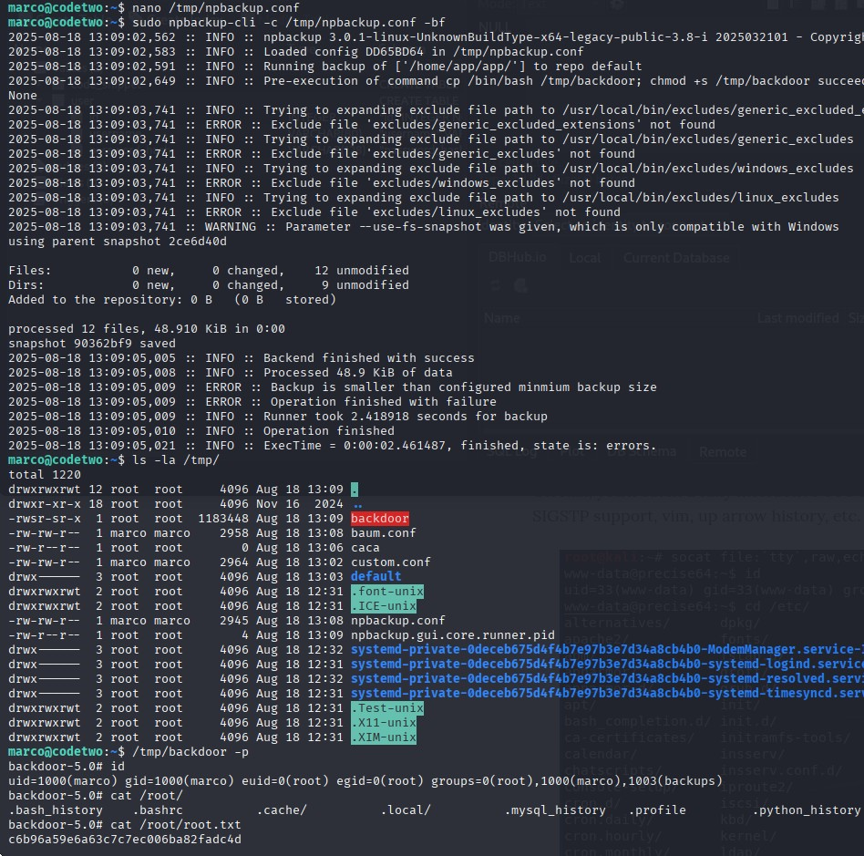

# Code_2 Writeup

Welcome to my writeup for the Code_2 box on HackTheBox. This was one of the simplest boxes I've ever done, but it was still a fun experience. It’s perfect for beginners, as it showcases the different steps and mindset needed to approach a CTF. Let’s dive into my journey.

---

## Initial Reconnaissance

Starting off, I ran `nmap` and found two open ports:  
- **22 (SSH)**  
- **8000/tcp (HTTP)** running **Gunicorn 20.0.4**.

The HTTP service caught my attention, and I discovered that the page’s source code was open source and available for download. While exploring the code, I stumbled upon a hardcoded key:  
```python
app.secret_key = 'S3cr3tK3yC0d3Tw0'
```

At first, I wasn’t sure if this was just a placeholder or an actual key. I decided to note it down for later investigation.

---

## Exploring the Codebase

Looking into the `requirements.txt` file, nothing stood out as vulnerable. However, at the very top of `app.py`, I noticed this line:  
```python
js2py.disable_pyimport()
```

Curious about its purpose, I researched it online and discovered a vulnerability that allows escaping the sandbox and executing Python code—even on the latest version of `js2py`. Initially, I hadn’t searched for CVEs, assuming the box used the latest version, but this proved to be a mistake. Lesson learned!

---

## Exploiting the Vulnerability

Using `js2py`, it’s possible to import Python packages and execute code. While `disable_pyimport()` is meant to prevent this, by exploring the object tree in JavaScript, I found functions that allowed code execution.

To test this, I used a simple `curl` command (often present on servers) along with a proof of concept (PoC). Success! Here’s the result:  


With this foothold, I established a reverse shell:  


---

## Upgrading the Shell

I upgraded my shell using `socat` to get a full TTY. This is a classic move in situations like this, as Python and `stty` methods can be frustrating. With a proper shell, I began exploring the database.

---

## Database Exploration

Inside the database, I found user credentials stored in MD5 hashes without any salt:  
```sql
sqlite> SELECT * FROM user; 
1|marco|649c9d65a206a75f5abe509fe128bce5
2|app|a97588c0e2fa3a024876339e27aeb42e
3|mc1|ce7af47187c49b266339d62229ab9b88
```

Using CrackStation, I quickly cracked the hash for Marco:  
- **marco:** `sweetangelbabylove`

The password was reused for the account, and I found the user flag in Marco’s home directory:  


---

## Privilege Escalation

Next, I checked for `sudo` permissions and discovered I could use a backup tool:  


Backup tools often allow executing commands before or after the backup process. Conveniently, I found a configuration file in the home directory. This file confirmed my suspicion—it allowed command execution during backups:  


---

## Crafting the Exploit

I modified the configuration file to include a command that creates a SUID bash shell:  


Using the `-bf` flags discovered in the tool’s help menu, I forced a backup and successfully created my backdoor:  


Finally, I accessed the root flag located at `/root/root.txt`:  


---

## Final Thoughts

This box was straightforward and didn’t teach me much, but it was a great opportunity to systematize my shell upgrade process using `socat`. The Python and `stty` method had been annoying me for a while.

Overall, Code_2 is perfect for beginners, as it walks through the essential steps and mindset required for CTF challenges. For me, it was a quick and enjoyable experience.

TERMINÉ!  