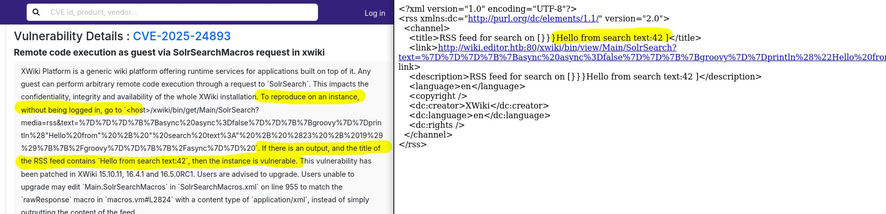
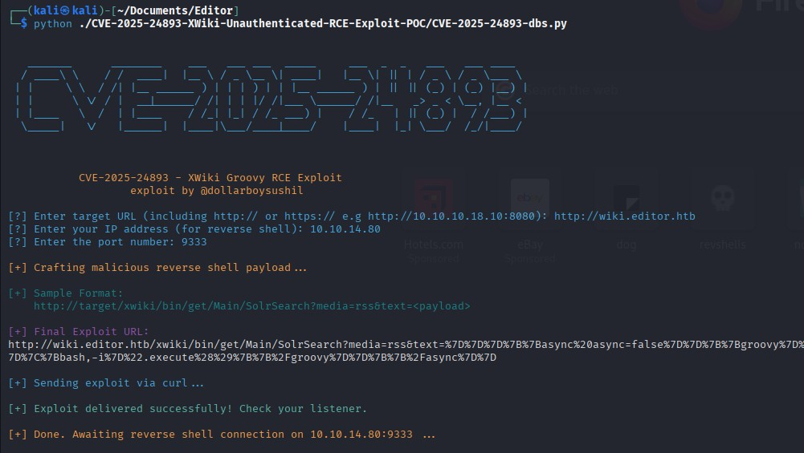
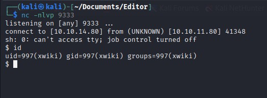
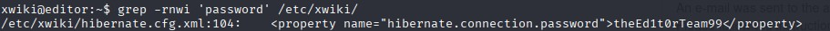
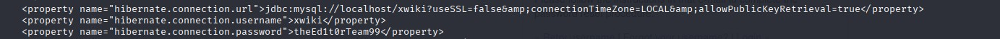
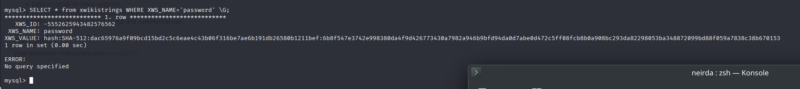
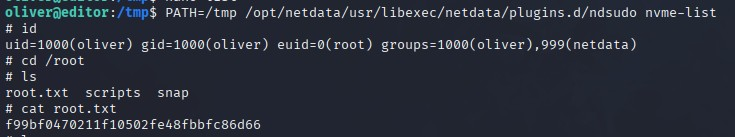

# HackTheBox Editor Writeup

[Here are the notes I took while solving](./walkthrough)

Welcome to my writeup for the HackTheBox "Editor" challenge! This was a fun and challenging box that tested my problem-solving skills and patience. Here's how I tackled it step by step.

---

## Initial Recon

The box had three open ports: 80, 8080, and 22. Starting with port 80, I quickly found a link on the homepage that led me to a subdomain hosting the program's documentation. The subdomain was running XWiki, and after some digging, I discovered a vulnerability: [CVE-2025-24893](https://www.cvedetails.com/cve/CVE-2025-24893/). 

I verified that the target was indeed vulnerable, as shown in the screenshot below:



---

## Exploiting XWiki

I found a proof-of-concept exploit on GitHub: [CVE-2025-24893-XWiki-Unauthenticated-RCE-Exploit-POC](https://github.com/dollarboysushil/CVE-2025-24893-XWiki-Unauthenticated-RCE-Exploit-POC). The exploit explained the vulnerability well—it was caused by improper sanitization of text that gets evaluated later. Running the PoC gave me a foothold on the server:

  


---

## Finding the Database Credentials

Once on the server, I spent a lot of time searching for the database user and password. Initially, I looked in `/lib/xwiki` and `/usr/lib/xwiki`, but found nothing. Eventually, I realized I should check `/etc/xwiki`, which made more sense for configuration files. Lesson learned: always use `find` to locate directories when you're stuck.

Inside `/etc/xwiki`, I ran a `grep` command to search for passwords and found this:



The password `theEd1t0rTeam99` seemed custom, not a default value. I checked the file to find the corresponding username:



With the credentials `xwiki:theEd1t0rTeam99`, I gained access to the database.

---

## Cracking the Hash

While exploring the database, I stumbled upon a hashed password in one of the tables:



The hash format was SHA-512, but after spending two days trying to crack it, I realized something odd. The password `theEd1t0rTeam99` worked for the user `oliver` over SSH, even though it didn't work with `su oliver`. I couldn't find an explanation online, but it was a valuable lesson: always test credentials with SSH as well as `su`.

With `oliver:theEd1t0rTeam99`, I captured the user flag.

---

## Privilege Escalation

While searching for privilege escalation vectors, I found a SUID binary:  
`/opt/netdata/usr/libexec/netdata/plugins.d/ndsudo`.

Researching this binary led me to [CVE-2024-32019](https://nvd.nist.gov/vuln/detail/CVE-2024-32019), which exploits how `ndsudo` executes binaries by searching for them in the `PATH` variable. A GitHub repository with a PoC was available: [CVE-2024-32019-POC](https://github.com/AzureADTrent/CVE-2024-32019-POC/blob/main/poc.c). However, I wanted to solve the challenge without relying on the PoC.

Running `ndsudo --help` revealed the commands it supported:

```
ndsudo

(C) Netdata Inc.

A helper to allow Netdata run privileged commands.

The following commands are supported:

- Command    : nvme-list
    Executables: nvme 
    Parameters : list --output-format=json
...
```

I noticed that the first parameter (`list`) could be a file executed by Python. Here's what I did:

1. Copied Python to a directory I controlled:  
     `cp /usr/bin/python3 /tmp/nvme`

2. Created a file named `list` with the following content:  
     ```python
     import os
     os.execl("/bin/sh", "sh", "-p")
     ```

3. Modified the `PATH` variable and executed the command:  
     ```bash
     PATH=/tmp:$PATH /opt/netdata/usr/libexec/netdata/plugins.d/ndsudo nvme-list
     ```

This gave me root access, and I captured the root flag located in `/root/root.txt`:


