# Writeup: HackTheBox Challenge

## Introduction

This challenge was a fun and straightforward exercise with a mix of CVE exploitation and manual tricks. The journey was filled with clues that guided me step by step, making the process enjoyable and satisfying. Here's how I approached and solved it.

---

## Initial Reconnaissance

Starting with `nmap`, I discovered two open ports: **80** (HTTP) and **22** (SSH). Naturally, I began by exploring the web page hosted on port 80. The site was built with **Next.js**, and there were plenty of hints suggesting that the software or libraries in use might be outdated. This led me to search for relevant CVEs, and I stumbled upon a recent one that caught my attention.

The CVE in question described a vulnerability in Next.js middleware authentication. Essentially, it allowed bypassing middleware by injecting a specific header. The vulnerability arises because Next.js uses this header internally to identify whether requests originate from middleware or the user. If the header is crafted correctly, Next.js assumes the request is part of an infinite middleware loop and skips middleware checks, including authentication.

The explanation on [this article](https://securitylabs.datadoghq.com/articles/nextjs-middleware-auth-bypass/) was incredibly helpful in understanding the vulnerability. Armed with this knowledge, I tested the exploit by adding the crafted header, and voilà! I bypassed the login middleware and accessed restricted pages.

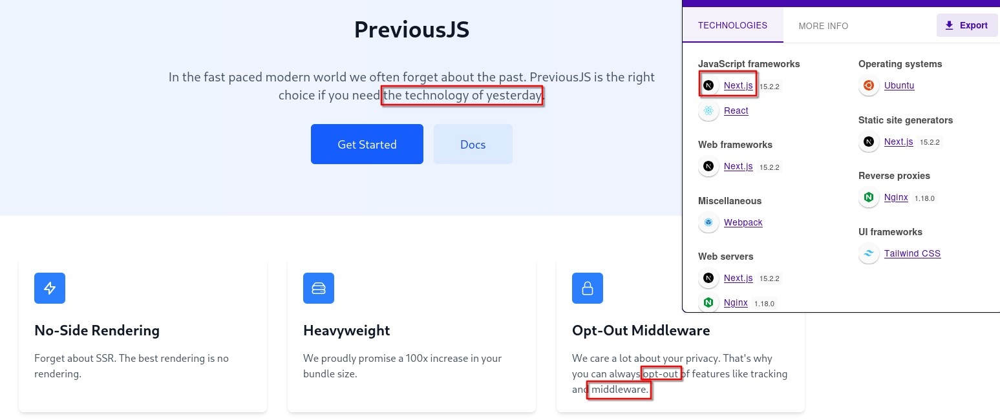  
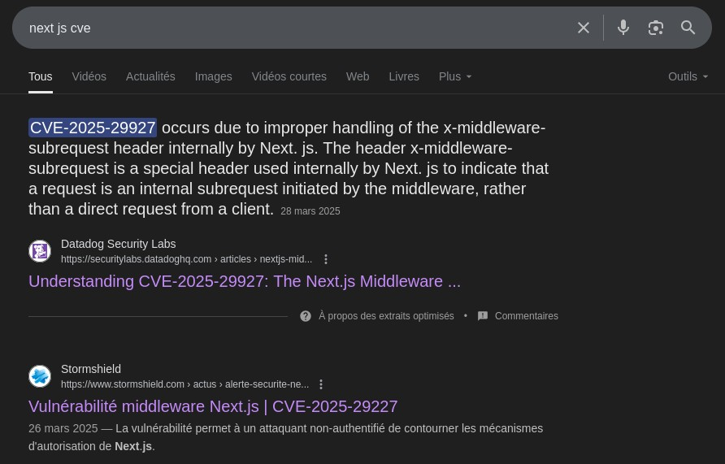  
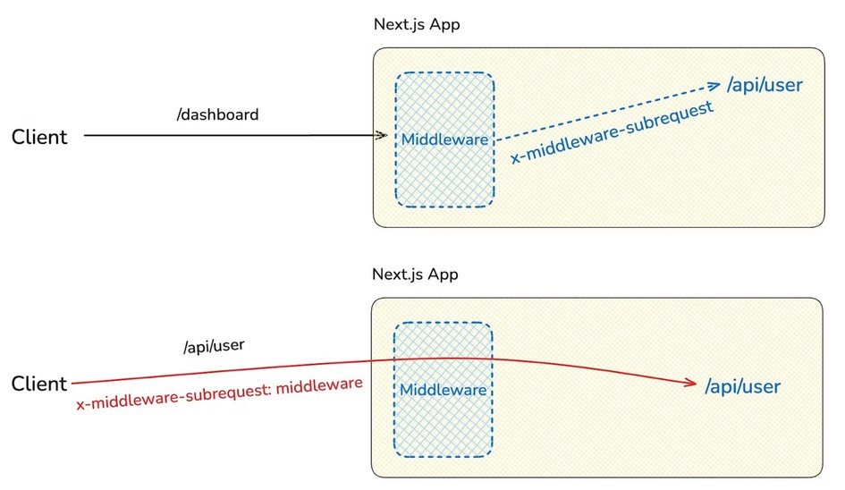  
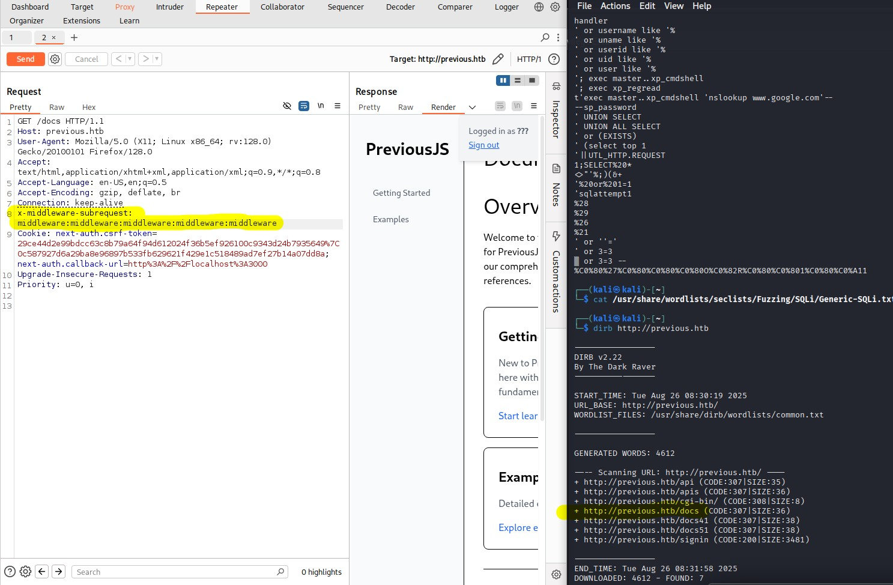  

To make things easier, I added a rule in **Burp Suite** to automatically inject the header into all my requests. This allowed me to navigate the site freely without worrying about authentication middleware.

---

## Discovering the LFI

While exploring the documentation, I stumbled upon a link that hinted at a potential **Local File Inclusion (LFI)** vulnerability. Testing confirmed my suspicion, and I was able to exploit the LFI to access various files on the server.

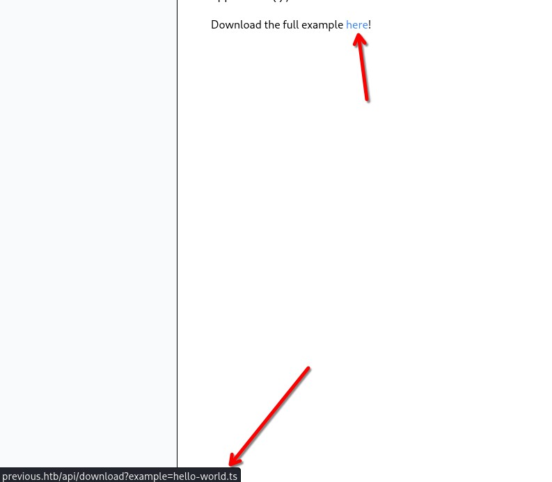  
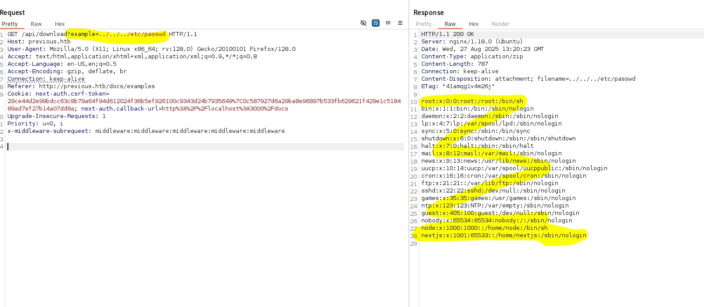  

Interestingly, I noticed that hitting a folder with the LFI returned a **500 Internal Server Error**, which turned out to be a useful indicator during my exploration. This detail saved me time and helped me focus on the right paths.

---

## Finding Credentials

My goal was to find credentials, but they weren’t in the `.env` file or environment variables that I had previously accessed via the LFI. This meant they were likely hardcoded somewhere. Using the LFI, I accessed the `.next` build folder and found a JSON file listing all the paths. One path related to authentication caught my eye.

Upon inspecting the file, I found hardcoded credentials:  
**jeremy:MyNameIsJeremyAndILovePancakes**  

This matched an email I had seen on the homepage. I used these credentials to attempt an SSH login as **jeremy**, and it worked! Inside Jeremy's home directory, I found the **user flag**.

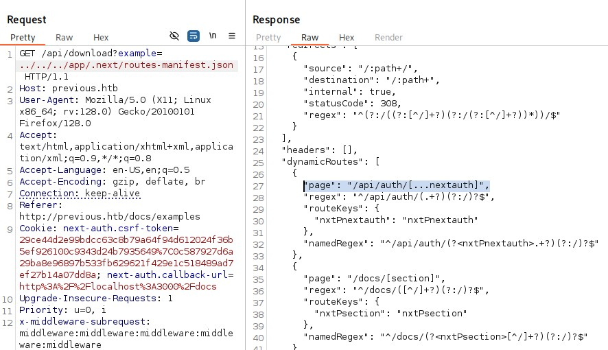  
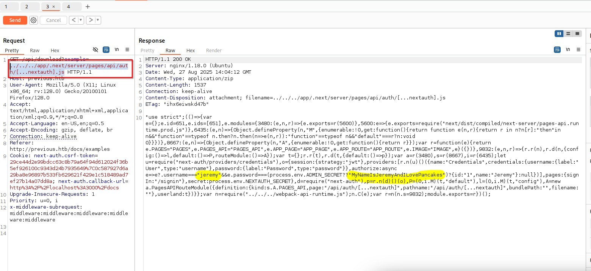  

---

## Privilege Escalation

While exploring Jeremy’s account, I discovered a **sudo** command for `terraform`. The command was restricted to `apply` and pointed to a non-writable directory. However, I found a `.terraformrc` file in Jeremy’s home directory that I could modify. This file contained a line referencing `override`, which seemed like a promising lead.

After a quick dive into the Terraform documentation, I learned that the `provider` setting determines where Terraform fetches its binaries. The `dev_overrides` option allows redirecting this search to a local file during development. This was the key to my privilege escalation.

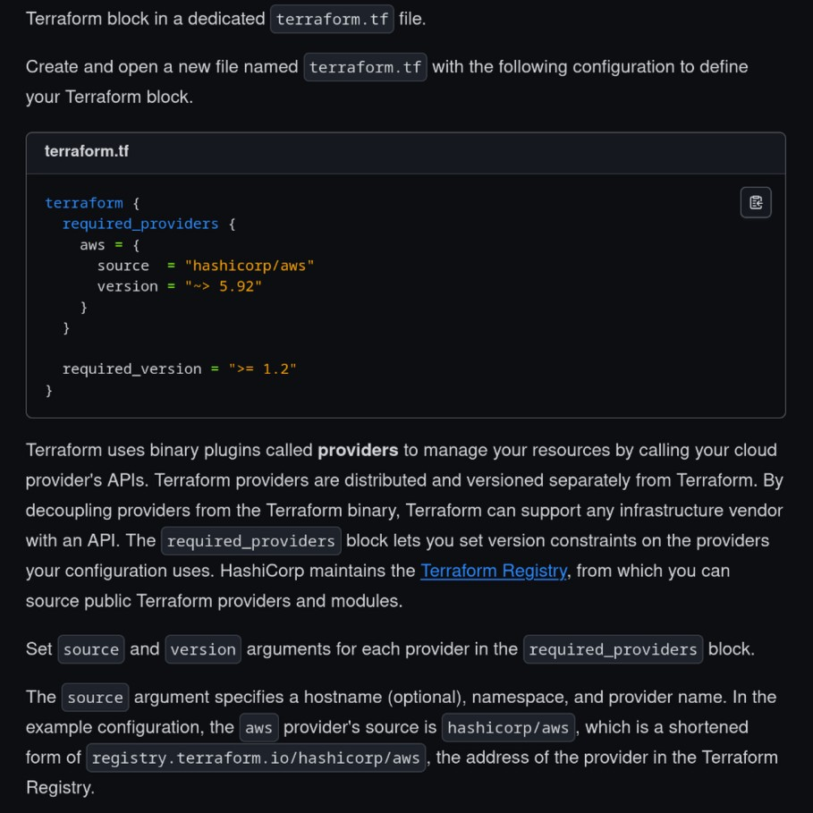  
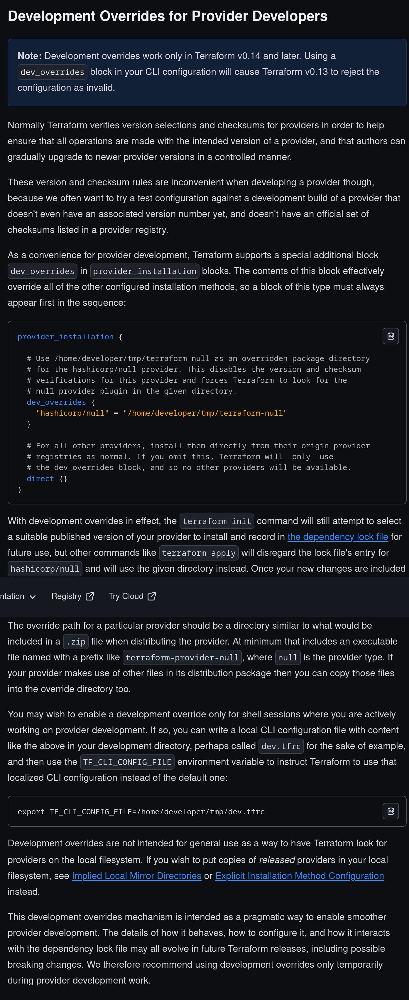  

I copied the existing Terraform directory to a location I controlled and edited the provider to execute a malicious binary that created a backdoor. I then updated the `.terraformrc` file to override the provider location to my modified directory.

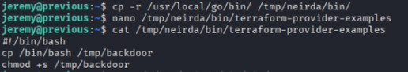  
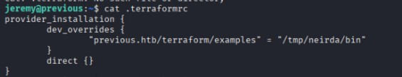  

When I executed the `terraform apply` command, it ran my malicious binary instead of the legitimate provider. Although an error message appeared, my backdoor was successfully created. Using the backdoor, I accessed the root directory and retrieved the **root flag**.

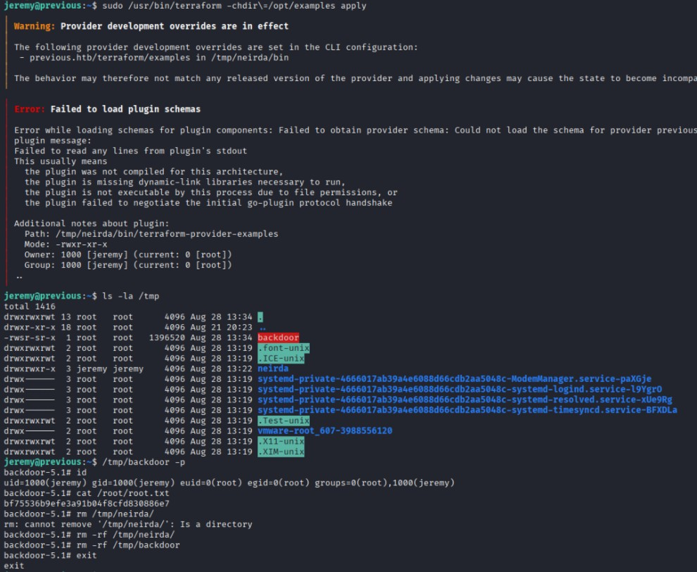  

---

## Conclusion

This challenge was relatively simple but very enjoyable. The abundance of clues made the process straightforward, but the manual exploitation steps added a layer of satisfaction. The LFI exploitation was the trickiest part, as I initially missed the fact that there was **500 errors** when hitting folders. Once I realized that, searching for the right file was much easier.

Overall, this was a great exercise that combined CVE exploitation with creative problem-solving. It was a fun and rewarding experience!  