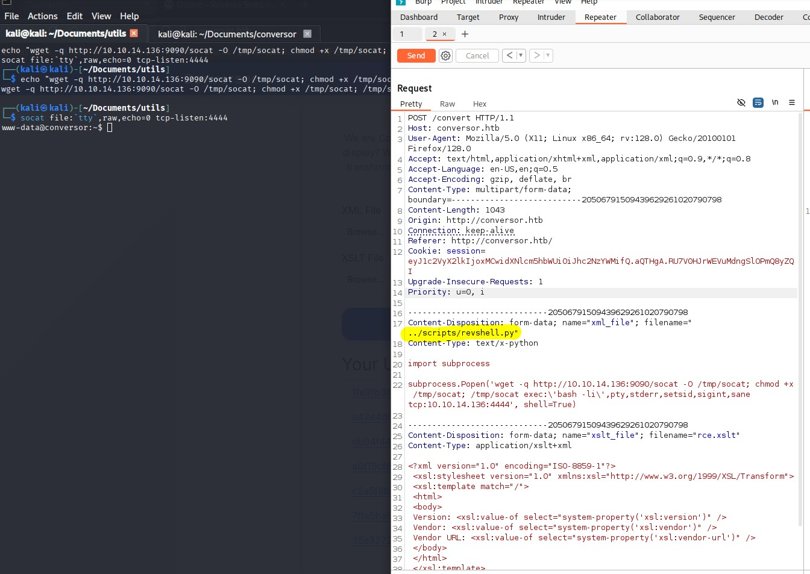

# Hack The Box — Conversor (Walkthrough)

This is the path I took to root Conversor. It’s a professional writeup but I’ll keep it relaxed and honest about the detours I took, because that’s where the learning lives.


## Recon

I started with a full TCP scan and service detection:

```bash
nmap -p- -sV -A 10.10.11.92
```

Key findings:
- 22/tcp OpenSSH 8.9p1 (Ubuntu)
- 80/tcp Apache 2.4.52 redirecting to http://conversor.htb/
- Linux kernel 5.x

The HTTP service redirected to conversor.htb, so I added it to /etc/hosts and browsed the site.

## First lead: XML/XSLT form (dead end, but important)

Landing on the web app, I found a form that takes XML and XSLT and renders HTML. That screamed XSLT injection: LFI/SSRF/RCE via external entities or extension functions. I tested the XSLT engine capabilities by injecting:

```xslt
<xsl:value-of select="system-property('xsl:version')" />
<xsl:value-of select="system-property('xsl:vendor')" />
<xsl:value-of select="system-property('xsl:vendor-url')" />
```

That revealed we were on libxslt 1.0. I also found an About page exposing source code, specifically this app extract:

```python
parser = etree.XMLParser(resolve_entities=False, no_network=True, dtd_validation=False, load_dtd=False)
xml_tree = etree.parse(xml_path, parser)
xslt_tree = etree.parse(xslt_path)
```

The XML is parsed safely (no entities, no network, no DTD), while XSLT is parsed without those protections — promising for XSLT-SSI. I followed this great reference:
https://book.hacktricks.wiki/en/pentesting-web/xslt-server-side-injection-extensible-stylesheet-language-transformations.html#include-external-xsl

Despite trying include/import tricks and external resource pulls, this didn’t translate into a working exploit in this setup. It became a cul-de-sac. The hint was there that the vulnerability was elsewhere.

## The pivot: scheduled Python runner + unsafe upload paths

In the code and notes I found:
- “You can also run it with Apache using the app.wsgi file.”
- A cron hint stating the server regularly runs Python scripts:

```
* * * * * www-data for f in /var/www/conversor.htb/scripts/*.py; do python3 "$f"; done
```

Translation: if I can drop a .py file in /var/www/conversor.htb/scripts, it will get executed every minute as www-data.

I checked the file upload handling and noticed path concatenation with minimal validation:

```python
xml_path = os.path.join(UPLOAD_FOLDER, xml_file.filename)
xslt_path = os.path.join(UPLOAD_FOLDER, xslt_file.filename)
xml_file.save(xml_path)
xslt_file.save(xslt_path)
```

This suggested a path traversal primitive via controlled filenames. I tested by targeting the /static directory first: by prefixing the filename with ../static in the upload, I confirmed arbitrary write outside the intended upload folder was possible. That worked.



From there, the plan was trivial: write a Python file into ../scripts and let cron execute it to gain a foothold as www-data. That opened the door to explore the web root.

## Looting credentials and SSH

Inside the site’s directory I found a database file. After downloading it, I pulled these credentials:

```
fismathack:5b5c3ac3a1c897c94caad48e6c71fdec
```

Cracking on CrackStation yielded:

```
fismathack:Keepmesafeandwarm
```

Password reuse did the rest. I SSH’d in as the user and grabbed user.txt from the home directory.

## Privilege escalation: needrestart (CVE-2024-48990)

Sudo privileges told the whole story:

```bash
fismathack@conversor:~$ sudo -l
Matching Defaults entries for fismathack on conversor:
    env_reset, mail_badpass, secure_path=/usr/local/sbin\:/usr/local/bin\:/usr/sbin\:/usr/bin\:/sbin\:/bin\:/snap/bin, use_pty

User fismathack may run the following commands on conversor:
    (ALL : ALL) NOPASSWD: /usr/sbin/needrestart
```

There’s a recent LPE chain for needrestart:
https://github.com/makuga01/CVE-2024-48990-PoC

In particular, CVE-2024-48990 leverages PYTHONPATH manipulation to get code execution as root when needrestart runs. I uploaded the PoC and tuned it to the box:
- gcc wasn’t installed, but gcc-11 was. I edited start.sh to use gcc-11.
- I created /tmp/poc (required by the PoC’s logic).
- I ran the PoC, then in a second terminal executed sudo needrestart to trigger it.

The run looked like this:

```bash
fismathack@conversor:/tmp/neirda/CVE-2024-48990-PoC$ sh start.sh 
Error processing line 1 of /usr/lib/python3/dist-packages/zope.interface-5.4.0-nspkg.pth:

  Traceback (most recent call last):
    File "/usr/lib/python3.10/site.py", line 192, in addpackage
      exec(line)
    File "<string>", line 1, in <module>
  ImportError: dynamic module does not define module export function (PyInit_importlib)

Remainder of file ignored
##########################################

Don't mind the error message above

Waiting for needrestart to run...
Got the shell!
# id
uid=1000(fismathack) gid=1000(fismathack) euid=0(root) groups=1000(fismathack)
# cd /root
# cat root.txt
4f88dcd6f611772af47defa269654404
#
```

Root shell achieved via euid=0, and the root flag retrieved.

## Notes and takeaways

This box is rated very easy, and it really is once you stop tunneling on XSLT. The XML/XSLT angle looked juicy — different parsers, libxslt 1.0, potential for SSRF or file include — but it was a dead end here. The real vulnerability chain was:
- Path traversal on upload → arbitrary write
- Scheduled Python execution from a predictable scripts directory
- Credential disclosure via local files → password reuse → SSH
- Sudo NOPASSWD on needrestart → CVE-2024-48990 → root

Biggest lesson for me: when an avenue stalls, pivot sooner. The breadcrumbs were clear that uploads landed on disk and that the system had automation executing Python scripts — that was the real foothold. Once in, escalation via needrestart was straightforward.

Links referenced:
- XSLT-SSI techniques: https://book.hacktricks.wiki/en/pentesting-web/xslt-server-side-injection-extensible-stylesheet-language-transformations.html#include-external-xsl
- needrestart CVE-2024-48990 PoC: https://github.com/makuga01/CVE-2024-48990-PoC
- Nmap: https://nmap.org
- CrackStation: https://crackstation.net