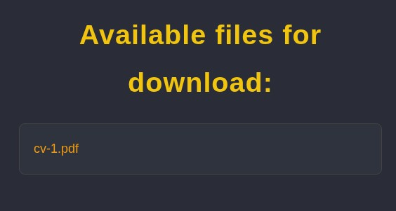
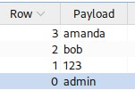
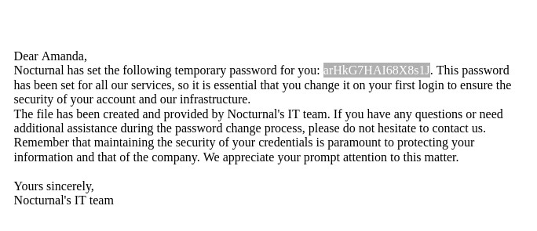
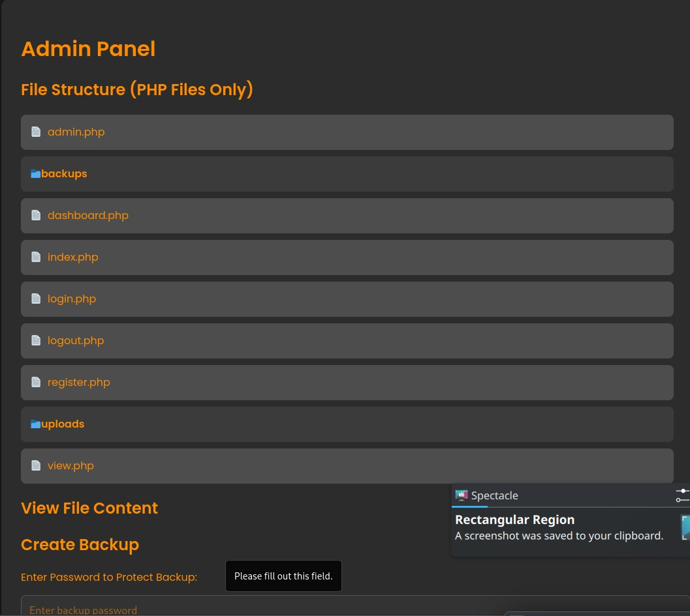
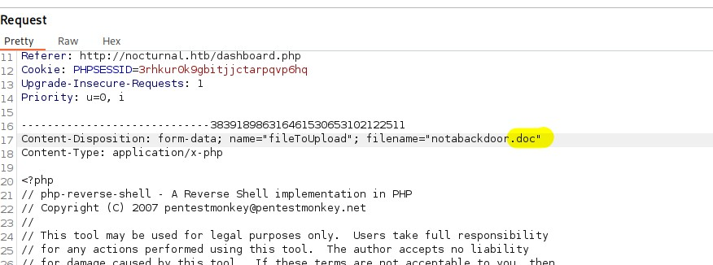
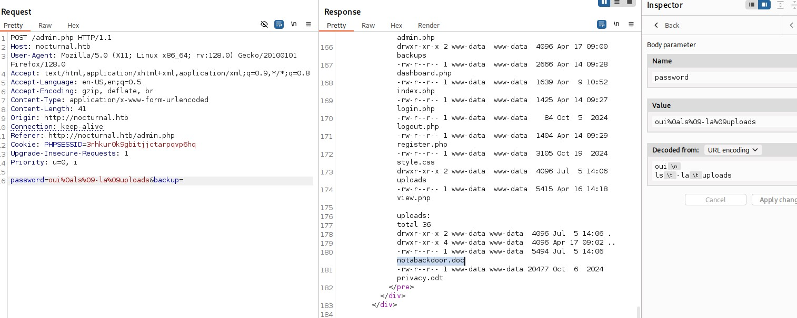
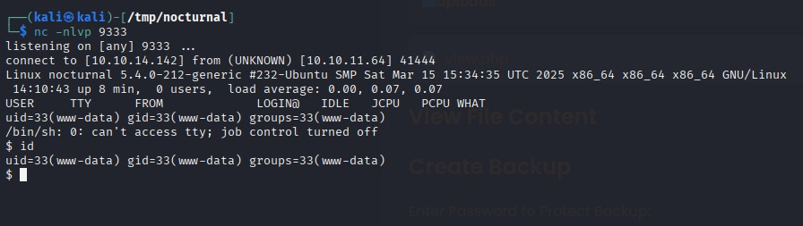
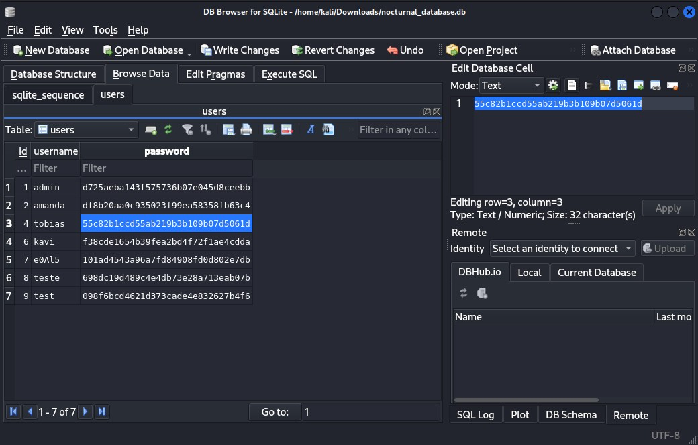
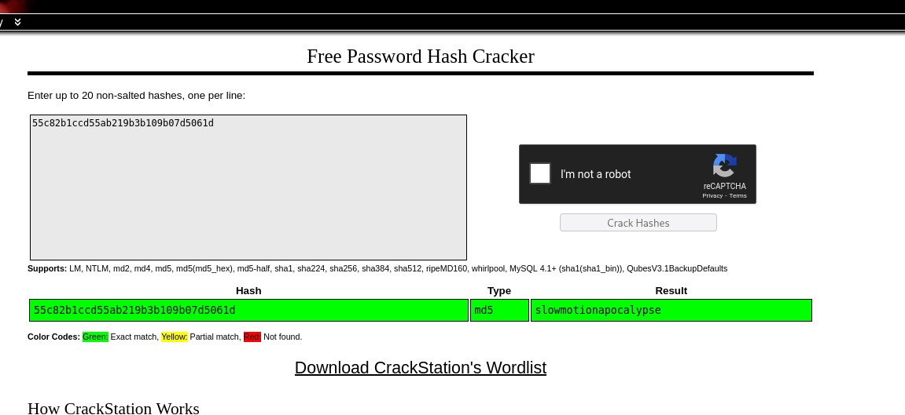

# Nocturnal CTF Writeup  

Welcome to my writeup for the Nocturnal CTF challenge on HackTheBox. I'll walk you through my thought process, the obstacles I faced, and how I ultimately conquered this box.  


## Initial Recon  
Using `nmap`, I scanned the target and found that only ports 22 (SSH) and 80 (HTTP) were open. With limited options, I decided to focus on the website hosted on port 80 to gather more information and identify potential vulnerabilities.

The first thing I noticed was the absence of subdomains, which simplified the scope. The `/backups` path was accessible, and `/uploads` might be too. Additionally, `admin.php` was present, which hinted at an administrative panel.  

I tried Remote File Inclusion (RFI) but couldn't upload `.php` files. Local File Inclusion (LFI) seemed promising, but the path didn't appear sensitive to directory traversal. However, I discovered that files belonging to other users could be accessed using their username and filename via `http://nocturnal.htb/view.php?username={username}&file={filename}`.

  


## Finding Users  

At this point, I realized that the key was identifying valid usernames. Using a wordlist, I found four users, as shown in the screenshot below:  

  

Among these, Amanda had a file named `privacy.odt`. Inside, I found a password:  

  

With `amanda:arHkG7HAI68X8s1J`, I attempted SSH but had no luck. However, I successfully logged into her account on the web application.  


## Exploring Amanda's Account  

Amanda had access to the admin panel, which was a significant breakthrough:  

  

The panel allowed backups to be created, stored in `/backups/backup_2025-07-04.zip`. I wrote a script (`scripts/download.py`) to check for other backups but found none.  

The admin panel displayed "File Structure (PHP Files Only),” which hinted at the possibility of exploring non-PHP files.  


## Command Injection Attempt  

The backup creation process used the following command:  

```php  
$command = "zip -x './backups/*' -r -P " . $password . " " . $backupFile . " .  > " . $logFile . " 2>&1 &";  
```  

The password was sanitized using `cleanEntry()`, which blacklisted characters like `;`, `&`, `|`, `$`, and spaces. I tried bypassing this by using newline characters and tabs but couldn't achieve a reverse shell.  


## Uploading a Reverse Shell  

I shifted my focus to uploading a reverse shell with an allowed extension, then modifying its extension to `.php` to bypass restrictions. This worked perfectly:  

  
  
  


## Database Extraction  

Once inside, I remembered the PHP files mentioned earlier and located the database. Downloading it revealed password hashes:  

  

Using CrackStation, I cracked Tobias's password:  

  

With `tobias:slowmotionapocalypse`, I accessed his account and found the user flag in his home directory.  


## Privilege Escalation  

I noticed an internal server running on port 8080, hosting ISPConfig. This administrative panel had a known CVE (CVE-2023-46818) that allowed Remote Code Execution (RCE).  

I exposed the internal port externally using an SSH tunnel and exploited the vulnerability using [this exploit](https://github.com/ajdumanhug/CVE-2023-46818).  


## Root Access  

The exploit worked flawlessly, granting me a root shell. The final flag was located in `/root/root.txt`.  


## Conclusion  

Through this challenge, I learned the importance of not rushing headlong into a problem without carefully analyzing the responses provided by the target. During the initial phase, I spent hours overlooking the fact that user-stored files were displayed directly by the site when their usernames were discovered. This oversight led me to undervalue this avenue, which turned out to be crucial.

Overall, Nocturnal was a good machine—fairly simple but highly representative of fundamental pentesting concepts. It served as a great reminder to approach problems methodically and pay close attention to every detail.