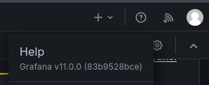
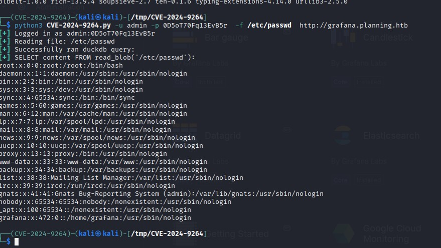
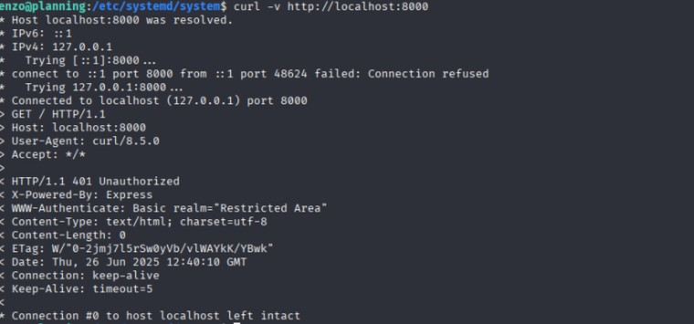
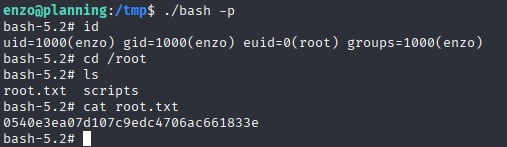

# Writeup: Exploiting a Grafana Instance and Privilege Escalation via Crontab-UI

## Introduction

This writeup documents the process of exploiting a vulnerable Grafana instance and escalating privileges to root on a target system. The goal was to demonstrate a methodical approach to penetration testing, showcasing enumeration, exploitation, and privilege escalation techniques. The structure reflects my thought process and decision-making at each step, with accompanying images for clarity.

---

## Initial Enumeration

The first step was to perform a basic scan of the target system using `nmap`. The scan revealed two open ports:

- **Port 22**: SSH
- **Port 80**: HTTP

I started by exploring the HTTP service. After testing a few forms for SQL injection and XSS vulnerabilities, I found nothing exploitable. Path enumeration also yielded no results. However, subdomain enumeration revealed something interesting: a subdomain hosting **Grafana**.

---

## Grafana Enumeration and Exploitation

Accessing the Grafana instance, I noticed it was running **version v11.0.0**, as shown below:

With the version identified, I researched known vulnerabilities and found **CVE-2024-9264**, which allows for Remote Code Execution (RCE) and Local File Inclusion (LFI). The exploit was available on GitHub: [CVE-2024-9264 Exploit](https://github.com/nollium/CVE-2024-9264).

Testing the exploit confirmed it worked. Below is the LFI in action:

While I couldn’t establish a reverse shell directly through this exploit, exploring the system via LFI revealed environment files containing credentials.

The credentials included `enzo:RioTecRANDEntANT!`. Testing this password for SSH access, I successfully logged in as the user `enzo` and retrieved the user flag from their home directory.

---

## Privilege Escalation

With user-level access, I began analyzing the system for privilege escalation opportunities. During my investigation, I noticed a **Node.js package** called `crontab-ui` installed on the system. This package allows users to manage cron jobs via a web interface. Below is the package in the `node_modules` directory:

Further inspection revealed a service associated with `crontab-ui` running on **port 8000**. Accessing this port returned a **401 Unauthorized** response, indicating the service was protected by authentication.

### Finding the Password

To gain access to the `crontab-ui` interface, I needed valid credentials. Searching the system, I discovered a plaintext password in the crontab configuration files.

The password was `P4ssw0rdS0pRi0T3c`. Testing for password reuse, I logged into the `crontab-ui` interface with `root:P4ssw0rdS0pRi0T3c`. It worked, granting me access to the web interface, which allowed me to edit cron jobs.

---

## Exploiting Crontab-UI for Root Access

With access to the `crontab-ui` interface, I created a new cron job to execute a simple backdoor script as root. This granted me root access to the system.

After executing the cron job, I successfully obtained the root flag.

---

## Conclusion

This challenge was a great exercise in methodical exploitation and privilege escalation. Key takeaways include:

1. **Enumeration is critical**: Subdomain discovery and version identification were pivotal in finding the Grafana vulnerability.
2. **Password reuse is a common weakness**: Both SSH and `crontab-ui` were compromised due to reused credentials.
3. **Understanding the system**: Recognizing the potential of `crontab-ui` as a privilege escalation vector was essential.

Thanks for reading !