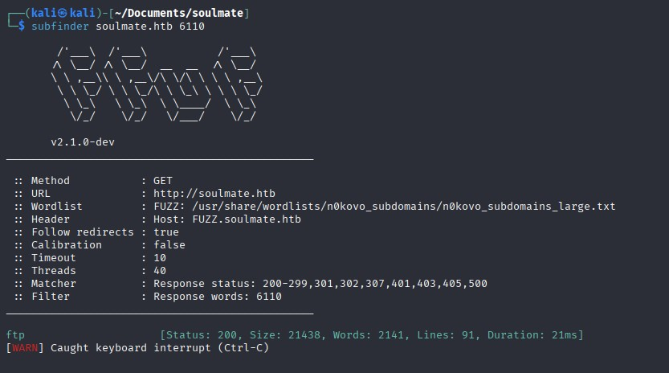
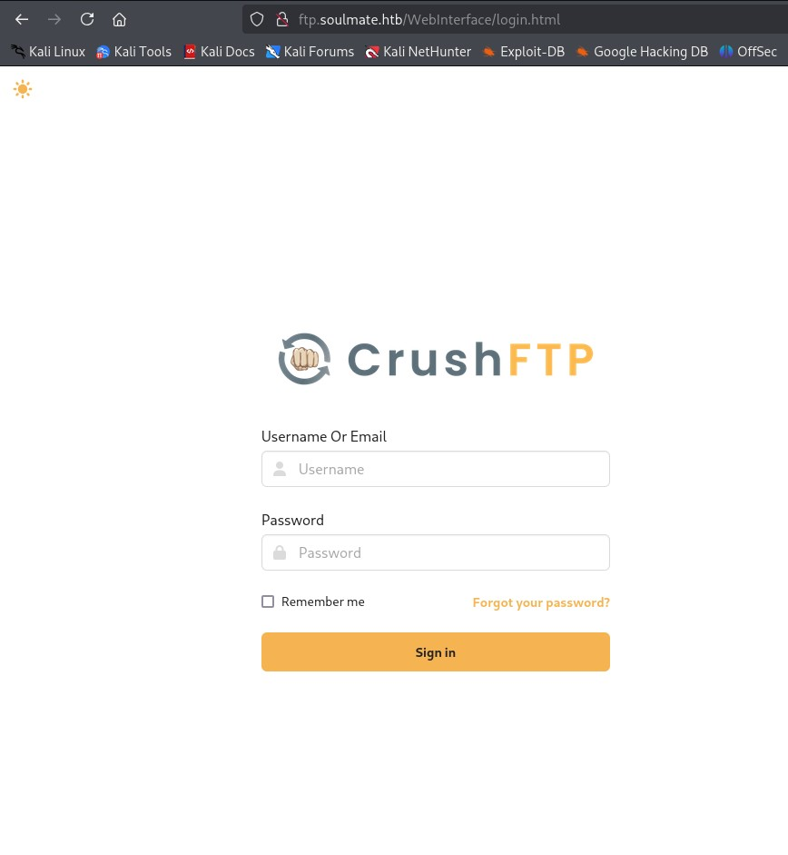
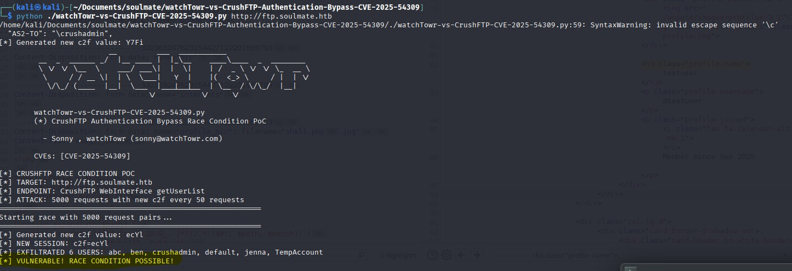
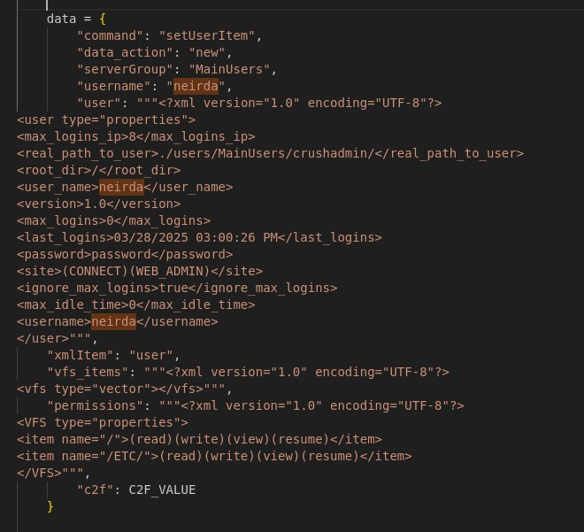
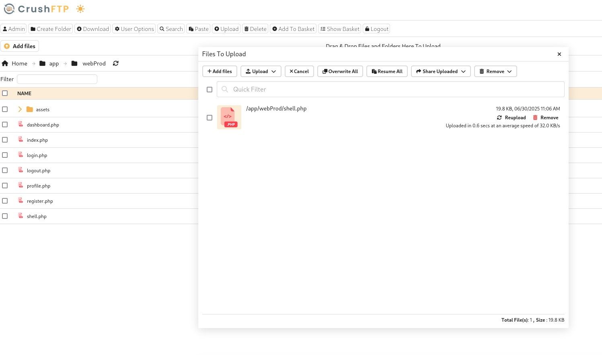
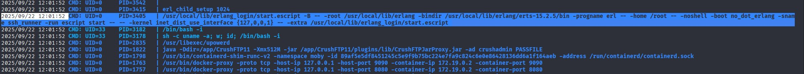
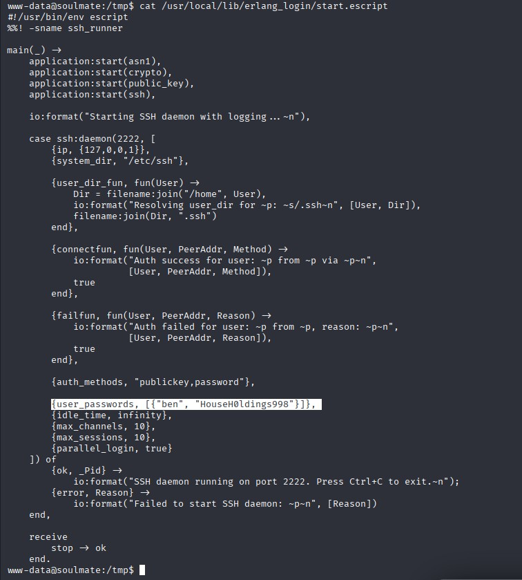
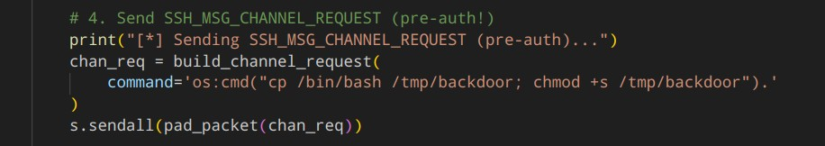

# Soulmate - HackTheBox Writeup
[Here are the notes I took while solving](./walkthrough)

## Introduction

This writeup recounts my journey through the HackTheBox machine "Soulmate." It was a challenging yet rewarding experience, filled with moments of frustration, discovery, and a few "aha!" moments. The machine's theme revolved around the concept of "soulmates," which I later realized was a clever nod to the software "CrushFTP" used in the challenge. Let's dive into the details.

---

## Initial Enumeration

I started with a basic `nmap` scan on the provided IP address. The scan revealed two open ports: **80** (HTTP) and **22** (SSH). Naturally, I began exploring the web server hosted on port 80. 

The website had options to register, log in, and even upload an image. I poked around for vulnerabilities but couldn’t find anything exploitable at first glance. Frustrated, I decided to expand my search scope. After enumerating paths and subdomains, I stumbled upon something interesting: a subdomain named `ftp.soulmate.htb`. 

---

## Discovering CrushFTP

Navigating to the subdomain revealed a web interface for an FTP server called **CrushFTP**. At first, I didn’t think much of it, but after some research, I realized this software had a history of vulnerabilities. The name "Soulmate" suddenly made sense—"crush" is a term for someone you have a romantic interest in. Clever, right?

I found an article detailing a recent CVE involving a **race condition** in CrushFTP. I decided to test the Proof of Concept (PoC) provided in the article, and to my surprise, the application was indeed vulnerable.

---

## Modifying the PoC

The PoC I found was harmless, but I wanted to take it a step further. I modified the script to include requests that would allow me to add a new admin user. After tweaking the code, I ran the exploit, and it worked! I successfully gained access to the admin panel.

Once inside, I adjusted my permissions in the settings to give myself full control. This step was crucial because it allowed me to upload a reverse shell in PHP.

---

## Gaining a Foothold

With my new permissions, I uploaded a PHP reverse shell and executed it. This gave me a foothold on the machine. From here, I began exploring the system, looking for privilege escalation opportunities.

---

## The Roadblock

After days of searching, I hit a dead end. I couldn’t find a clear path to escalate my privileges. Frustrated, I decided to cheat. Eventually, I realized I had overlooked something critical: one of the processes running as root.

---

## The Breakthrough

Upon closer inspection, I found a process that initialized an account with the credentials `ben:HouseH0ldings998`. This discovery was a game-changer. I used these credentials to log in and continue my exploration.

  

---

## Exploiting the SSH Server

Further research revealed that the SSH server was built using Erlang, which had a known vulnerability (CVE-2025-32433). I found an exploit online that targeted this specific vulnerability.

[Exploit Source](https://github.com/platsecurity/CVE-2025-32433/blob/main/CVE-2025-32433.py)

I tested the exploit, and it worked flawlessly. To make things more interesting, I modified the exploit to generate a backdoor on the system.

---

## Root Access

With the backdoor in place, I gained root access to the machine. The root flag was located in `/root/root.txt`. Victory at last!

---

## Conclusion

This machine was a rollercoaster of emotions. While the initial foothold was relatively straightforward, the privilege escalation required a lot of patience and attention to detail. The key takeaway for me was to never overlook running processes—they often hold the answers you’re looking for. 

Overall, "Soulmate" was a challenging yet enjoyable experience. It tested my skills and taught me the importance of persistence and thorough enumeration. Until next time, happy hacking!

