# Writeup — Reverse Engineering DestinyEleven

Je me faisais chier et en ce moment je suis dans un mood de reverse engineering, donc tentons de reverse **DestinyEleven** pour avoir une carrière de FOU !

## 1. Analyse initiale

J'arrive sur le jeu, je me rends compte rapidement que tout tourne en local, je m'y attendais.
Ça semble être du vanilla JS.

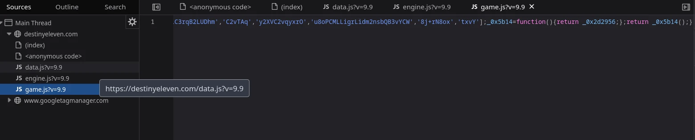

Je récupère le code des 3 fichiers JS puis je le passe dans un beautifier pour y voir un peu plus clair.
Je me retrouve quand même avec du code obfusqué.

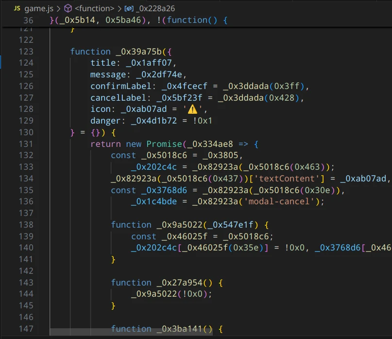

Je me dis qu'il y a deux moyens d'arriver à mes fins :
- Soit je change le JS.
- Soit je change le state dans le storage.

Je me dis que changer le JS sera un peu trop chiant (il est déjà 23h, je veux dormir pas trop tard). Je regarde donc où est stockée la data : dans le `localStorage` sous le nom de `destinyEleven_current`.

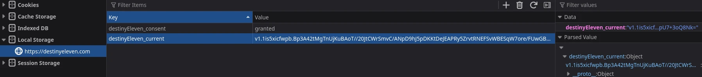

Mais ça a l'air chiffré ou encodé je ne sais pas comment... Je pensais à un simple Base64 mais ça ne donne rien sur CyberChef.

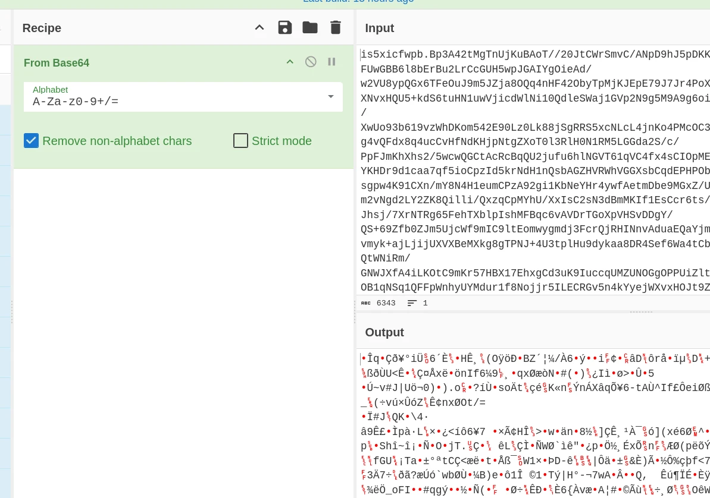

---

## 2. Analyse des fonctions de déchiffrement

Je vais donc rechercher dans le code l'endroit où est écrit et lu le `localStorage`. Lié à cet endroit, je devrais trouver les fonctions de chiffrage et déchiffrage.

Je trouve 9 mentions de `localStorage` dans `data.js` et 9 dans `engine.js`. Prenons-en un au hasard : j'en choisis un avec `getItem` parce que ça sera plus simple de valider la validité d'une fonction de déchiffrement que l'inverse.

Celui-là par exemple dans `engine.js` :

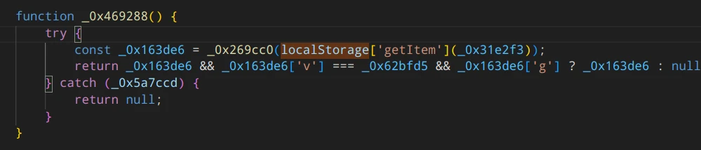

Il passe le résultat du `getItem` dans la fonction `_0x269cc0`.

Encore une fonction incompréhensible qui appelle plein d'autres fonctions...

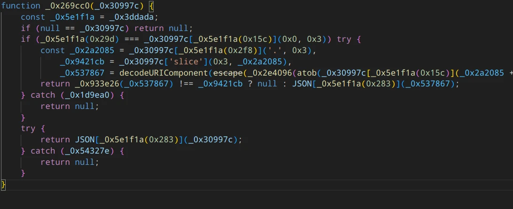

J'essaie d'isoler toutes les fonctions qu'elle appelle dans un nouveau fichier. Malgré ça, ça ne fonctionnait pas, je ne comprenais pas. En fait, dans le script, il y a une table immense de strings chiffrées (qui correspondent en gros à toutes les strings du code).

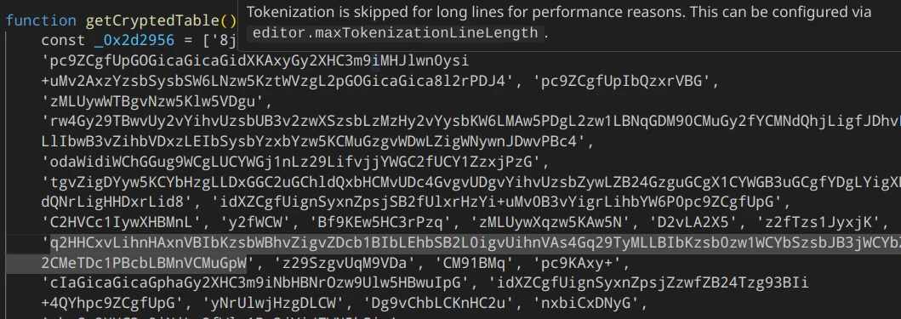

Mais quand j'utilisais la fonction de déchiffrage avec les index du tableau présent dans le code, ça me donnait les mauvais signes. Après une bonne heure à tourner dans le vide, j'ai réussi ! En fait, juste après la fonction de déchiffrage, le programme appelle une autre fonction qui fait une certaine rotation du tableau chiffré. En copiant cette fonction aussi, j'ai réussi à avoir les bonnes strings au bon endroit.

Après avoir trouvé comment retrouver les strings du code en clair, grâce à ça je sais que toute référence à `_0x31e2f3` dans le code correspond à `destinyEleven_current` (la clé de la data que l'on cherche).

Tout porte donc à croire que j'avais visé juste et que `_0x269cc0()` est une fonction de déchiffrage. Malheureusement elle ne semble pas fonctionner au début et me retourne `null`.

Après un long travail à chercher toutes les fonctions nécessaires et à les ramener dans mon fichier, j'ai enfin réussi à déchiffrer le storage !

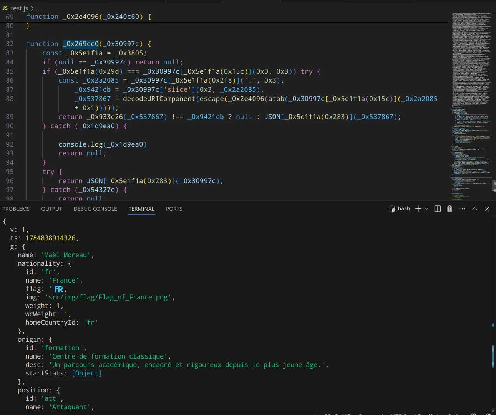

Je stocke le résultat dans un fichier JSON et il ne reste plus qu'à trouver la fonction de chiffrement.

---

## 3. Reverse de la fonction de chiffrement & Script

On va donc faire le chemin inverse, c'est-à-dire essayer de trouver un `localStorage` dans le code avec `setItem`.

Ce morceau de code semble être notre seule piste :

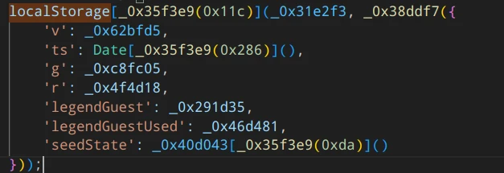

Comme pour la dernière fois, une fois tous les morceaux recollés, ça fonctionne ! Plus qu'à comparer le chiffrage avec les données réelles.

**ET C'EST VALIDÉ !**

Il n'y a plus qu'à demander à un ami chinois de me coder vite fait une extension Tampermonkey :

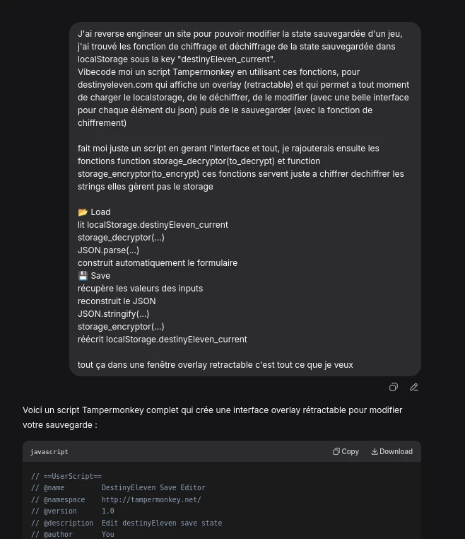

Il y avait quelques soucis mais après modifications tout fonctionne.

Je vous présente **Sofiane Diallo**, le prodige de Marseille :

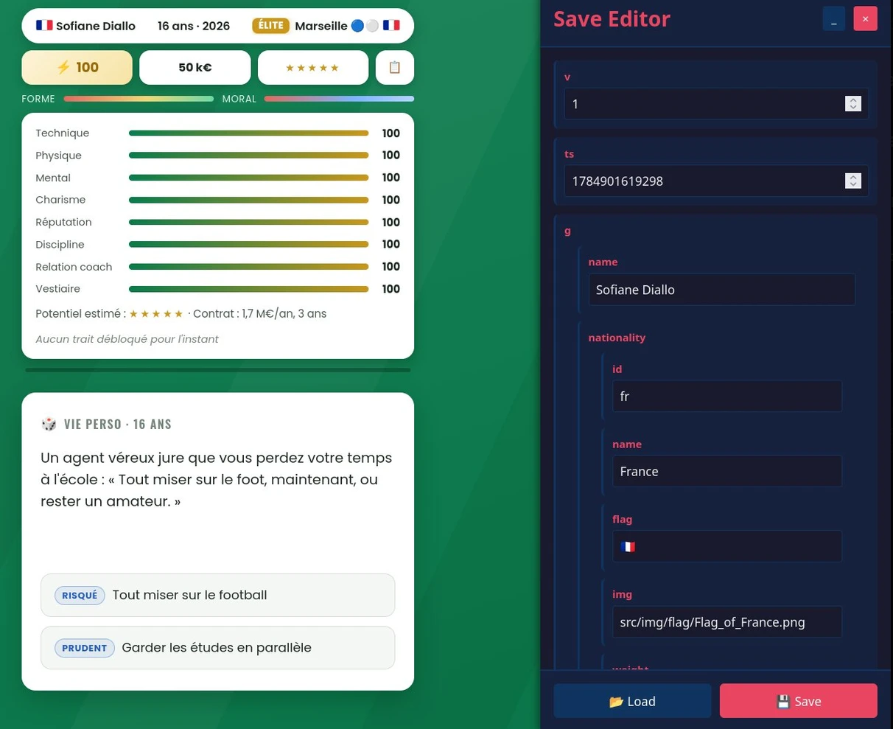

---

## Lien du script

Le script Tampermonkey est disponible ici :
👉 [https://pastebin.com/Xg9CV2La](sc/https://pastebin.com/Xg9CV2La)