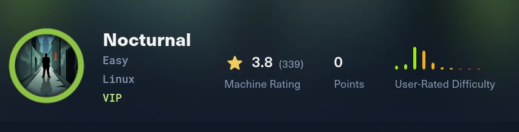
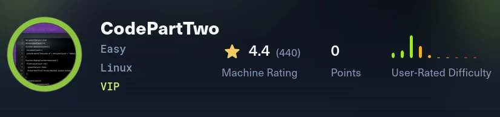
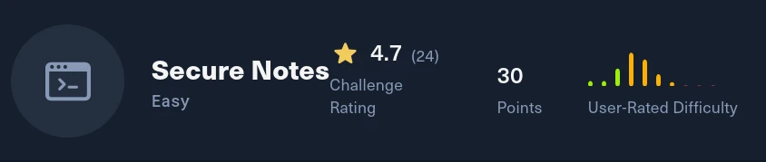
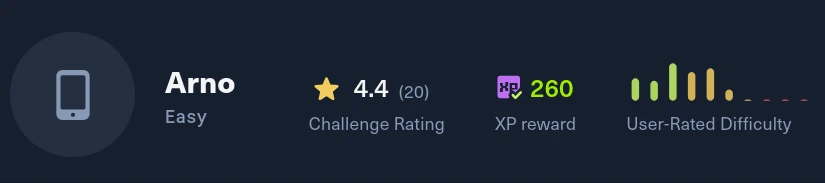
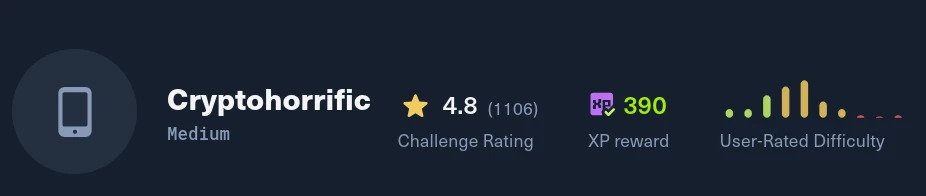

# Pentesting Labs & CTF Writeups

Welcome to the repository showcasing detailed writeups for various pentesting labs and Capture The Flag (CTF) challenges. Each writeup provides a comprehensive walkthrough of the exploitation process, including enumeration, vulnerability analysis, and privilege escalation techniques.

## Writeups Index

### HackTheBox
#### Machines
- [PLANNING](./Machines/planning/writeup.md)
  
    *Overview*: Demonstrates the exploitation of a Grafana vulnerability, privilege escalation via a misconfigured Node.js crontab service, and retrieval of root access.
- [Nocturnal](./Machines/nocturnal/writeup.md)
  
    *Overview*: Explores enumeration techniques, exploitation of file upload vulnerabilities, command injection attempts, and privilege escalation using a known CVE in ISPConfig.
- [Dog](./Machines/dog/writeup.md)
  
    *Overview*: Highlights the exploitation of Backdrop CMS vulnerabilities, enumeration of users, password reuse, and privilege escalation using the `bee` binary.
- [Outbound](./Machines/outbound/writeup.md)
  
    *Overview*: Covers the exploitation of Roundcube Webmail, decryption of sensitive data, and privilege escalation using a vulnerable binary.
- [Fluffy](./Machines/Fluffy/writeup.md)
  
    *Overview*: AD DC compromise via NTLMv2 capture from a malicious ZIP, crack to p.agila, BloodHound path through "Service Accounts" for GenericWrite on winrm_svc, shadow credentials with `pywhisker`, PKINIT-derived NT hash, and foothold via `evil-winrm`.
- [CodeTwo](./Machines/Code_2/writeup.md)
  
    *Overview*: Exploits a vulnerability in `js2py` to escape the sandbox and execute Python code, cracks MD5 hashes for user credentials, and escalates privileges using a backup tool to gain root access.
- [Editor](./Machines/Editor/writeup.md)
  
    *Overview*: Exploits XWiki vulnerabilities for initial access, find credentials, and escalates privileges using a SUID binary to gain root access.
- [Previous](./Machines/Previous/writeup.md)
  
    *Overview*: Exploits a Next.js middleware authentication bypass vulnerability, leverages LFI to retrieve credentials, and escalates privileges by exploiting terraform.
- [Soulmate](./Machines/soulmate/writeup.md)
  
    *Overview*: Exploits a race condition in CrushFTP to gain admin access, uploads a PHP reverse shell for foothold, and escalates privileges using a CVE in an Erlang-based SSH server.
- [Expressway](./Machines/expressway/writeup.md)
  
    *Overview*: Explores an IKE VPN configuration vulnerability, cracks the preshared key using `psk-crack`, gains SSH access, and escalates privileges by exploiting a vulnerable `sudo` version.
- [Imagery](./Machines/Imagery/writeup.md)
  
    *Overview*: Exploits an XSS vulnerability to extract admin cookies, leverages an LFI vulnerability to explore server files, and escalates privileges by exploiting a command injection flaw in image processing.
- [TombWatcher](./Machines/TombWatcher/writeup.md)
  
    *Overview*: Demonstrates AD enumeration, BloodHound-based privilege escalation, GMSA password retrieval, and exploitation of AD CS ESC15 misconfiguration to gain Domain Admin access.
- [Signed](./Machines/signed/writeup.md)
  
    *Overview*: Exploits a misconfigured MSSQL server, leverages Kerberos authentication vulnerabilities, and escalates privileges using silver ticket attacks to gain full system access.
- [Conversor](./Machines/conversor/writeup.md)
  
    *Overview*: Exploits a path traversal vulnerability to achieve arbitrary file write, gains foothold via cron-executed Python scripts, and escalates privileges using the `needrestart` CVE-2024-48990 vulnerability.
- [Giveback](./Machines/giveback/writeup.md)
  
    *Overview*: Exploits the GiveWP plugin vulnerability for initial access, leverages Kubernetes service account tokens to enumerate secrets, and escalates privileges by exploiting a misconfigured `runc` binary to escape the container and gain root access.
- [Eighteen](./Machines/Eighteen/writeup.md)
  
    *Overview*: Exploits an MSSQL server misconfiguration for initial access, leverages Kerberos delegation vulnerabilities to impersonate privileged users, and escalates privileges using Badsuccessor
- [MonitorsFour](./Machines/MonitorsFour/Writeup.md)
  
    *Overview*: Explores API token bypass techniques, exploits a CVE in Cacti for initial access, gains foothold via Docker container escape, and escalates privileges by mounting the host filesystem to retrieve sensitive files.
- [Gavel](./Machines/Gavel/Writeup.md)
  
    *Overview*: Exploits a YAML injection vulnerability in a custom auction service, gains foothold via a crafted reverse shell, and escalates privileges by leveraging a misconfigured root daemon.
- [NanoCorp](./Machines/NanoCorp/Writeup.md)
  
    *Overview*: Explores NTLM hash theft via a ZIP extraction vulnerability, BloodHound-based privilege escalation, exploitation of CheckMK CVE for local privilege escalation, and bypassing Windows Defender with a custom payload to gain root access.
- [Browsed](./Machines/Browsed/Writeup.md)
  
    *Overview*: Explores a Chrome extension vulnerability to achieve initial access, leverages SSRF to discover internal services, and escalates privileges using Python cache poisoning to gain root access.
- [Facts](./Machines/Facts/Writeup.md)
  
    *Overview*: Exploits a mass assignment vulnerability in Camaleon CMS for privilege escalation, retrieves AWS credentials to access S3 buckets, downloads private SSH keys for initial access, and escalates privileges using a custom Ruby fact with `facter` to gain root access.
- [Pterodactyl](./Machines/Pterodactyl/Writeup.md)
  
    *Overview*: Exploits a Pterodactyl Panel RCE vulnerability (CVE-2025-49132) for initial access, leverages database credentials to gain a foothold, and escalates privileges using a two-step chain involving `udisks` and `libblockdev` vulnerabilities (CVE-2025-6018 → CVE-2025-6019).
- [WingData](./Machines/WingData/Writeup.md)
  
    *Overview*: Exploits a NULL byte truncation vulnerability in Wing FTP Server for authentication bypass, leverages Lua code injection for RCE, and escalates privileges using a Python tarfile extraction vulnerability (CVE-2025-4517).
- [Overwatch](./Machines/Overwatch/Writeup.md)
  
    *Overview*: Demonstrates AD enumeration, exploitation of a hardcoded MSSQL service account, ADIDNS poisoning for DNS redirection, and privilege escalation via a vulnerable WCF SOAP service to achieve system-level access.
- [Interpreter](./Machines/Interpreter/Writeup.md)
  
    *Overview*: Exploits a CVE in Mirth Connect to gain initial access, performs password hash brute force from the database for lateral movement, and bypasses an evaluation filter in the local API to escalate privileges.
- [AirTouch](./Machines/AirTouch/Writeup.md)
  
    *Overview*: Explores WiFi pentesting techniques, including WPA2-PSK and WPA2-Enterprise exploitation, Evil Twin attacks
- [CCTV](./Machines/cctv/Writeup.md)
  
    *Overview*: Exploits a time-based blind SQL injection vulnerability in ZoneMinder for initial access, leverages internal tunneling to access motionEye, and escalates privileges using an RCE vulnerability to gain root access.
#### Challenges
- [Secure Notes](./Challenges/Secure_Notes/Writeup.md)
  
    *Overview*: Exploits a prototype pollution vulnerability in Mongoose (CVE-2023-3696) to achieve arbitrary code execution, bypasses access restrictions to retrieve the flag, and demonstrates advanced Node.js exploitation techniques.
- [APKey](./Challenges/APKey/Writeup.md)
  
    *Overview*: Demonstrates Android reverse engineering techniques, including APK decompilation, alignment fixes, and cryptographic logic analysis to retrieve the flag.
- [Arno](./Challenges/Arno/Writeup.md)  
  
    *Overview*: Explores Unity-based Android reverse engineering, including IL2CPP analysis, dynamic Frida instrumentation, and AES decryption to retrieve the flag.
- [Jigsaw](./Challenges/Jigsaw/Writeup.md)  
  
    *Overview*: Explores Flutter-based Adroid reverse engineering, and reconstruct decrypt function from pieces of code scattered all throughout the apk.
- [Cryptohorrific](./Challenges/Cryptohorrific/Writeup.md)  
  
    *Overview*: Explores iOS application reverse engineering, including property list analysis and disassembly of the Mach-O binary to retrieve the flag.
- [Protected](./Challenges/Protected/Writeup.md)  
  
    *Overview*: Explores Android mobile forensics, analyzing application data, keystore database entries, and decrypting hidden media files using GalleryVault tools to retrieve the flag.
#### Perso
- [DestinyEleven](./Perso/DestinyEleven/Writeup.md)  
  
    *Overview*: Reverse engineer et déobfuscation d'un site à la mode dans le but de changer l'état de la partie
### Disclaimer
These writeups are for educational purposes only. Unauthorized use of these techniques on systems you do not own or have explicit permission to test is illegal.

---