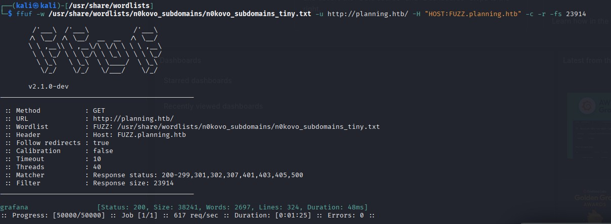
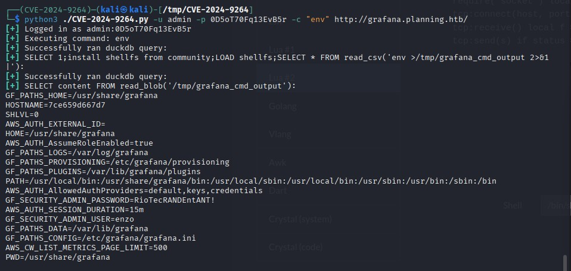
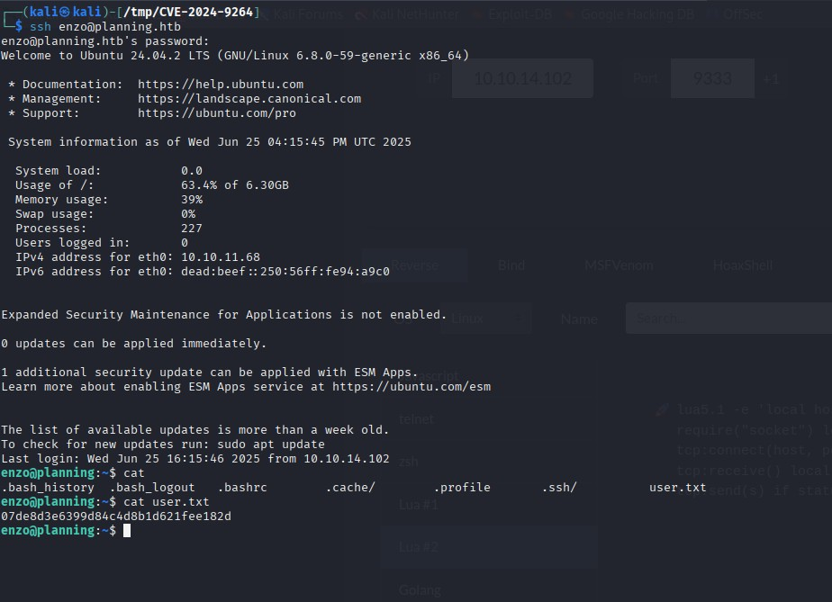
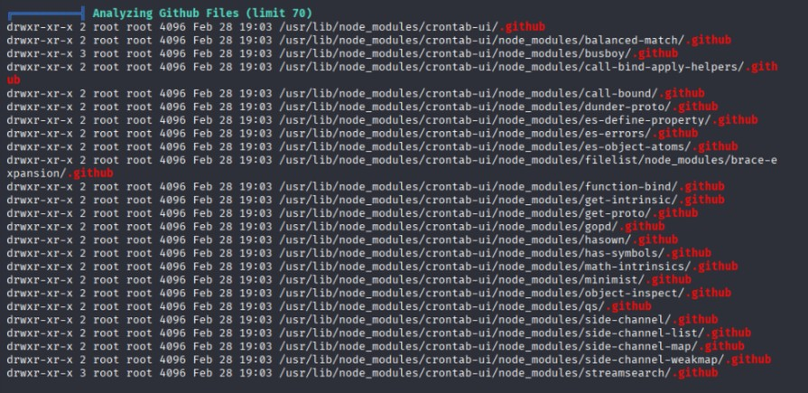
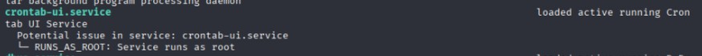
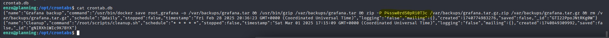
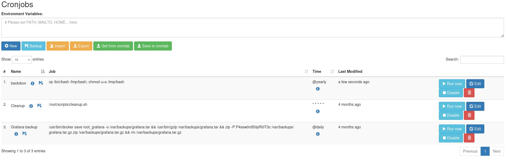

# HackTheBox Writeup: Exploiting a Vulnerable System

## Overview

This writeup showcases the exploitation of a vulnerable system, detailing the steps taken to achieve both user and root access. The process includes enumeration, vulnerability exploitation, and privilege escalation techniques.

---

## Initial Enumeration

### Open Ports
Using `nmap`, the following open ports were identified:
- **22**: SSH
- **80**: HTTP

### Web Application Testing
- **Form Testing**: Attempts at SQL Injection (SQLi) and Cross-Site Scripting (XSS) yielded no results.
- **Path Enumeration**: No interesting paths were discovered.
- **Subdomain Enumeration**: A subdomain `grafana` was identified.  
    

---

## Exploiting Grafana

### Credentials
The challenge provided the following credentials:
- **Username**: `admin`
- **Password**: `0D5oT70Fq13EvB5r`

### Grafana Version
The Grafana version was identified as **v11.0.0**.  

### Vulnerability Research
A known vulnerability, **CVE-2024-9264**, was identified:
- **Type**: Remote Code Execution (RCE) and Local File Inclusion (LFI)
- **Exploit**: [GitHub Repository](https://github.com/nollium/CVE-2024-9264)

### Exploitation
The exploit successfully worked, allowing access to sensitive files.  

While a reverse shell was not possible, credentials were discovered in environment files.  

### SSH Access
Using the discovered credentials:
- **Username**: `enzo`
- **Password**: `RioTecRANDEntANT!`

SSH access was successful, and the **user flag** was retrieved.  

---

## Privilege Escalation

### Node.js Crontab-UI
The system had the **crontab-ui** Node.js package installed.  

An associated service was running on port **8000**.  

Accessing the service returned a **401 Unauthorized** response.  

### Password Discovery
A plaintext password was found in the crontab system:
- **Password**: `P4ssw0rdS0pRi0T3c`  
    

### Privileged Access
Testing for password reuse, the following credentials granted access to the protected web page:
- **Username**: `root`
- **Password**: `P4ssw0rdS0pRi0T3c`

### Exploiting Crontab-UI
Using the web interface, a cron job was created to execute a backdoor script as root.  

### Root Flag
The backdoor provided root access, allowing retrieval of the **root flag**.  

---

## Conclusion

This writeup demonstrates a complete exploitation chain:
1. Enumeration of services and subdomains.
2. Exploitation of a Grafana vulnerability to gain initial access.
3. Privilege escalation via a misconfigured Node.js crontab service.

This exercise highlights the importance of:
- Securing sensitive credentials.
- Regularly updating vulnerable software.
- Restricting access to administrative services.

--- 